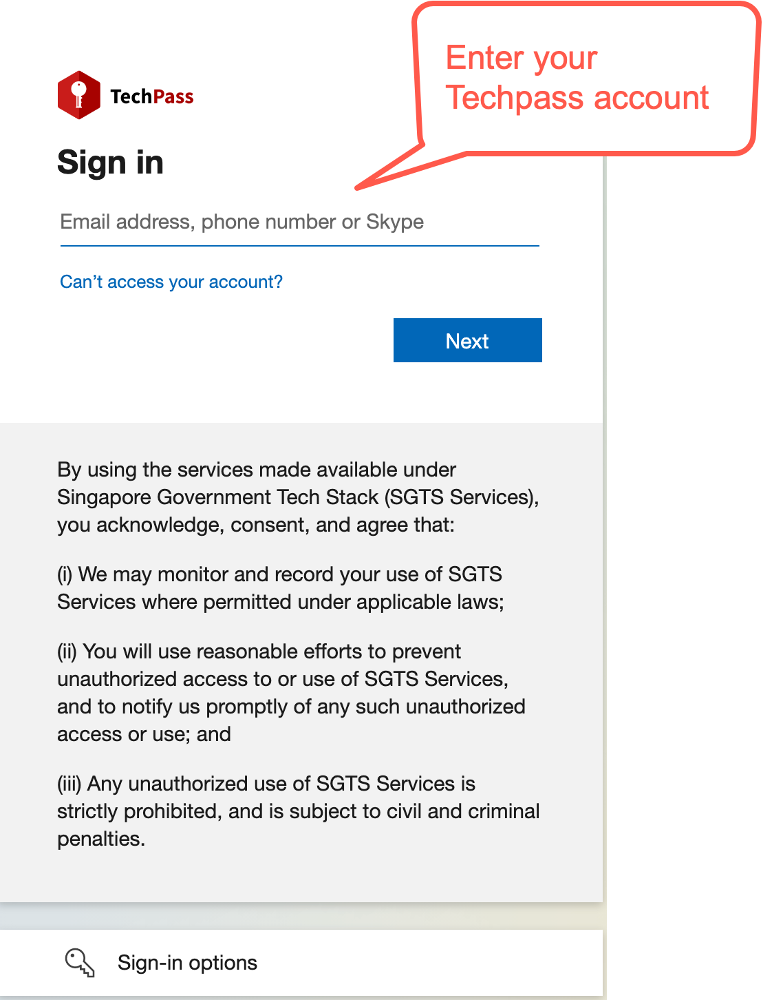

# Log in with TechPass account to access SGTS services

TechPass users can use their TechPass to securely and seamlessly access SGTS services such as SEED, GCC2.0, Cloud File Transfer (CFT), SHIP-HATS and Developer portal using their GMD and GSIB devices.

This article guides you on how to use TechPass to access SGTS resources.

- [Log in with TechPass for vendors](#to-log-in-with-techpass-for-vendor)
- [Log in with TechPass for public officers](#to-log-in-with-techpass-for-public-officer)

*To log in with TechPass for vendor* :

1. Go to the [Developer portal](https://docs.developer.tech.gov.sg/).
<kbd></kbd>

2.  Sign in to your TechPass account or choose your TechPass account.
<kbd></kbd>

3.  Enter your TechPass password.

<kbd></kbd>

4. Choose an authenticating method.
<kbd></kbd>

5. Use your mobile device to approve your sign-in.

?> To log out of TechPass, click **Log Out** and confirm which account you would like to log out.

*To log in with TechPass for public officer* :

1. Go to the [Developer portal](https://docs.developer.tech.gov.sg/).
<kbd></kbd>
2. Sign in to your TechPass account or choose your TechPass account.
<kbd></kbd>
3. If you are public officer accessing this SGTS service from your GMD, you will be prompted to authenticate your WOG account. Enter the verification code displayed for your SG Govt M365 on your Authenticator app.

<kbd>

4. You will now be prompted to approve your TechPass sign-in. On the Authenticator app, tap **APPROVE** to authenticate this sign-in. You are now successfully logged in with TechPass.

<kbd></kbd>

?> To log out of TechPass, click **Log Out** and confirm which account you would like to log out.
