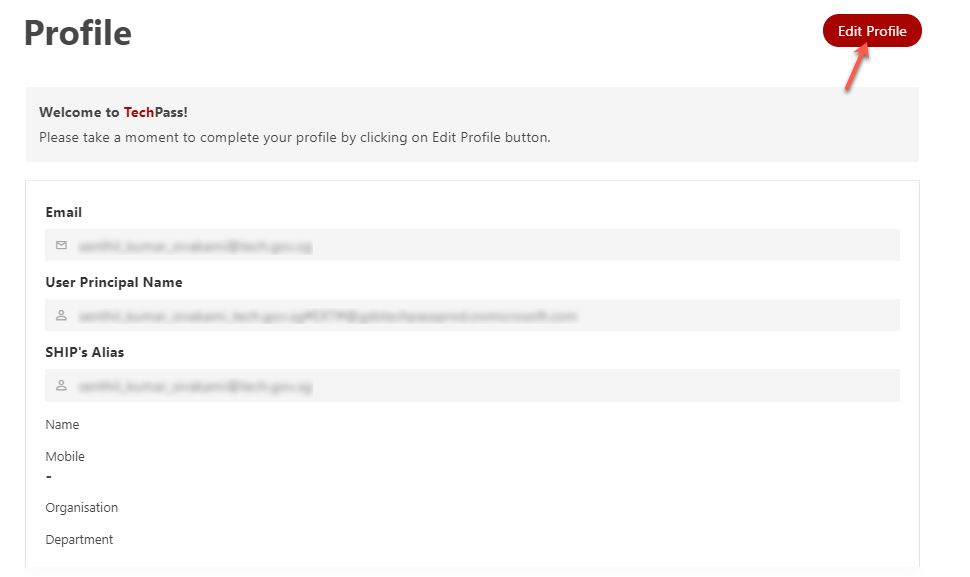

# Edit profile

Currently TechPass users can edit their TechPass profile anytime by logging into the TechPass portal using non-SE GSIB machine.

?> If you do not have a non-SE GSIB machine, create a [service request](https://go.gov.sg/techpass-sr) so that we can help you update your profile details.

_To edit your profile:_

1. From your GSIB devcie, go to [TechPass portal](https://portal.techpass.gov.sg) and click **Login with TechPass**.

<kbd></kbd>

2. Choose your TechPass account.

<kbd></kbd>

?> If you are a public officer and not logged into your WOG account, you will be prompted to log in to it first before proceeding to TechPass account.

3. You will be prompted to approve your TechPass login. Approve it on your Authenticator app.

<kbd></kbd>

4. Hover over your account name and click **My Account**.

<kbd></kbd>

5. Click **Edit Profile**.

<kbd></kbd>

6. Make the required changes and click **Save**.

<kbd></kbd>

?> Public officers cannot edit their email address.
