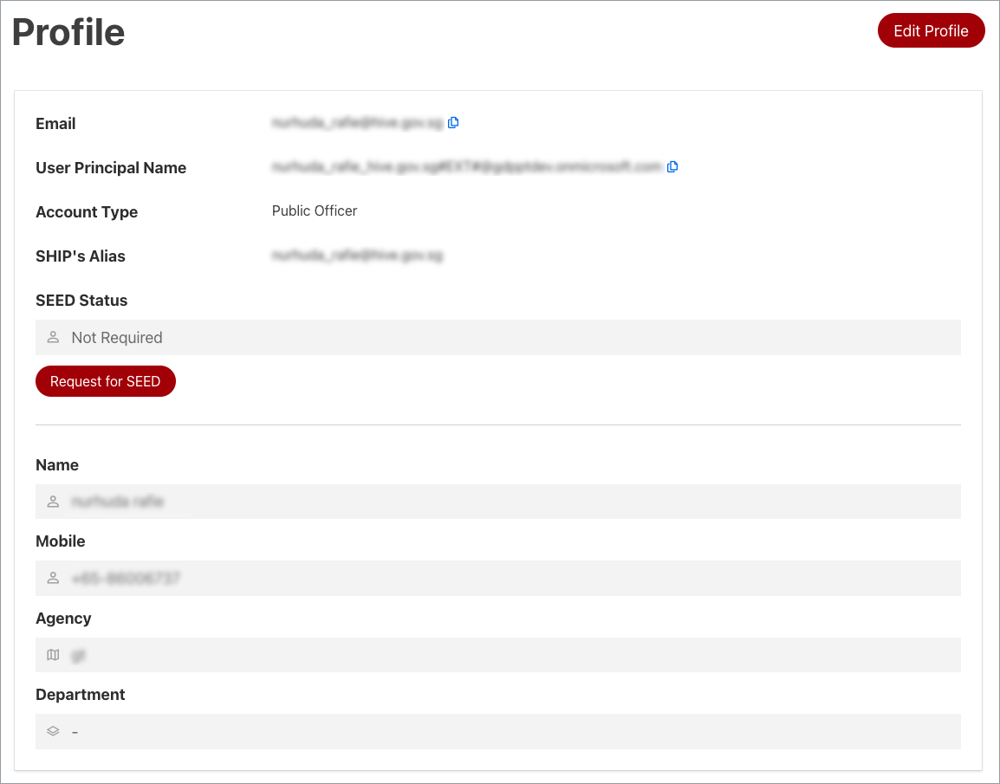
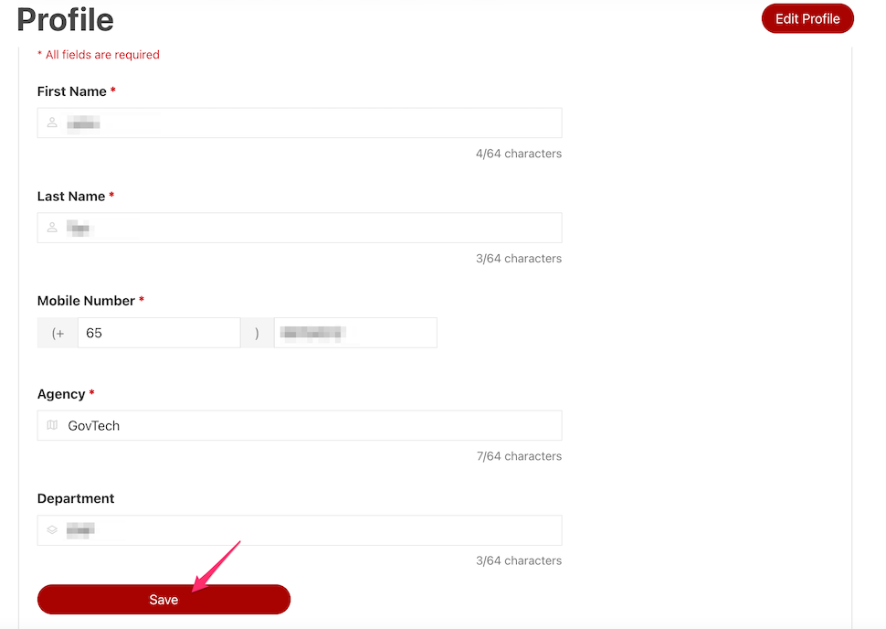
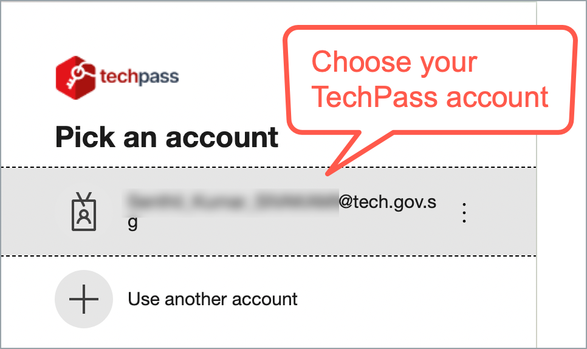
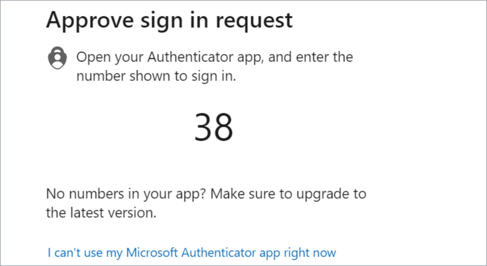

# Edit your TechPass profile

TechPass users can edit their TechPass profile anytime by logging into the TechPass portal.

?> Users who don't have access to TechPass portal, create a [service request](https://go.gov.sg/techpass-sr) with us to update your profile details.

## Audience

TechPass users who can access TechPass portal.

## Prerequisites

You need the following to edit your TechPass profile via the TechPass portal:

- An active TechPass account.
- A non-SE GSIB device.

### To edit your TechPass profile

1. From your non-SE GSIB device, log in to [TechPass portal](https://portal.techpass.gov.sg).

2. Hover over your account name and click **My Account**.

3. Click **Edit Profile**.

4. Make the required changes and click **Save**.

?> If you need to edit your email address, create a [service request](https://go.gov.sg/techpass-sr) with us.

<!--
2. Sign in to your TechPass account.
<kbd></kbd>

> **Note**
> If you are a public officer you may be prompted to log in to the WOG account first before proceeding to TechPass account.

You will now be prompted to approve your TechPass sign-in. A number will be shown on your browser.

 <kbd></kbd>

3. On the Authenticator app, enter the number shown, and tap **Yes**.
-->