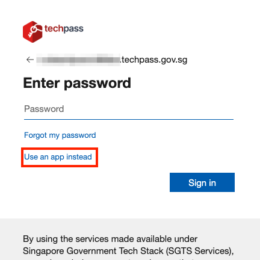

# Passwordless FAQ

This article provides additional information about passwordless sign-in.

## Audience

Users with `@techpass.gov.sg` accounts.

## Who is affected?

- **Included**: All users with **@techpass.gov.sg** accounts.
- **Excluded**:
  - Users with **WoG/MOE identities**.
  - Project product identities used for **synthetic monitoring**.
  - **Test** and **training** product identities.

## What do the affected users need to do?

**Existing `@techpass.gov.sg` users** that have setup multifactor authentication (MFA), follow the steps in [Setup Passwordless](transition-passwordless.md).

**New `@techpass.gov.sg` users** onboarding to TechPass, follow the steps in [Get invited and onboard to TechPass](get-invited-and-onboard-to-techpass.md). The steps have been updated to include passwordless sign-in setup.

## How passwordless sign-in looks like?

With passwordless sign in, after you enter or select your `@techpass.gov.sg` account, you will not be prompted for password. Instead, the Microsoft Authenticator app in your mobile phone will receive a sign-in notification for you to approve the sign-in. You may also refer to [login to TechPass using passwordless](log-in-with-techpass#authentication-for-techpassgovsg-account-using-passwordless-sign-in).

## How do I verify that I have setup passwordless sign-in properly?

To verify, follow the steps in [Verify passwordless setup](verify-passwordless).

## I have setup passwordless sign-in, but I am still being prompted for password

If you have setup passwordless sign-in but the sign-in flow still prompts for password, you may click on the "Use app instead".

It may take a few minutes for the "Use app instead" option to be available if passwordless sign-in is recently setup.

If it still does not prompt for passwordless sign-in and "Use app instead" option is not available after an hour:
1. Verify that the passwordless sign-in setup is registered by following the steps in [Verify passwordless setup](verify-passwordless)
2. Raise a [ticket](https://go.gov.sg/seed-techpass-support) with us.

## I have accounts in other TechPass environments (@stg.techpass.gov.sg, @dev.techpass.gov.sg). Will this affect me?

Yes. Passwordless will be applied to all TechPass environments.

## I am using Microsoft Authenticator with number matching push notification. Can do I need to do?

Great! You are only one step closer to use passwordless. You may follow the step in [Enable Passwordless sign-in in mobile app](transition-passwordless#step-4-enable-passwordless-sign-in-in-mobile-app). The step only needs you to enable passwordless sign-in in your mobile app.

## I am using OATH software tokens like Authy and Google authenticator apps. Can I continue using them?

Use **Microsoft Authenticator** app. Passwordless is configured only using Microsoft Authenticator. Follow the steps in [Setup Passwordless](transition-passwordless) to transition to Microsoft Authenticator. 

Authy and Google Authenticator **will not** be supported in the future. Raise a [ticket](https://go.gov.sg/seed-techpass-support) with us if there are special circumstances where you cannot bring your mobile device into your work premises.

## When do I need to transition from Authy or Google authenticator apps to use Microsoft Authenticator passwordless sign-in?

There is no deadline determined yet the use of Software OATH like Authy and Google authenticator apps. However, they will not be supported in the future. We strongly recommend to start using **Microsoft Authenticator** app with passwordless sign-in. 

## What are the supported authenticator?

Only the **Microsoft Authenticator** app is supported for passwordless sign-in. Other authenticators and passkeys are not supported. Raise a [ticket](https://go.gov.sg/seed-techpass-support) with us if there are special circumstances where you cannot bring your mobile device into your work premises.

## If you change, lose, or damage your phone

If you change to a new phone and still have access to the old phone with Microsoft Authenticator:
1. Install Microsoft Authenticator in your new phone.
2. Follow the steps in [Setup Passwordless](transition-passwordless) to setup passwordless sign-in in your new phone.
3. After you have verified that you can use passwordless sign-in using the new phone, you can remove the Microsoft Authenticator linked to your old phone by following the steps in [Delete an unused sign-in method](transition-passwordless#step-8-optional-delete-an-unused-sign-in-method).

If you do not have access to your Microsoft Authenticator in your old phone anymore, you can regain access using Temporary Access Pass (TAP). Follow the steps in .........

