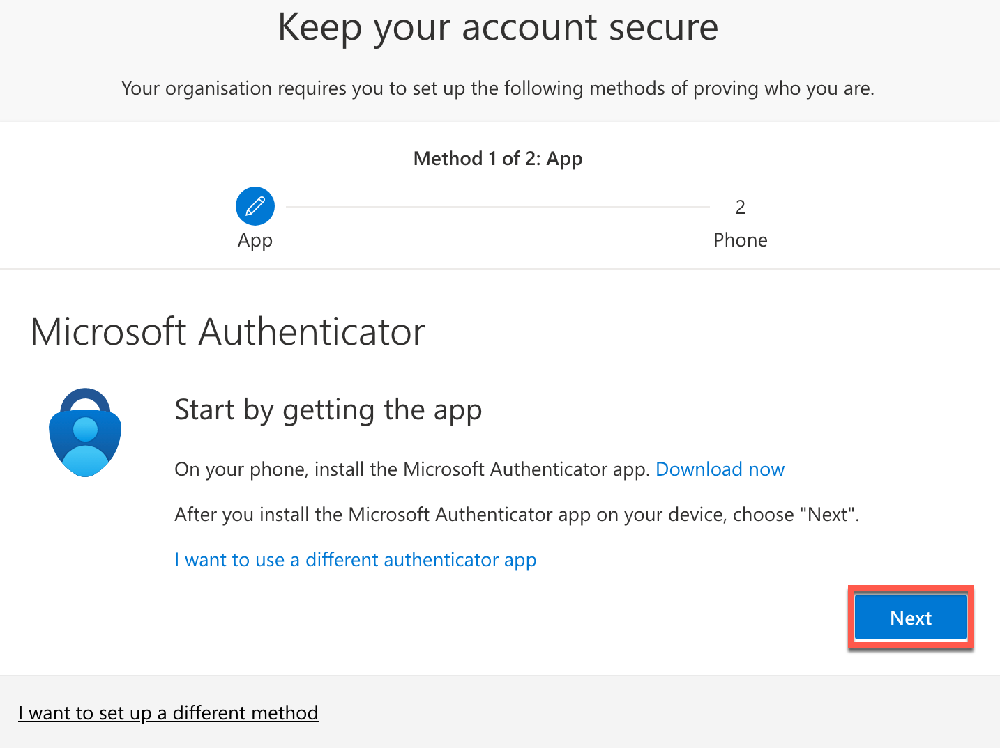
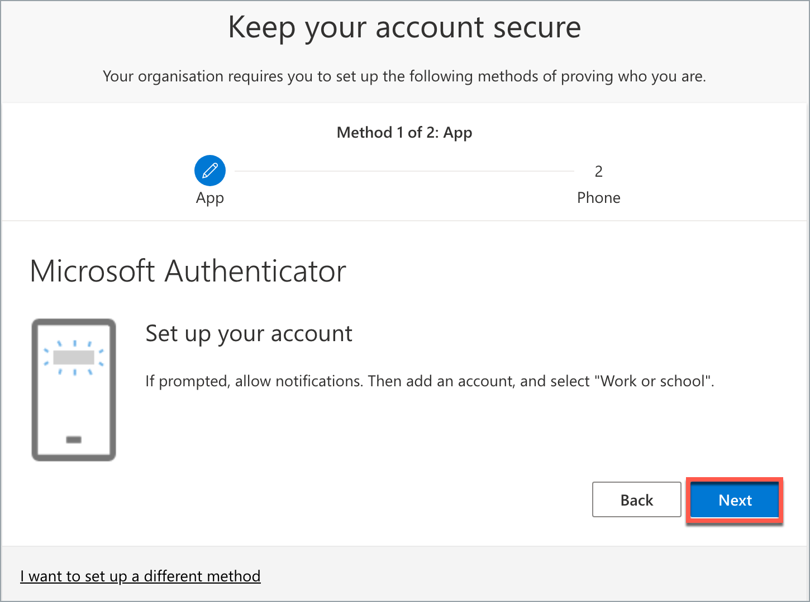
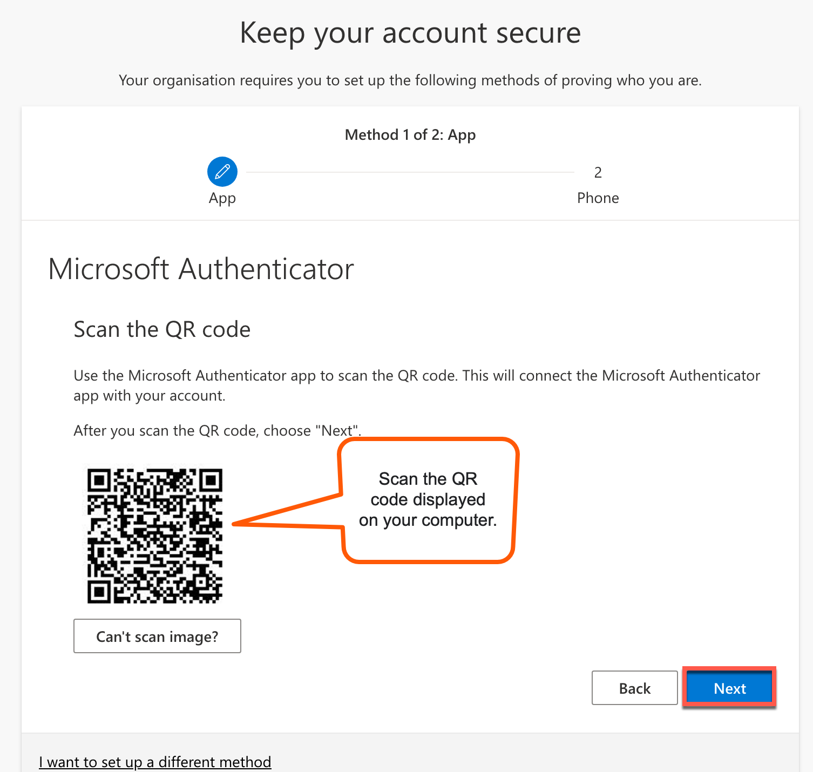
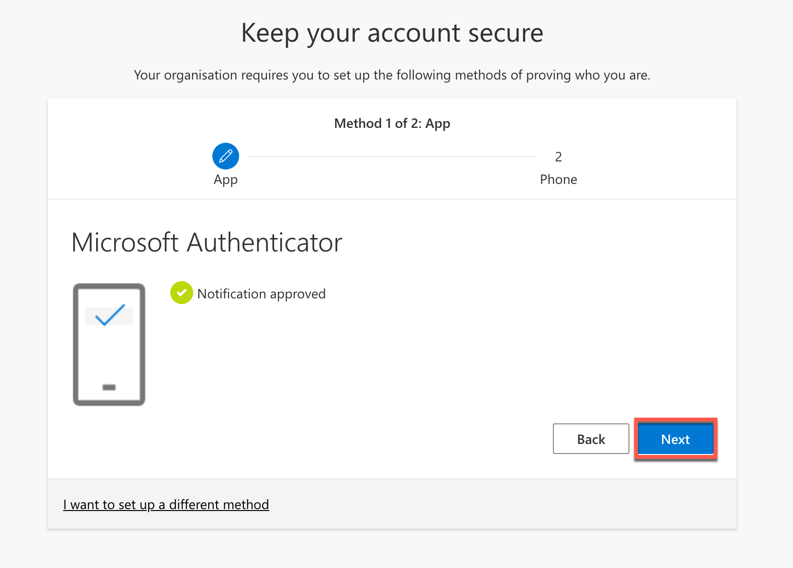
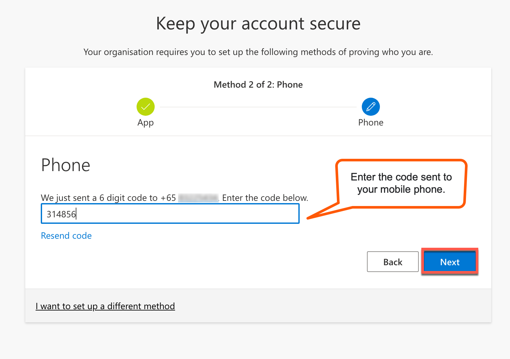
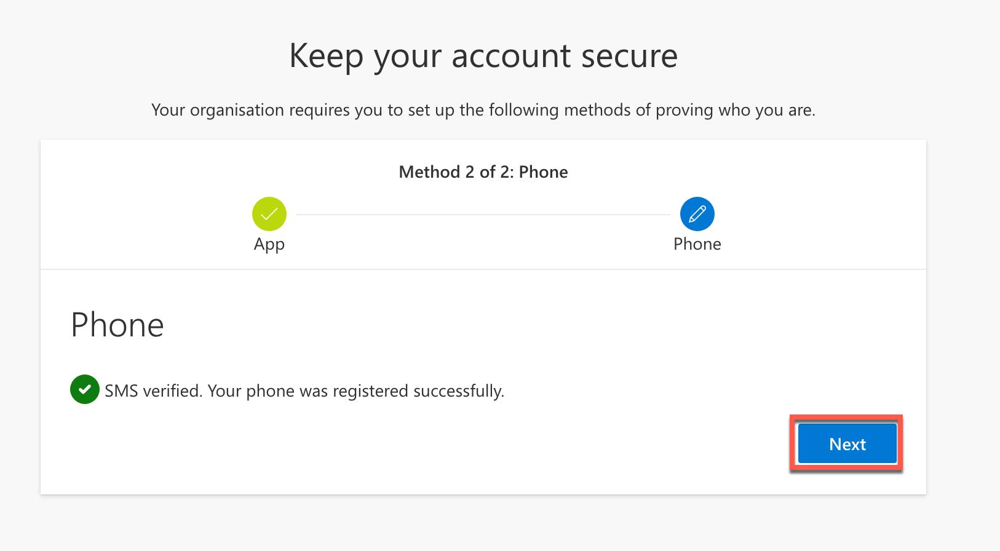
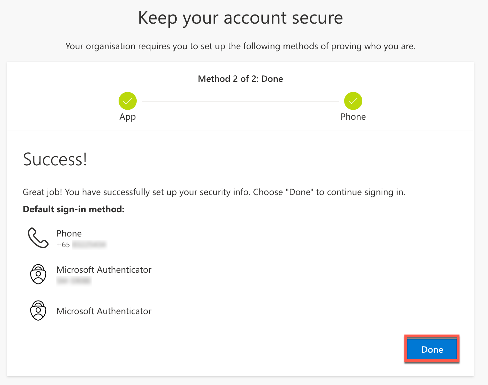

# Get invited and onboard to TechPass

This article guides you how to request for a TechPass account and onboard to it. 

?>- Alternatively, public officers with a non-SE GSIB device can access the [**TechBiz Portal**](https://portal.techbiz.suite.gov.sg) to request for TechPass and SEED provisioning, which is optional. <br>- For more information, see [**TechBiz documentation**](https://docs.developer.tech.gov.sg/docs/techbiz-documentation/).


## Audience

Users who require a TechPass account but do not have a WOG account or a non-SE GSIB device.

## Prerequisites

You need the following to get invited to TechPass and complete the onboarding:

- Check the flowchart on the [Onboard to TechPass](onboard-to-techpass) page to see if you're eligible to sign up via the Portal. If you can't sign up for TechPass account via TechPass Portal, you need to request to get invited.
- Your organisational email address which has a standard mailbox and not a LiteMail.  
- Before you onboard, ensure you have received the TechPass onboarding email and is still valid.

?>- TechPass does not support email accounts which does not have an inbox. For example, LiteMail accounts. If you use such an email account, upgrade it to a standard mailbox before requesting for TechPass.<br>- If you do not see the TechPass onboarding email in your inbox, please check your Junk Email, Deleted Items or Archive folder.<br>- The onboarding email is valid for 30 days. If you do not onboard to TechPass within this 30 days, we will terminate your TechPass account, and you need to sign up again.


## Step 1: Request for TechPass account

1. Contact your project manager or the reporting officer to request for the provisioning of TechPass and SEED (optional for onshore users, mandatory for offshore users).

   !> To access services such as SGTS and GCC 2.0 resources through an Internet Device, you need to onboard that device to SEED.

2. Project manager or the reporting officer contacts the sponsoring agency or the tenant admin to invite you to TechPass.

3. If the invitation is successful, you will receive an email notification containing a link to complete your registration

## Step 2: Complete the registration
1. Open the registration link sent to your email and fill in the form to complete the registration. 
2. The following information are required:
    - Username
    - First Name
    - Last Name
    - Mobile Number
    - Department
    - *Offshore Reporting Officer Name & Email
    - *Offshore Company Address
    
    **only applicable to offshore users who do not belong to an Offshore Development Centre (ODC).*
  
> **If your request for TechPass provisioning is successful**:
>
>- A TechPass account is provisioned for you and is in pending state.
>- We'll send the TechPass onboarding email with your TechPass account or log in ID. 
>- You need to activate the account within 30 days. 
>- Your TechPass log in ID's domain is ```techpass.gov.sg```.
>- We'll send the initial password by SMS to the registered mobile number.
>
> **If your request for SEED provisioning is successful**:
>
>- We'll send the SEED onboarding email immediately.
>- This email is valid only for 30 days.
>- Ensure that you have activated your TechPass account before proceeding to onboard your Internet Device to SEED.
>- If your SEED onboarding email has expired, create a [service request with TechPass](https://go.gov.sg/seed-techpass-support) to receive the SEED onboarding invitation email again. For more information, see [SEED FAQs](https://docs.developer.tech.gov.sg/docs/security-suite-for-engineering-endpoint-devices/faqs/seed-faq-general).


> Failure to register within **5 days** invalidates the link and will require a new invitation.

## Step 2: Sign in using your initial password

1. Go to the required Docs portal environment and click **Login**.

    - [Docs portal - staging environment](https://stg.docs.developer.tech.gov.sg/)
    - [Docs portal - production environment](https://docs.developer.tech.gov.sg/)
2. Enter your TechPass username and click **Next**.

   
3. Enter the initial password and click **Sign in**.

   
4. Click **Next** to configure MFA for your TechPass account. 

   


## Step 3: Configure Multi-Factor Authentication (MFA) for TechPass account

?> This section guides you to configure Microsoft Authenticator as your MFA. We recommend Microsoft Authenticator for the following reasons:<br>- It supports **Number Matching** to protect you from MFA Fatigue attacks and increases the security of your account.<br>- Microsoft constantly improves its MFA security policies to protect its users.


  1. Install Microsoft Authenticator on your mobile phone.

  2. Click **Next** on your computer. 

    

  3. On your mobile phone, open Microsoft **Authenticator** and select **+ Add account** > **Work or School account**.
  4. Select **Scan a QR code**.
  5. Go back to your computer and click **Next**.

    

  6. Scan the QR code on your computer screen and click **Next**. Your TechPass account gets activated and linked to the Authenticator app.

     

   A number is shown on your browser.
   
    

  7. On the Authenticator app, enter the number shown, and select **Yes** to authenticate your sign-in. 
   
    

  8. On your computer, click **Next**.
  9. Choose the country code, enter your phone number and click **Next**.
  
    

  10. Enter the six-digit code sent to your mobile phone through text message and click **Next**.

    

  11. Your mobile phone is registered successfully to this account. Click **Next**.

    

  12. When you see a success message, click **Done**. Now you are prompted to reset your initial password.

    

## Step 4: Reset your initial password

 1. Enter your **initial password**, **new password** and retype the new password to confirm.

  2. Click **Sign in** to proceed to accept the Terms of Use.

  


## Step 5: Accept the terms and conditions

1. Read the **Privacy Policy** and click **Accept**.
2. Read the **Terms of Use** and click **Accept**. You have successfully onboarded to TechPass.
3. If you had requested for SEED provisioning and is successfully provisioned to you, read the **MDM AUP Policy** and click **Accept**.

  ?>- Upon accepting the terms and conditions, you are successfully onboarded to TechPass.<br>- If you had requested for SEED to be provisioned, you may proceed to onboard your Internet Device to SEED.<br>- Before you onboard your Internet Device to SEED, see[Prerequisites for onboarding your device to SEED](https://docs.developer.tech.gov.sg/docs/security-suite-for-engineering-endpoint-devices/#/prerequisites-for-onboarding).

### Next step

- [Verify TechPass login](log-in-with-techpass#log-in-to-a-service-using-your-techpass-account)


