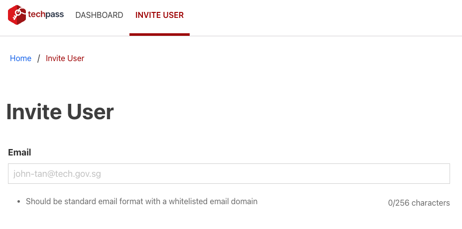
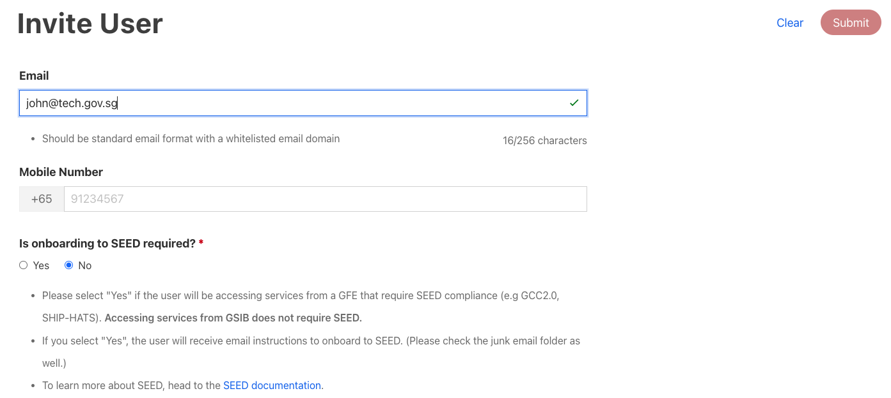
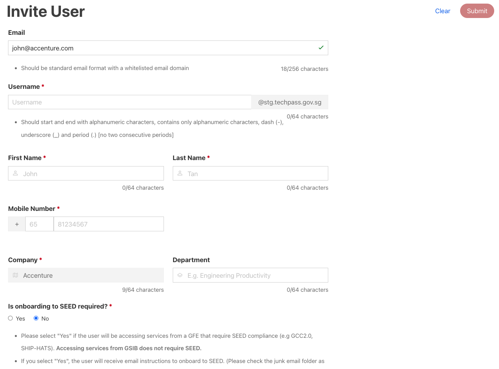

# Invite user

?>This feature is only available to a TechPass user who is a Public Officer.

This article guides how a **Public Officer** can invite a user to TechPass.

## Audience

TechPass users who are Public Officers.

## Prerequisites

You need the following to invite user via the TechPass Portal:

- An active TechPass account.
- A non-SE GSIB or GMD device.

### To invite a user

1. Using your non-SE GSIB or GMD device, go to [TechPass Portal](https://portal.techpass.gov.sg) and click **Login with TechPass**.

2. Sign in to your TechPass account.

3. Click **Invite User** on the top navigation bar to provision an account.

4. Enter the user's email address to display the appropriate onboarding form based on whether the email address is associated with an integrated identity provider (e.g. WoG, MoE) account.

5. For integrated identity provider accounts, provide the Mobile Number and indicate whether SEED is required (only applicable for WoG accounts).

6. For non-integrated identity provider accounts, provide the following information: 
  - Username
  - First Name
  - Last Name
  - Mobile Number
  - Department
  - whether SEED is required

!> **Note**: Email, username and mobile number must be unique.

7. Fill in the required information and click **Submit**.

> The invited user will receive an onboarding invitation email and if it's a non-integrated identity provider account, they will also receive the initial password by SMS.
