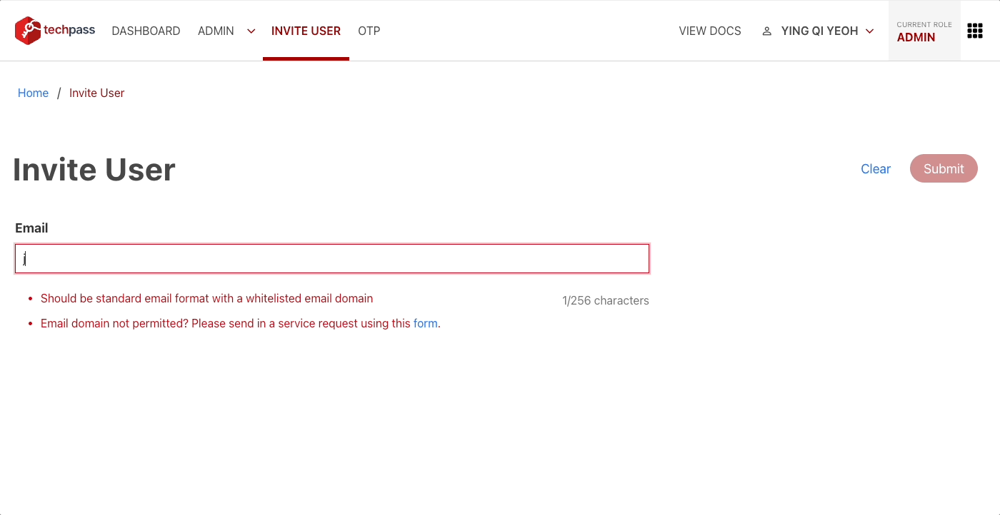

# Invite user

?>This feature is only available to a TechPass user who is a Public Officer.

This article guides how a **Public Officer** can invite a user to TechPass.

## Audience

TechPass users who are Public Officers.

## Prerequisites

You need the following to invite user via the TechPass Portal:

- An active TechPass account.
- A non-SE GSIB or GMD device.

### To invite a user

1. Using your non-SE GSIB or GMD device, go to [TechPass Portal](https://portal.techpass.gov.sg) and click **Login with TechPass**.

2. Sign in to your TechPass account.

3. Click **Invite User** on the top navigation bar to provision an account.

4. Enter the user's email address to display the appropriate onboarding form based on whether the email address is associated with an integrated identity provider (e.g. WoG, MoE) account.

5. For integrated identity provider accounts, provide the Mobile Number and indicate whether SEED is required (only applicable for WoG accounts).

6. For non-integrated identity provider accounts, provide the following information: 
    - *Sponsoring Agency (the agency that the user is attached to)
    - *Business Operation (*onshore/offshore*)
    - *Offshore Development Centre (ODC) - only applicable to *offshore* users; if the user does not belong to any of the listed ODCs, select *Others* & fill in the Offshore Company Name.
    - Whether SEED is required (For *offshore* users, SEED is mandatory and will be automatically indicated as 'Yes')
  
      **not applicable to Public Officers with non-WOG email domains listed in Q3 of the [onboarding flow chart](/onboard-to-techpass)*

      

7. Fill in the required information and click **Submit**.

> **Upon successful invitation:**
  > - for integrated identity provider account:
    >   - the **user account has been created**
    >   - the invited user will receive an onboarding invitation email
  >
  >
  > - for non-integrated identity provider account:
    >   - the **user account has not yet been created**; the invited user will receive a registration link via email to complete the [registration](/get-invited-and-onboard-to-techpass?id=step-2-complete-the-registration)
    >   - the **registration** must be completed within 5 days, after which the link will expire, requiring a new invitation to be sent.
    >   - the user account will be created upon successful registration
    >   - you will be notified via email whether the user successfully completes the registration or fails to register within the allotted time.
    >   - if you need to correct some of the invitation details after it has been sent, you may do so by sending a new invitation (the new invitation will override the old one), provided the user has not completed their registration; if the user has already completed the registration, you will need to raise a [service request](https://go.gov.sg/seed-techpass-support) for us to update the details on your behalf.