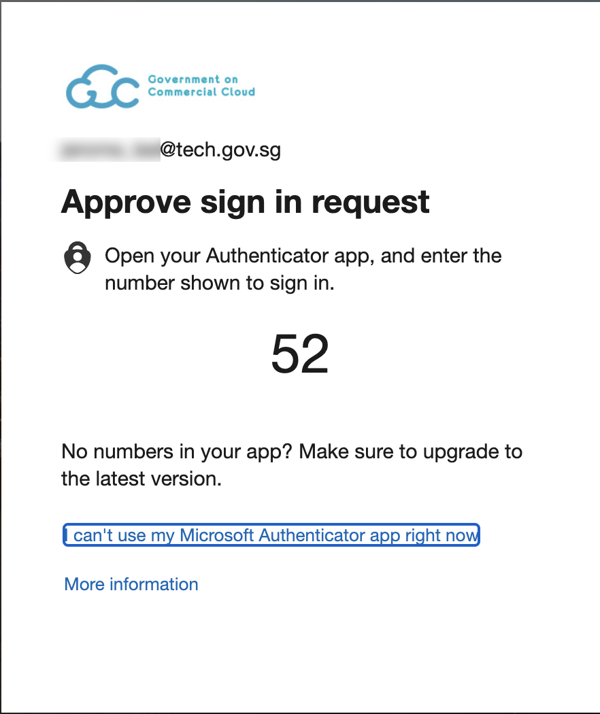

# Log in as public officer

Public officer can log in to TechPass using your non-SE GSIB device or your Government Managed Device (GMD).

**To log in with a non-SE GSIB device**

1. Go to the [Docs portal](https://docs.developer.tech.gov.sg/) and click **Log in**.

<kbd></kbd>

2. Click **Log in with TechPass**.

<kbd></kbd>

3. Sign in to your TechPass account or choose your TechPass account.

<kbd></kbd>

4. You will be prompted to authenticate your WOG account. A number will be shown on your browser.

<kbd></kbd>

You are now successfully logged in with TechPass.

<kbd></kbd>

?> To log out of TechPass, click **Log Out** and confirm which account you would like to log out.

**To log in with a GMD device**

1. Go to the [Docs portal](https://docs.developer.tech.gov.sg/) and click **Log in**.

<kbd></kbd>

2. Click **Log in with TechPass**.

<kbd></kbd>

3. Sign in to your TechPass account or choose your TechPass account.

<kbd></kbd>

4. You will be prompted to authenticate your WOG account. Enter the verification code displayed for your SG Govt M365 profile on your Authenticator app.
 
<kbd></kbd>

5. You will now be prompted to approve your WOG sign-in. A number will be shown on your browser.

<kbd></kbd>

You are now successfully logged in with TechPass.

<kbd></kbd>

?> To log out of TechPass, click **Log Out** and confirm which account you would like to log out.