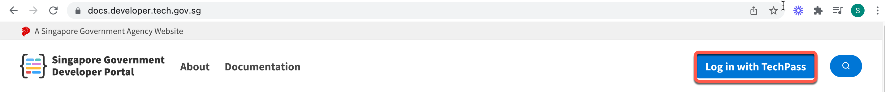
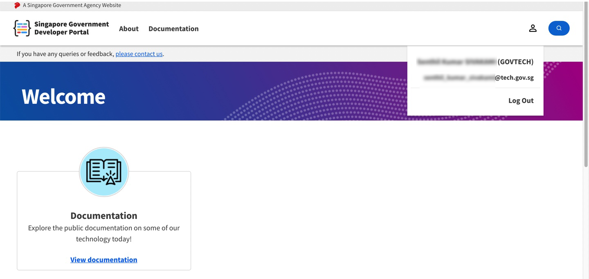

# Log in as public officer

1. Go to the [Docs portal](https://docs.developer.tech.gov.sg/) and click **Log in with TechPass**.
<kbd></kbd>
2. Sign in to your TechPass account or choose your TechPass account.
<kbd></kbd>

If you are signing in from your GMD, you will be prompted to authenticate your WOG account.

3. Enter the verification code displayed for your SG Govt M365 profile on your Authenticator app.

<kbd>-->

You will now be prompted to approve your TechPass sign-in. A number will be shown on your browser.

 <kbd></kbd>

4. On the Authenticator app, enter the number shown, and tap **Yes** to authenticate this sign-in.

You are now successfully logged in with TechPass.

<kbd></kbd>

?> To log out of TechPass, click **Log Out** and confirm which account you would like to log out.
