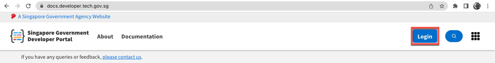

# Log in as vendor

1. Go to the [Docs portal](https://docs.developer.tech.gov.sg/) and click **Login**.

<kbd></kbd>

2. Sign in to your TechPass account or choose your TechPass account.
<kbd></kbd>

3. Enter your TechPass password.

<kbd></kbd>

<!--4. Choose an authenticating method.
<kbd></kbd>-->

You are prompted to approve your TechPass sign-in. A number is shown on your browser.

 <kbd></kbd>

4. On the Authenticator app, enter the number shown, and select **Yes**.

