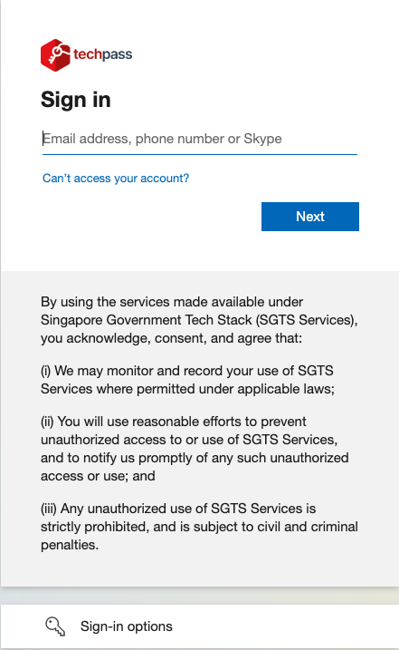
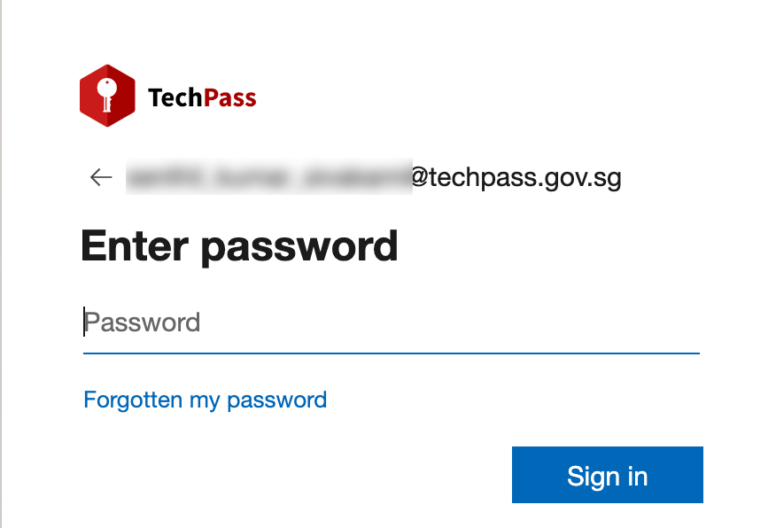
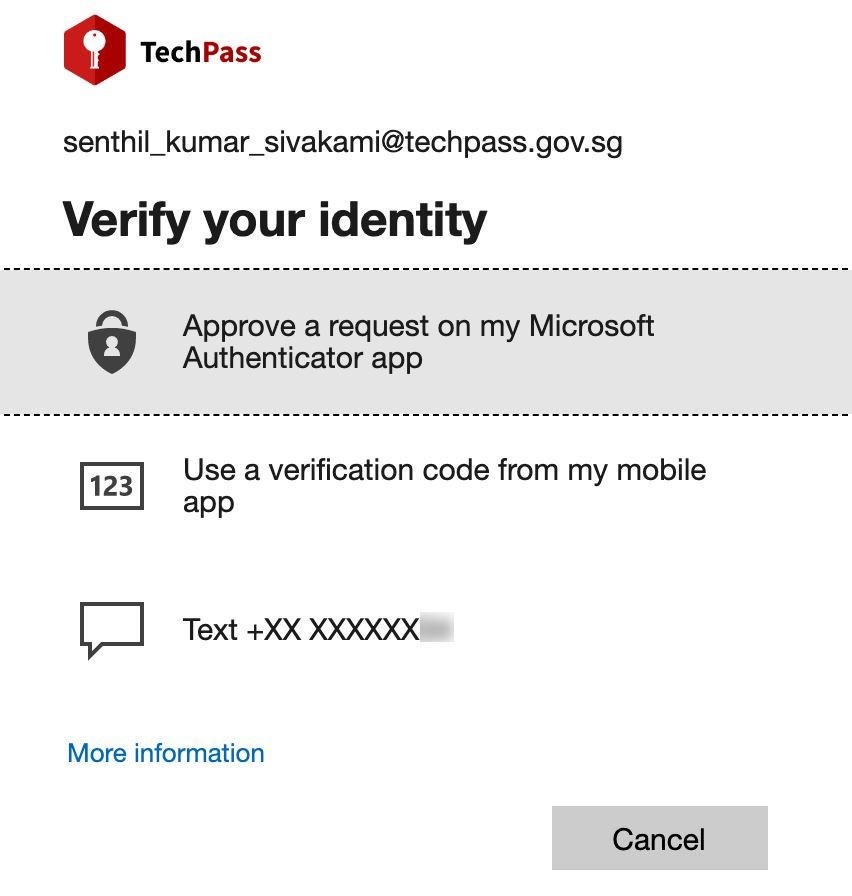

# Log in as vendor

1. Go to the [Docs portal](https://docs.developer.tech.gov.sg/) and click **Log in with TechPass**.
<kbd></kbd>

2.  Sign in to your TechPass account or choose your TechPass account.
<kbd></kbd>

3.  Enter your TechPass password.

<kbd></kbd>

<!--4. Choose an authenticating method.
<kbd></kbd>-->

You will now be prompted to approve your TechPass sign-in. A number is shown on your browser.

 <kbd></kbd>

4. On the Authenticator app, enter the number shown, and tap **Yes**.

?> To log out of TechPass, click **Log Out** and confirm which account you would like to log out.
