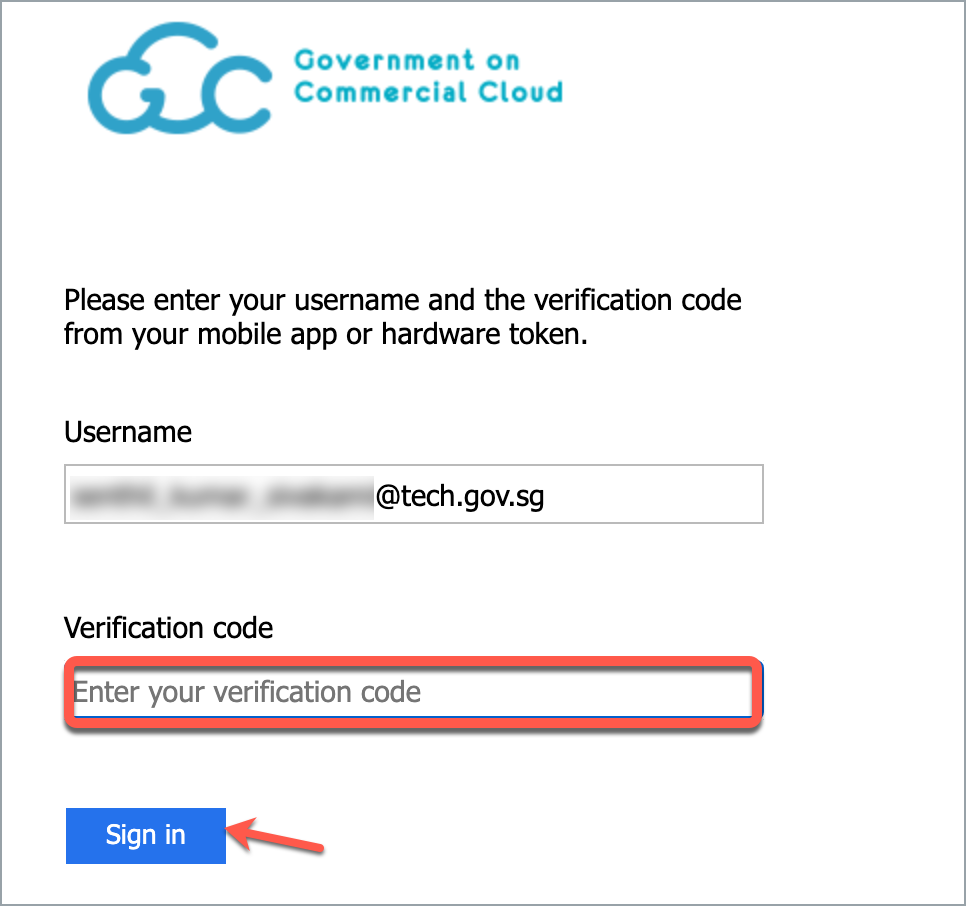

# Log in with TechPass

This article tells you how to:
 
 - [Log in to a service using your TechPass account](#log-in-to-a-service-using-your-techpass-account).
 - [Log in to TechPass portal](#log-in-to-techpass-portal).

## Log in to a service using your TechPass account

This section guides you how to access services and products which use TechPass as their IAM.

1. Go to the portal or home page of the required service. 
2. Click **Login with TechPass**.
3. Sign in to your TechPass account or choose the required TechPass account.

<kbd></kbd>

If you are signing in from your GMD, you will be prompted to authenticate your WOG account first.

4. Enter the verification code displayed for your SG Govt M365 profile on your Authenticator app and click **Sign in**.

<kbd></kbd>

You will now be prompted to approve your TechPass sign-in. A number will be shown on your browser.

<kbd></kbd>

5. On the Authenticator app, enter the number shown, and select **Yes** to authenticate this sign-in.

You have now successfully logged in to the service using your TechPass account.

## Log in to TechPass portal

TechPass users who have a non-SE GSIB device can log in to TechPass portal. 

**To access TechPass portal**

1. From your non-SE GSIB device, go to the [TechPass portal](http://portal.techpass.gov.sg/).
2. Click **Login with TechPass**.
3. Sign in to your TechPass account or choose the required TechPass account.

<kbd></kbd>
4. You will now be prompted to approve your TechPass sign-in. A number will be shown on your browser.

<kbd></kbd>

5. On the Authenticator app, enter the number shown, and select **Yes** to authenticate this sign-in.

 You have now successfully logged in to the TechPass portal.

