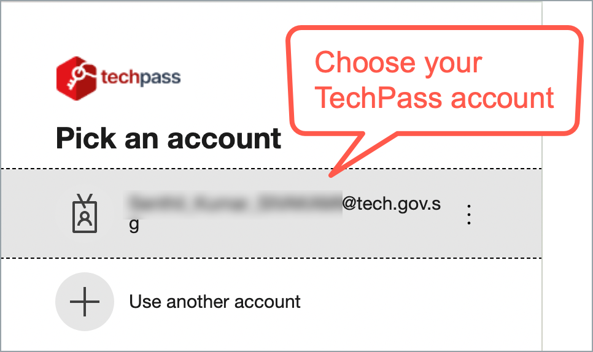
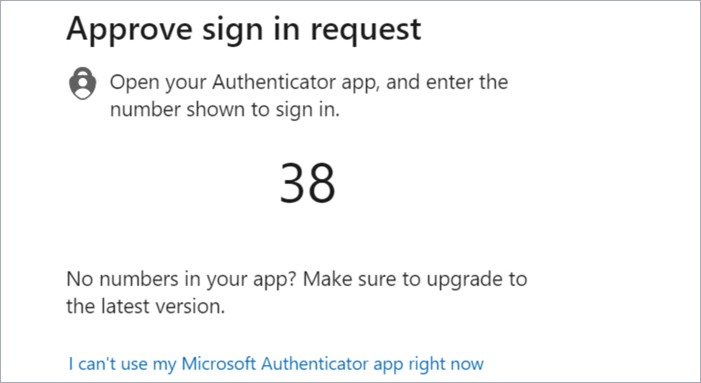

# Log in with TechPass

This article tells you how to sign-in to a service using TechPass account.
 
## Log in to a service using your TechPass account

1. Go to the Portal or home page of the required service. Some of the services using TechPass:
   - [TechPass Portal](https://portal.techpass.gov.sg/) (accessible using non-SE GSIB, Comet or GMD)
   - [Console (TechBiz, StackOps, SHIP-HATS)](https://console.developer.tech.gov.sg/) (accessible using non-SE GSIB, Comet or GMD)
   - [Documentation Portal](https://docs.developer.tech.gov.sg/docs) (accessible using any device)
   - [GCC CMP](https://cmp.gcc.gov.sg/) (accessible using non-SE GSIB, Comet or GMD)
   - [SEED Dashboard](https://dashboard.seed.tech.gov.sg/) (accessible using non-SE GSIB, Comet or GMD)

2. Click **Login with TechPass**.
3. Choose the required TechPass account.

   

4. You may be asked to provide other authentication method:
   - If you have a **WOG account** and logging in via your GMD, refer to [Authentication for WOG account via GMD](#authentication-for-wog-account-via-gmd)
   - If you have a **@techpass account**, refer to 
     - [Using passwordless sign-in](#authentication-for-techpassgovsg-account-using-passwordless-sign-in)
     - [Using password and authenticator push notification](#authentication-for-techpassgovsg-account-using-password-and-microsoft-authenticator-push-notification)

## Authentication for WOG account via GMD

?> If you have setup passwordless sign-in for your WOG account, proceed to step 3.

1. Enter the verification code displayed for your SG Govt M365 profile on your Authenticator app.

2. Click **Sign in**.

3. You are prompted to authenticate your sign-in. A number is shown on your browser.

   

4. On the Authenticator app, enter the number shown on your browser.

5. Select **Yes** or **Done** on the app.

   You have successfully logged in to the service using your TechPass account.

## Authentication for @techpass.gov.sg account using passwordless sign-in

?> If you have **@techpass.gov.sg** account and have not set up passwordless sign-in, refer to: [Enable passwordless sign-in](get-invited-and-onboard-to-techpass#step-7-enable-passwordless-sign-in-in-mobile-app)

1. If you have setup passwordless sign-in but the sign-in flow still prompts for password, you may click on the "Use app instead"
  
  
  
  ?> If passwordless sign-in has just been recently setup, it may take a few minutes for the "Use app instead" option to be available.

2. You are prompted to approve your sign-in. A number is shown on your browser.

  

3. On the Authenticator app, enter the number shown.

4. Select **Yes** or **Done** on the app.

   You have successfully logged in to the TechPass Portal.

## Authentication for @techpass.gov.sg account using password and Microsoft Authenticator push notification

1. Enter the password of your TechPass account and click **Sign in**. For example, if your TechPass ID is john_doe@techpass.gov.sg, you need to enter your TechPass password.

2. You are prompted to authenticate your sign-in. A number is shown on your browser.

   

3. On the Authenticator app, enter the number shown on your browser.

4. Select **Yes** or **Done** on the app.

   You have successfully logged in to the service using your TechPass account.

