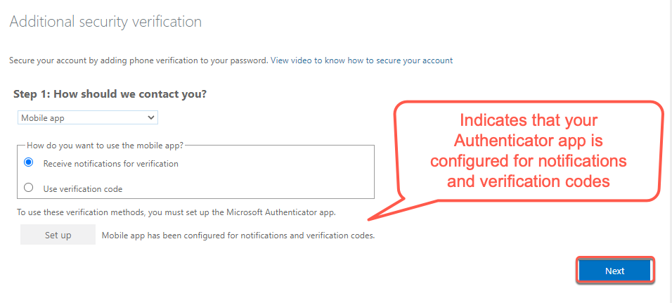

# Set up security verification for Whole of Government (WOG) account

We know that public officers can use their TechPass account to access Singapore Tech Stack (SGTS) services and tools. However, if public officers want to access SGTS services and tools from their Government Managed Device (GMD) using TechPass, they must first set up security verification for their WOG account. This adds an additional level of security layer when they access these resources from their GMD.

To achieve this, public officers set up a multi-factor authentication (MFA) for their WOG account using their Government Standard Imaging Build (GSIB) device.

This article guides public officers to set up security verification for their WOG account.

_To manage security verification for WOG account:_

1. In the GSIB device, go to [Azure Active Directory](https://account.activedirectory.windowsazure.com/proofup.aspx).

?> If you are prompted to sign in, use your organisation email address and GSIB device password.

2. Select **Mobile app** as the preferred authenticating method, and we strongly recommend you to choose **Receive notifications for verification**.

?> This is because as a public officer you may use your WOG account for many other government services and to ease the MFA process for them, we recommend you to choose **Receive notifications for verification**.

3. Click **Set up**.
<kbd></kbd>
4. Follow the on-screen instructions displayed on the **Configure mobile app** page.
<kbd></kbd>
Once you scan the QR code displayed on your computer screen, your WOG account will be listed on the authenticator app and when you click **Next** your activation status is confirmed.

5. In the **Additional security verification** page, click **Next**.
<kbd></kbd>
6. To verify that you are reachable on your mobile device, a notification is sent to your mobile app. Approve sign-in on the **Authenticator** app.
7. Click **Done**.
<kbd></kbd>
8. Your **Profile** page is displayed.
<kbd></kbd>

Now you can access STGS services and tools from your GMD.
