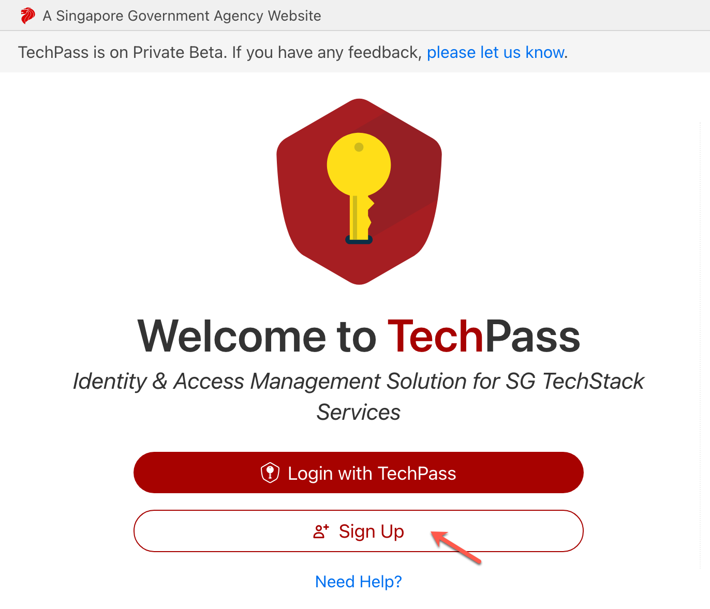
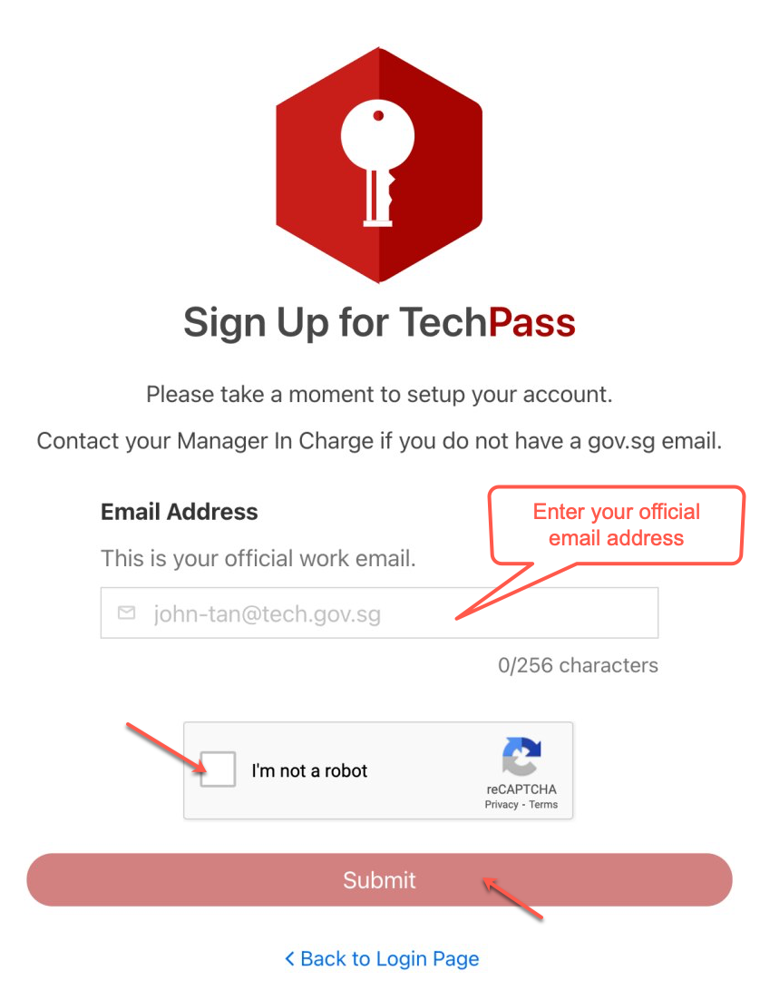
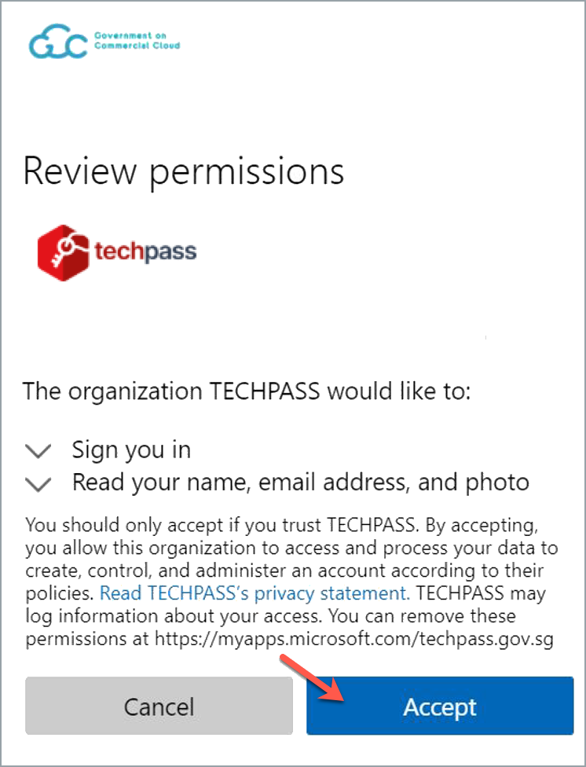
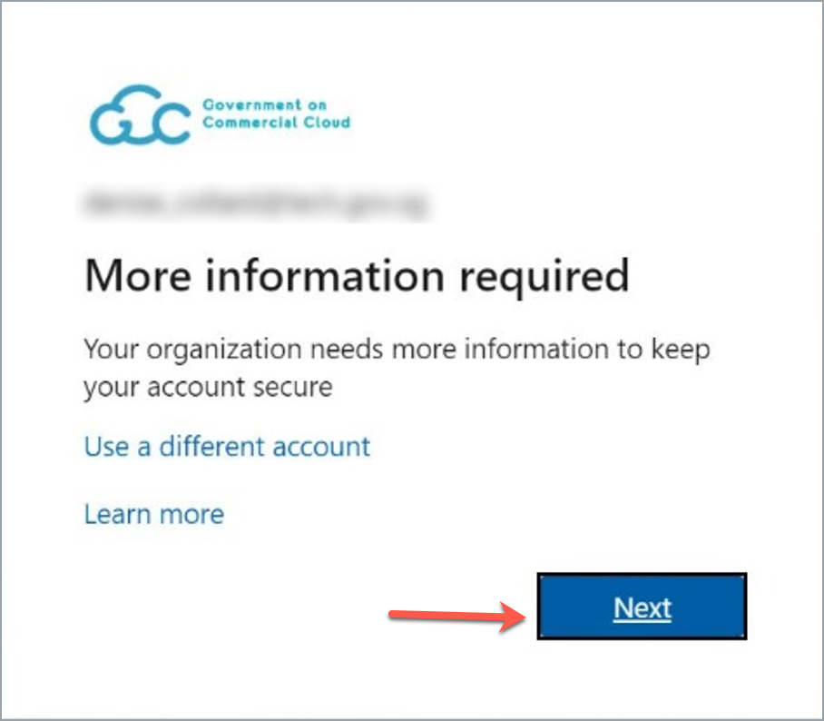
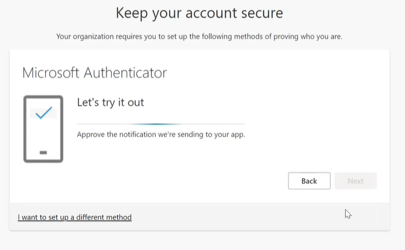

# Onboarding Public Officers

This article guides public officers to sign up for TechPass account and to onboard to it using their non-SE, GSIB machine.

While public officers create their TechPass using non-SE GSIB machine, they can use their TechPass account to access Singapore Tech Stack(SGTS) products and services from GSIB and non-GSIB machines.

**Overview**

Following are the steps involved in your TechPass onboarding journey.

  
a. Sign Up for TechPass
 

  Public officers sign up for their TechPass account using their organisational email address. An invitation link will be sent to this email address for them to accept.

  _To get a TechPass invitation link:_

  1. Go to [TechPass portal](http://portal.techpass.gov.sg/public/home) and click **Sign Up**.

  

  2. Enter your organisational email address and select **I'm not a robot**.

  ?> Format of your organisational email address shall be _your_name@agency.gov.sg_ or _your_name@tech.gov.sg_

  

  3. Click **Submit**. An invitation will be sent to this email address.

  
b. Accept invitation
 

  Once the invitation link is received, the public officer  accepts it to onboard in to TechPass.

  _To accept TechPass invitation:_

  1. Search for the email with the invitation link in your inbox.

  ?> If you do not see the email in your inbox, check if it is the same email address you provided during sign up. If a spam filter or email rule moved the email, it might be in your other folders, Junk Email, Deleted Items or Archive folder.

  2. Click **Accept invitation** and proceed with [Onboarding  to TechPass](#onboard-to-techpass).

  

  
c. Onboard to TechPass
 
  Now that you have [Signed up for TechPass](#sign-up-for-techpass) and [accepted the invitation](#accept-invitation), you may proceed with the onboarding.

  _To onboard in to your TechPass account:_

  1. Once you accept the invitation, you will be directed to **Review Permissions**. Click **Accept**.

  

  2. Click **Log in with TechPass**.

  

  3. Click **Next**.

  

  By default, your organisational email address will be displayed as username.

  4. Set up an authentication method by choosing one of the following:

  - If you do not have Microsoft Authenticator app(recommended) on your mobile phone, download and install it on your [Microsoft phone](https://www.microsoft.com/en-sg/store/apps/windows-phone), [Android](https://play.google.com/store/apps?hl=en&amp;gl=US) or [iOS phone](https://www.apple.com/app-store/).
  - If you want to use other authenticators, click **I want to use a different authenticator app.**
  - Click **I want to setup a different method.**

  Note: while we recommend Microsoft Authenticator, you can choose any other authenticator app. When you use other authenticators, you may have to enter an OTP to approve your sign in whereas in Microsoft authenticator, you just need to tap **Approve** on your mobile phone.

  As we recommend Microsoft Authenticator, this article guides you to set up multi-factor authentication for your TechPass account using that. For other authenticators, refer to the respective help resources.

  

  5. Click **Next**.
  6. In your mobile device, open Microsoft **Authenticator**.
  7. Tap on **+ Add account**.
  8. Choose **Work or School account**.
  9. Click **Next.**

  

  10. Scan the QR code displayed on your computer screen. Your TechPass account is now activated and added to the authenticator app.
  11. Click **Next**.

  

  

  On your Authenticator app, there will be a prompt to approve the sign-in.

  12. Tap **APPROVE** on your mobile device.
  13. On your computer, you will see that you have approved your sign-in. Now, click **Next**.

  

  14. Click **Done**.

  

  You will now be directed to the Terms of Use page.

  15. Click the arrow to view the **TechPass Terms of Use**.

  

  16. Read the TechPass **Terms of Use** and click **Accept**.

  

  17. Click the arrow to view the **TechPass Privacy Policy**.

  

  18. Read the TechPass **Privacy Policy** and click **Accept** before you proceed to set up the TechPass multi-factor authenticating (MFA) method.

  

  You have now successfully onboarded to TechPass.

