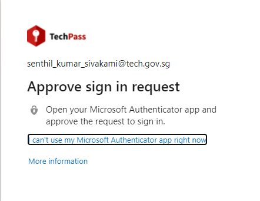
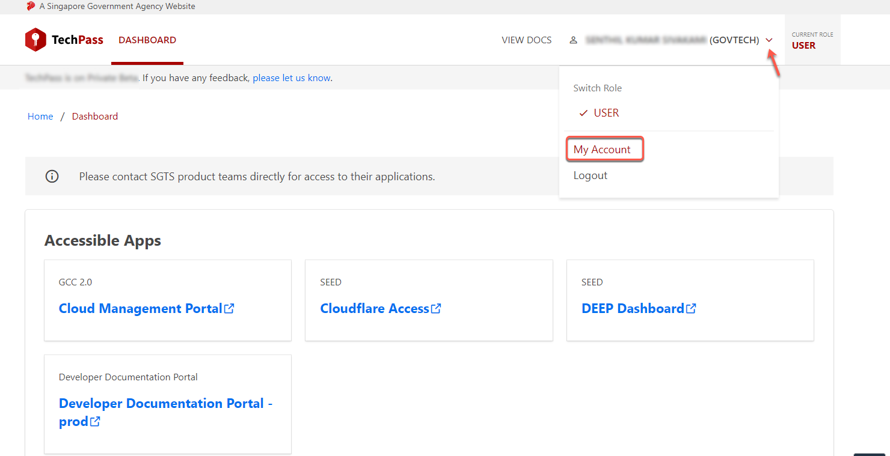
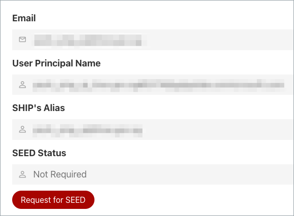
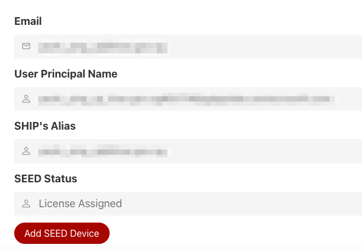
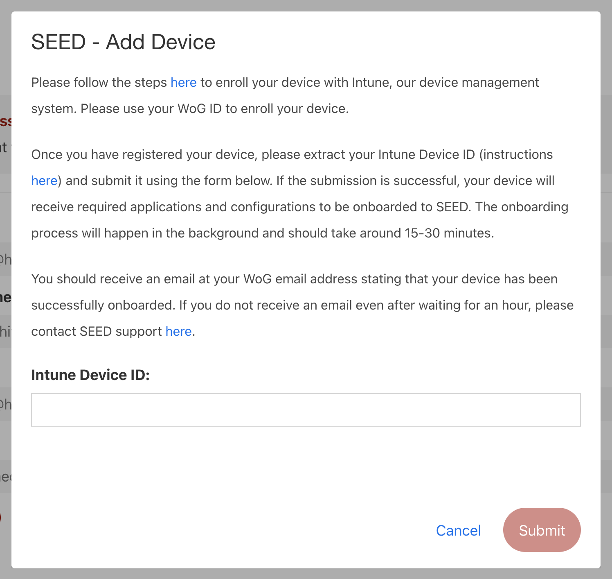
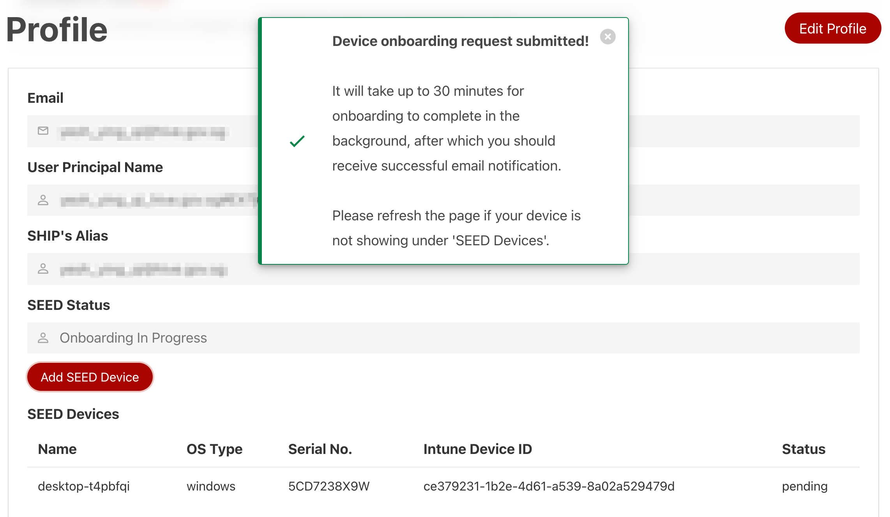

# Onboard to SEED

Currently, Public Officers can onboard their device to SEED by logging into the TechPass portal using non-SE GSIB machine.

 <ul>
 <li>SEED is not applicable only for GSIB and DWP devices.</li>
 <li>If you are a vendor or contractor, contact your project manager or reporting officer to get your SEED licence before proceeding to onboard to SEED.</li>
 <li>Click <a href="https://docs.developer.tech.gov.sg/docs/security-suite-for-engineering-endpoint-devices">here</a> for more information about SEED.</li>
 </ul>

_To onboard your device to SEED:_

1. Go to [TechPass portal](https://portal.techpass.gov.sg) and click **Login with TechPass**.

<kbd></kbd>

2. Choose your TechPass account.

<kbd></kbd>

?> If you are a public officer and not logged into your WOG account, you will be prompted to log in to it first before proceeding to TechPass account.

3. You will be prompted to approve your TechPass login. Approve it on your Authenticator app.

<kbd></kbd>

4. Hover over your account name and click **My Account**.

<kbd></kbd>

5. Under **SEED Status**, either click **Request for SEED** _(this will show up if you have not been assigned SEED license)_
<kbd></kbd>  
or **Add SEED Device** _(this will show up if you have already been assigned SEED license)_
<kbd></kbd>

6. A **SEED - Add Device** dialog should pop up. Follow the instructions within to enroll your device to SEED and extract your Intune Device ID. Enter the Intune Device ID _(ensure there are no spaces to the beginning and end of it)_ and click **Submit**.

<kbd></kbd>

7. Upon successful registration, a success notification should pop up. It will take up to 30 minutes for the onboarding to complete in the background, after which you should receive an email confirming your successful onboarding to SEED.

<kbd></kbd>  

8. Under **SEED Devices** _(visible only if you have successfully added your device)_, a device that is pending onboarding to be completed in the background would have the status of 'pending' whereas a device that has completed onboarding would have the status of 'onboarded'.

9. More details on SEED onboarding (including FAQ, troubleshooting common issues, raising support ticket) can be found [here](https://docs.developer.tech.gov.sg/docs/security-suite-for-engineering-endpoint-devices)
