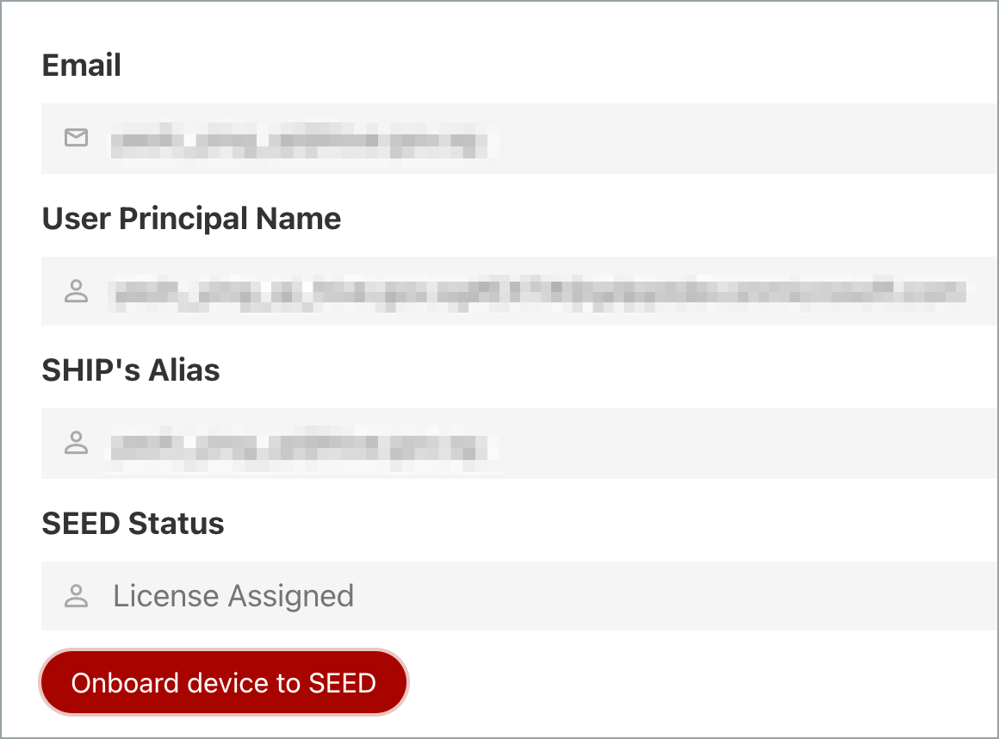
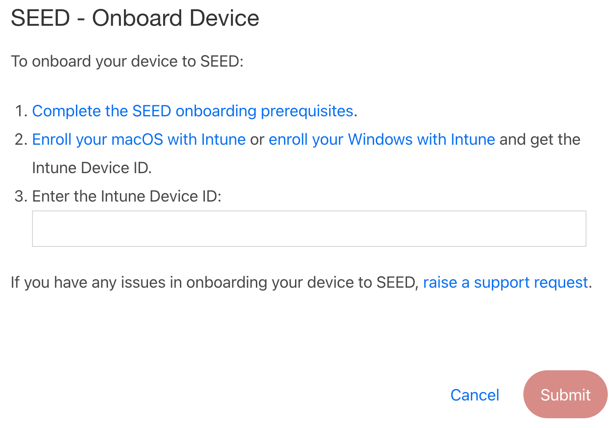
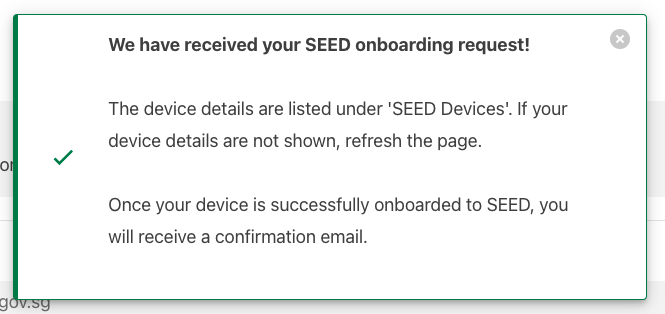

# Request for SEED and submit Intune device ID for SEED onboarding

This article is applicable only for public officers who have an existing active TechPass ID and need to onboard their device to SEED. Public officers can request for SEED provisioning from the [TechPass portal](https://portal.techpass.suite.gov.sg/public/home) using their non-SE GSIB machine.

<ul>
<li>You can't onboard a GSIB or DWP device to SEED.</li>
<li>If you are a vendor or contractor, contact your project manager or reporting officer to request for SEED provisioning before proceeding with your SEED onboarding</li>
</ul>

_To onboard your device to SEED_:

1. From your GSIB device, go to [TechPass portal](https://portal.techpass.suite.gov.sg) and click **Login with TechPass**.

<kbd></kbd>

2. Sign in to your TechPass account.

?> Note: If you are not logged into your WOG account, you will be prompted to log in to that before signing in to your TechPass account.

<kbd></kbd>

3. Approve your TechPass login from your Authenticator app.

<kbd></kbd>

4. Hover over your account name and click **My Account**.

<kbd></kbd>

5. To request for SEED, click **Request for SEED** under **SEED Status**.

<kbd></kbd>

?> Note:  If you have already been provisioned with SEED, instead of **Request for SEED**, the **Onboard device to SEED** button is displayed.

6. To onboard the device to SEED, click **Onboard device to SEED**.

<kbd></kbd>  

7. The **SEED - Onboard Device** dialog is displayed. Follow the instructions on this dialog.

?> Note: If you are using SE-GSIB device, create a [support request](https://form.gov.sg/#!/5f69797d0666cb0011cc59da) to submit your Intune device ID.

8. Enter the Intune device ID in this dialog and click **Submit**.

<kbd></kbd>

> **Notes**:
>- Refer to [SEED onboarding](https://docs.developer.tech.gov.sg/docs/security-suite-for-engineering-endpoint-devices/#/onboard-device/onboard-device-to-seed) and [FAQs](https://docs.developer.tech.gov.sg/docs/security-suite-for-engineering-endpoint-devices/#/faqs/seed-faqs) for step-by-step instructions to onboard a device to SEED.
>- Ensure there are no spaces at the beginning and at the end of the Intune device ID.

After you submit the Intune device ID, the following success message is displayed.

<kbd></kbd>

 It might take up to 60 minutes for Intune to update your device with the required softwares and configurations. During this time, the device onboarding status is **Pending**. After the device is updated with all the required softwares and configurations, the device onboarding status changes to **Onboarded** and you will receive a successfully onboarded email.

9. Refer to [SEED documentation](https://docs.developer.tech.gov.sg/docs/security-suite-for-engineering-endpoint-devices/#/) and complete the post onboarding instructions for SEED.

?> If you are a GCC 1.0 user, refer to the [post onboarding instructions for GCC 1.0 users](https://docs.developer.tech.gov.sg/docs/security-suite-for-engineering-endpoint-devices/#/post-onboarding-instructions/gcc-1.0-users).
