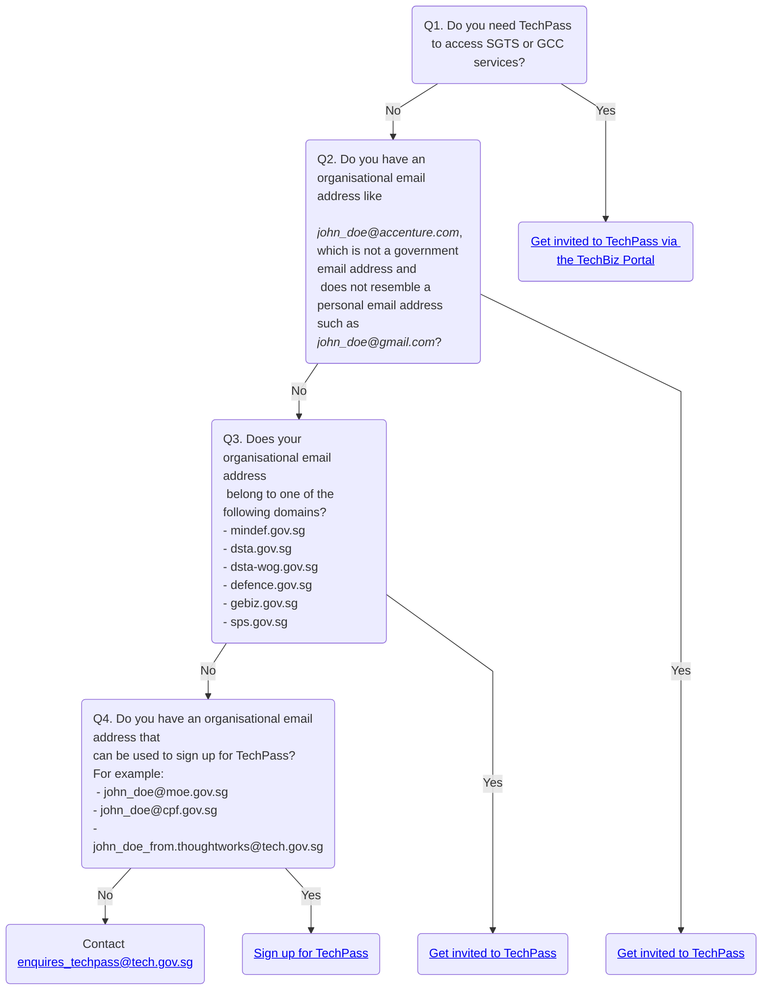

# Onboard to TechPass

Depending on the users' device and supported organisational email addresses, there are different ways for a user to onboard to TechPass.

## Identify your onboarding flow

The following chart helps you to identify your TechPass onboarding flow.

## Next steps

Refer to the onboarding flow that is applicable to you.

- [Sign up and onboard](sign-up-and-onboard-to-techpass)
- [Get invited and onboard](get-invited-and-onboard-to-techpass)

