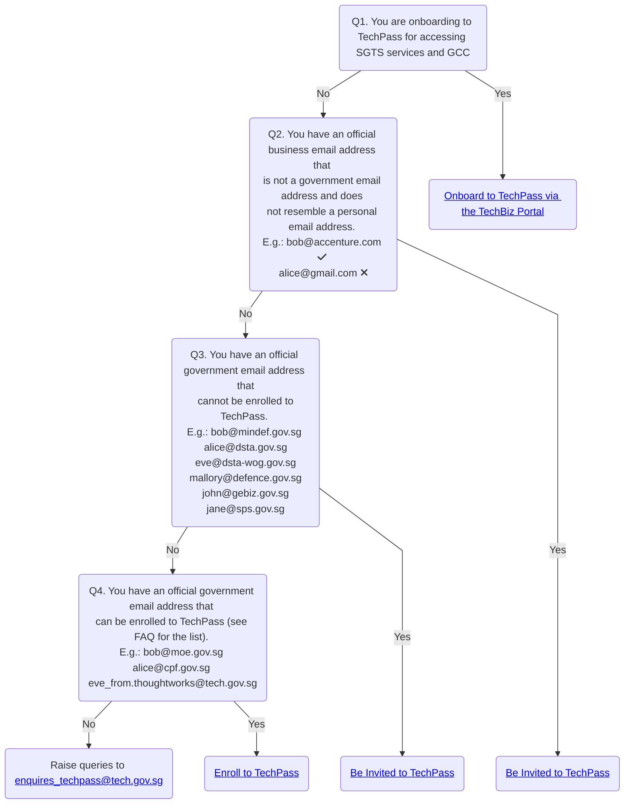

# Onboard to TechPass

Users can onboard to TechPass as **public officers** or **vendors**.

Refer to the following table to identify your onboarding persona:

| Persona| Description | 
Examples
 |
|----| ------------- |:-------------:|
| **Vendor** | Users who do not have a WOG account. These users may have an email address provided by the vendor organisation or it may belong to specific domains such as &nbsp;&nbsp;&nbsp;&nbsp;&nbsp;&nbsp;&nbsp;&nbsp;- dsta.gov.sg &nbsp;&nbsp;&nbsp;&nbsp;&nbsp;&nbsp;&nbsp;&nbsp;- dsta-wog.gov.sg &nbsp;&nbsp;&nbsp;&nbsp;&nbsp;&nbsp;&nbsp;&nbsp;- mindef.gov.sg &nbsp;&nbsp;&nbsp;&nbsp;&nbsp;&nbsp;&nbsp;&nbsp;- defence.gov.sg &nbsp;&nbsp;&nbsp;&nbsp;&nbsp;&nbsp;&nbsp;&nbsp;- gebiz.gov.sg &nbsp;&nbsp;&nbsp;&nbsp;&nbsp;&nbsp;&nbsp;&nbsp;- sps.gov.sg  **Note**: - Email domain is the part of an email address that comes after the “@” symbol. For example, if your email address is john_doe@sps.gov.sg, then **sps.gov.sg** is your email domain.  - You can't use your personal email address such as john_doe@hotmail.com, john_doe@gmail.com and john_doe@yahoo.com while requesting for a TechPass account.| - john_doe@ncs.com.sg - john_doe@accenture.com.sg - john_doe@dsta.gov.sg - john_doe@gebiz.gov.sg  |
| **Public officer** | Users who have a WOG account.  **Note**: Users who have a  ***_from*** in their email address are **NOT** public officers.  | - john_doe@cpf.gov.sg - john_doe@hdb.gov.sg |

**Next steps**

- [Onboard to TechPass as public officers](onboard-public-officers-using-non-se-machines)
- [Onboard to TechPass as vendors](onboard-vendors-to-techpass)

