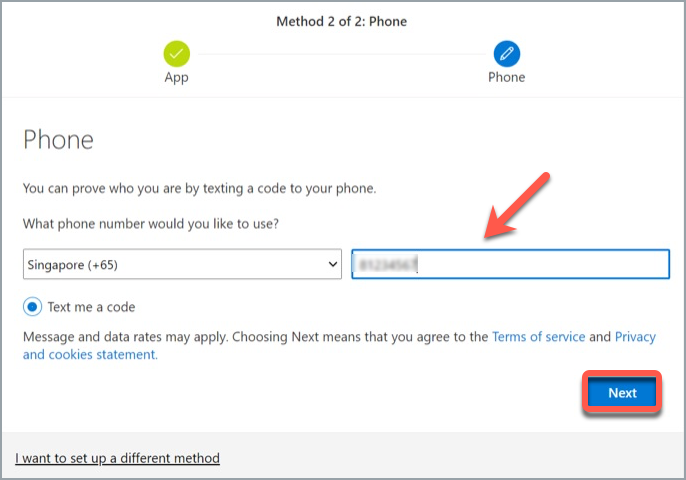

# Onboarding Vendors
This section guides how vendors or contractors working on Gov ICT Projects can get a TechPass account and onboard in to it.

## How to get a TechPass account for vendors or contractors?

If you are a vendor or contractor who does not have an active TechPass account, request one from your project manager or reporting officer. Make sure you provide your official email address, handphone number and your project name in your request. Your project manager or reporting officer in turn will work with the engaging government agency to set up a TechPass account for you.

?>
  You can use this TechPass account for projects hosted by all government agencies.  
  If you are a public officer or a user with a <i>user_name@gov.sg</i> email address, please refer to [Onboarding Public Officers](onboard-public-officers-using-non-se-machines).

## Onboarding vendors
When a TechPass account is created, you will be notified about it in an email. This notification will have a unique TechPass username for you and an initial password will be texted to your handphone.

Complete the following steps:

 
 Sign in using TechPass username and initial password

  1. Go to the web address(url) provided by your project manager or reporting officer to sign in to TechPass.

  ?> SGTS product team will provide the sign in web address to your project manager or reporting officer.

  2. Enter your TechPass username and click **Next**.
    <kbd></kbd>
  3. Enter the initial password and click **Sign in**.
    <kbd></kbd>

  You will now be directed to configure MFA for your TechPass account.

 
 Configure and verify MFA for TechPass account

  4. Install an authenticator on your mobile device. If you do not have Microsoft Authenticator app(recommended) on your mobile phone, download and install it on your [Microsoft phone](https://www.microsoft.com/en-sg/store/apps/windows-phone), [Android](https://play.google.com/store/apps?hl=en&amp;gl=US) or [iOS phone](https://www.apple.com/app-store/) and complete the wizard.

    <kbd></kbd>

  ?> You may install any authenticator. However, as we recommend Microsoft authenticator, this document will guide you to configure TechPass MFA using that.

  5. In your mobile device, open Microsoft **Authenticator** and tap **+ Add account** > **Work or School account**.
  6. Go back to your computer and click **Next**.
  <kbd></kbd>
  7. Scan the QR code displayed on your computer screen and click **Next**. Your TechPass account gets activated and linked to the authenticator app.
    <kbd></kbd>
  8. Authenticator will send a notification for you to approve and confirm if this verification was set up correctly.

      <kbd></kbd>

  9. Tap **APPROVE** on your mobile device and on your computer, you will see that you have approved your sign-in.

      <kbd></kbd>

  10. Click **Next**.

  11. Enter your handphone number.
      <kbd></kbd>

  12. To verify if you get notified, you will receive a six-digit code on this phone number. Enter the six-digit code and click **Next**.

      <kbd></kbd>

  13. Click **Next**.

      <kbd></kbd>
  14. When you see a success message, click **Done**.
      <kbd></kbd>

      Now you will be prompted to re set your initial password.

 
 Re set your initial password of TechPass

  15. Enter your **initial password**, **new password** and re type new password to confirm.  

  16. Click **Sign in** to proceed with Terms of Use.

  <kbd></kbd>

 Accept the Terms of Use and privacy policy

  17. Click the arrow to view the **TechPass Terms of Use**.

  <kbd></kbd>

  18. Read the TechPass **Terms of Use** and click **Accept**.

  <kbd></kbd>

  19. Click the arrow to view the **TechPass Privacy Policy**.

  <kbd></kbd>

  20. Read the TechPass **Privacy Policy** and click **Accept**.

  <kbd></kbd>

  You have now successfully onboarded to TechPass.

