# Onboard vendors
This section guides how vendors or contractors working on Government ICT Projects can get a TechPass account and a [SEED](https://docs.developer.tech.gov.sg/docs/security-suite-for-engineering-endpoint-devices/#/) licence to onboard their non-GSIB device to SEED.

<!-- tabs:start -->

## **Notes for GCC 1.0 users**

- Depending on the allotted schedule, the agency admin or cloud admin receives an email with instructions on how to register for TechPass and onboard non-GSIB and a non-DWP device to SEED.
- Agency admin or cloud admin will share this registration link with the required GCC 1.0 users.
- While registering, ensure to provide the correct VPN ID.
- It might take up to two weeks for us to verify the VPN ID before sending the TechPass invite email. If you do not receive this email after two weeks, check if it is the same email address you provided while registering for TechPass or check your Spam, Junk Email, Deleted Items or Archive folder.

## **Notes for all users**

- If you are a GCC 1.0 user and activating your TechPass account based on the below instructions, skip step 1.
- If you are a GCC Common Services vendor user with *_from@*.gov.sg - Please raise a <a href="https://go.gov.sg/techpass-sr">service request</a> to provision your accounts. You will need to provide a valid vendor company email address, mobile number, first name, last name, company and department.
- Other users need to complete the below steps using a non-SE GSIB machine.
- If you've started the TechPass onboarding process, make sure to complete it within the same session.

<!-- tabs:end -->

<!--

Notes for GCC 1.0 users

<ul>
<li>Depending on the allotted schedule, the agency admin or cloud admin receives an email with instructions on how to register for TechPass and onboard non-GSIB and a non-DWP device to SEED.</li>
<li>Agency admin or cloud admin will share this registration link with the required GCC 1.0 users.</li>
<li>While registering, ensure to provide the correct VPN ID.</li>
<li>It might take up to two weeks for us to verify the VPN ID before sending the TechPass invite email. If you do not receive this email after two weeks, check if it is the same email address you provided while registering for TechPass or check your Spam, Junk Email, Deleted Items or Archive folder.</li>

> **Notes for GCC 1.0 users**:
>1. Depending on the allotted schedule, the agency admin or cloud admin receives an email with instructions on how to register for TechPass and onboard non-GSIB and a non-DWP device to SEED.
>1. Agency admin or cloud admin will share this registration link with the required GCC 1.0 users.
>1. While registering, ensure to provide the correct VPN ID.
>1. It might take up to two weeks for us to verify the VPN ID before sending the TechPass invite email. If you do not receive this email after two weeks, check if it is the same email address you provided while registering for TechPass or check your Spam, Junk Email, Deleted Items or Archive folder.

<ul>
<li>If you are a GCC 1.0 user and activating your TechPass account based on the below instructions, skip step 1.</li>
<li>If you are a GCC Common Services vendor user with *_from@*.gov.sg - Please raise a <a href="https://go.gov.sg/techpass-sr">service request</a> to provision your accounts. You will need to provide a valid vendor company email address, mobile number, first name, last name, company and department. </li>
<li>Other users need to complete the below steps using a non-SE GSIB machine.</li>
<li>If you've started the TechPass onboarding process, make sure to complete it within the same session.</li>
</ul>

 -->

**To get a TechPass account**:

## Step 1. Get a TechPass account and SEED licence for vendors or contractors

 
 How to get a TechPass account and SEED licence?

 

 <ul>
 <li>SEED licence is applicable only for <b>non-GSIB device</b>.</li>
 <li> Emails with <b>*_from@*.gov.sg</b> format are <b>not permitted</b>. Please provide a company email supplied by the vendor company</li>
 <li> If you already have an active TechPass account and need a SEED licence, contact your project manager or reporting officer.</li>
 <li>If you are a public officer, refer to <a href="https://docs.developer.tech.gov.sg/docs/techpass-user-guide/#/onboard-public-officers-using-non-se-machines">Onboarding Public Officers to TechPass</a>.</li>
 </ul>
 

 1. If you are a vendor or contractor who has to access SGTS services and does not have an active TechPass account and a SEED licence, request for them from your project manager or reporting officer.
 2. Provide the required details such as your official vendor company email address, handphone number, project name and device details for SEED licence in this request. In turn, your project manager or reporting officer will work with the engaging government agency to assign a TechPass account and SEED licence.

 once the request is approved, vendors or contractors receive the TechPass invitation email on the provided official email address.

 > **Notes**:
 >- When a TechPass account is created for vendors or contractors, they will be notified about it in an email. This notification will have a unique TechPass username and an initial password will be texted to your handphone.
 >- If you've started the TechPass onboarding process, it is important to complete it within the same session.
 >- Similarly, vendors or contractors will receive an email when a SEED licence is assigned.

## Step 2. First-time sign in using initial password

 
Steps to sign in using TechPass username and initial password

  1. Go to the web page provided by your project manager or reporting officer to sign in to SGTS service using your TechPass account.

  ?> SGTS product team will provide the address of this web page to your project manager or reporting officer.

  2. Enter your TechPass username and click **Next**.
    <kbd>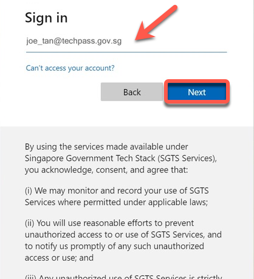</kbd>
  3. Enter the initial password and click **Sign in**.
    <kbd>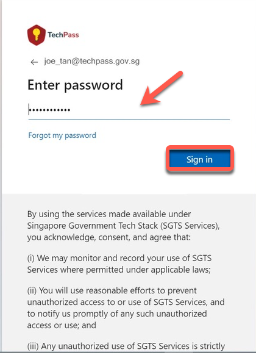</kbd>

  You will now be directed to configure MFA for your TechPass account.

## Step 3. Configure and verify MFA for TechPass account

 
 How to configure and verify MFA for vendor's TechPass account?

  1. Install Microsoft Authenticator on your mobile device.

    <kbd>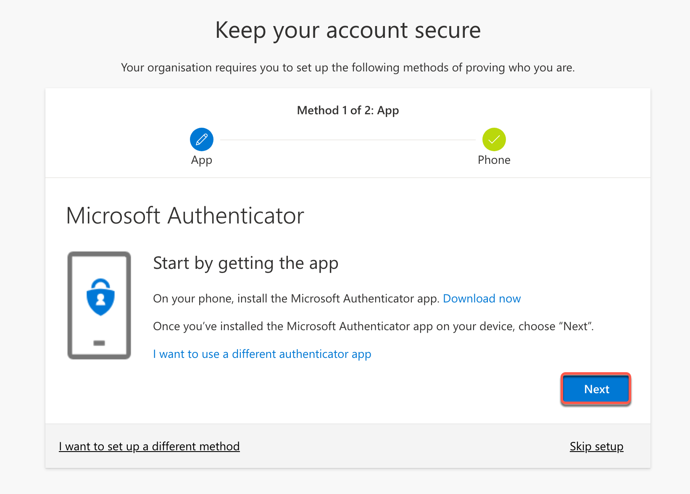</kbd>

  ?> You may install any authenticator. However, as we recommend Microsoft authenticator, this document guides you to configure TechPass MFA using that.

  2. On your mobile device, open Microsoft **Authenticator** and tap **+ Add account** > **Work or School account**.
  3. Tap **Scan a QR code**.
  4. Go back to your computer and click **Next**.
  <kbd>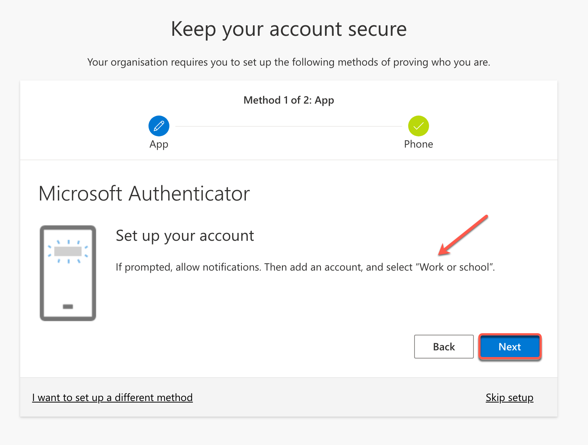</kbd>
  5. Scan the QR code displayed on your computer screen and click **Next**. Your TechPass account gets activated and linked to the authenticator app.
    <kbd>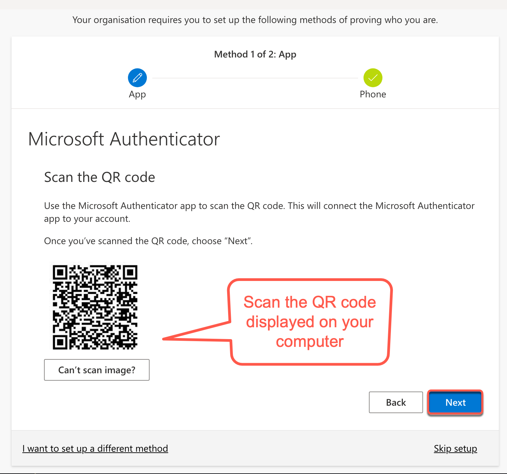</kbd>
    To confirm if this verification process was set up correctly, the Authenticator sends a notification to your mobile device.

      <kbd>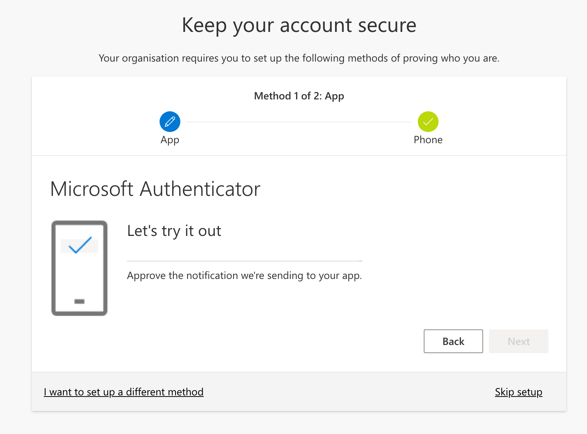</kbd>

  6. Tap **APPROVE** on your mobile device and on your computer, you will see that you have approved your sign-in.

      <kbd>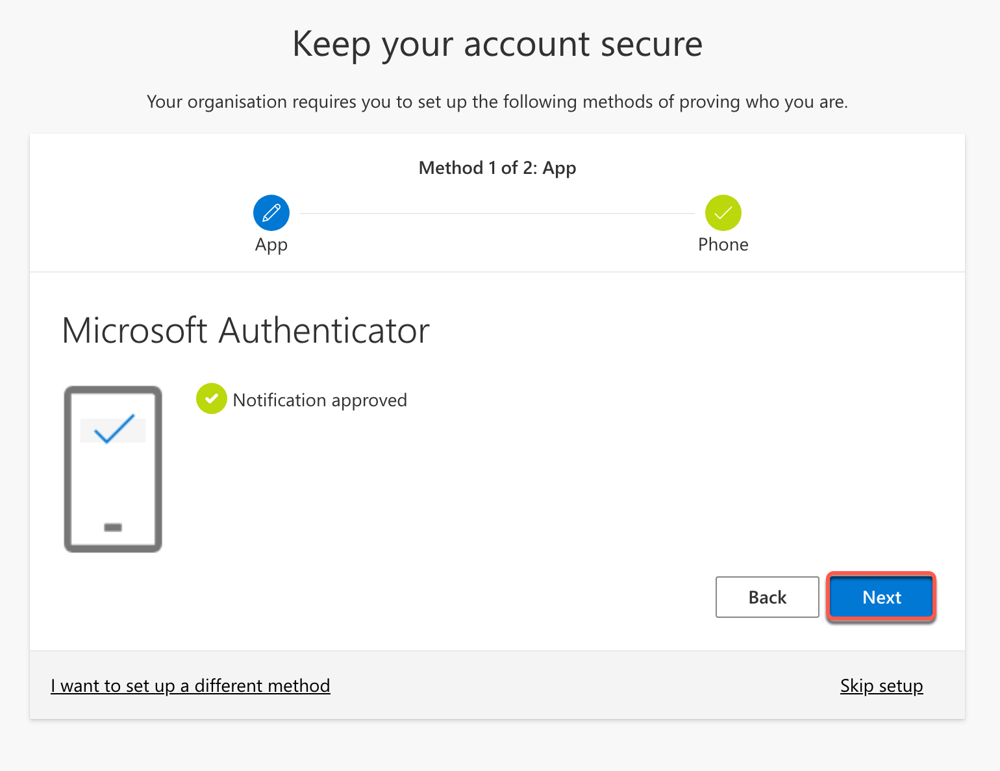</kbd>

  7. On your computer, click **Next**.
  8. Choose the country code and enter your handphone number.
      <kbd>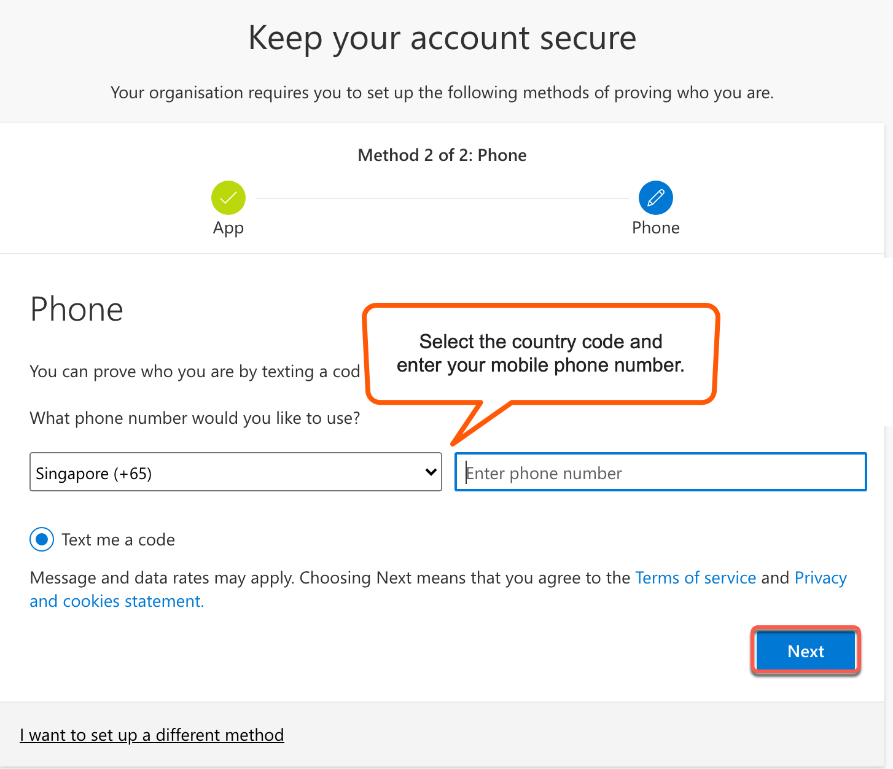</kbd>
  9. You will receive a six-digit code on this phone number. Enter the six-digit code and click **Next**.

      <kbd>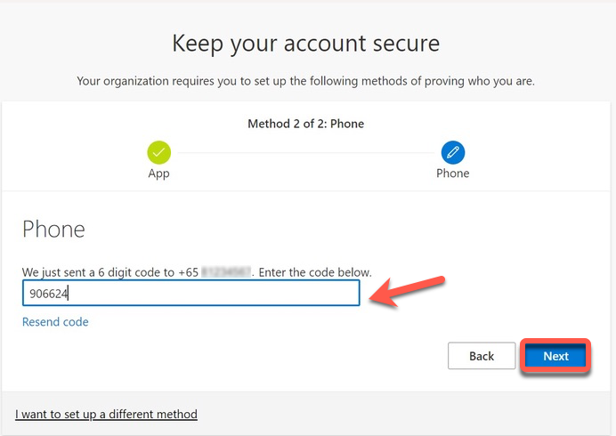</kbd>

  10. Click **Next**.

      <kbd>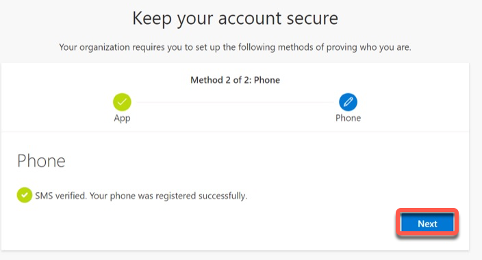</kbd>
  11. When you see a success message, click **Done**.
      <kbd>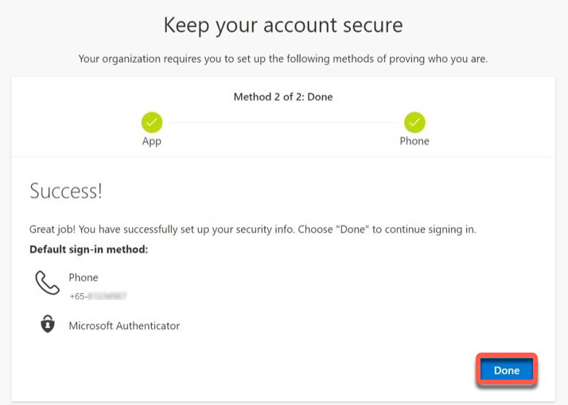</kbd>

      Now you will be prompted to reset your initial password.

## Step 4. Reset your initial password

 
 How to reset the initial password?

  1. Enter your **initial password**, **new password** and retype the new password to confirm.  

  2. Click **Sign in** to proceed with Terms of Use.

  <kbd>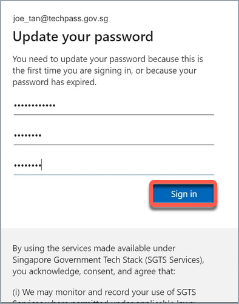</kbd>

## Step 5. Accept Terms of Use, Privacy Policy and Mobile Device Management-Acceptable Use Policy

 Steps to accept the Terms of Use, privacy policy and mobile device management - acceptable use policy for SEED

  1. Click the arrow to view the **TechPass Terms of Use**.

  <kbd>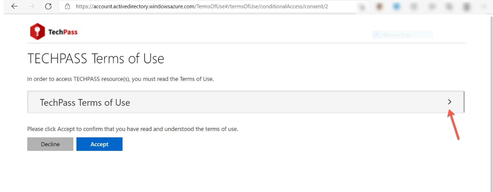</kbd>

  2. Read the TechPass **Terms of Use** and click **Accept**.

  <kbd>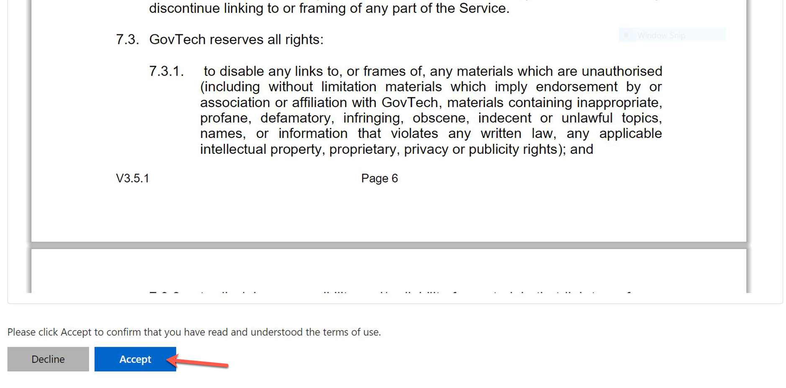</kbd>

  3. Click the arrow to view the **TechPass Privacy Policy**.

  <kbd>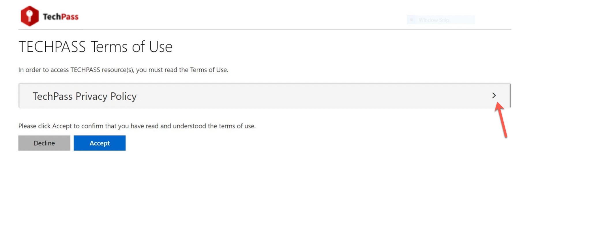</kbd>

  4. Read the TechPass **Privacy Policy** and click **Accept**.

  <kbd>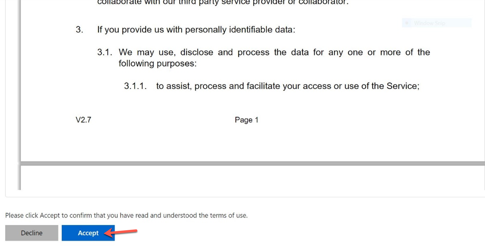</kbd>

  If SEED licence is assigned, you will be prompted to accept the TechPass Mobile Device Management(MDM) - Acceptable Use Policy(AUP).

  5. Click the arrow to view the **TechPass MDM AUP Policy**.

  <kbd></kbd>

  6. Read the policy details and click **Accept**.

  <kbd>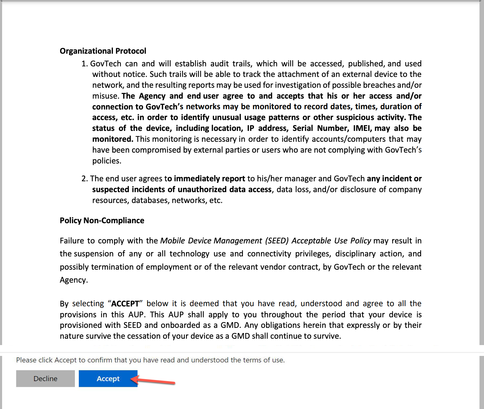</kbd>

  You have now successfully onboarded TechPass. You can now proceed to onboard your non-GSIB device to SEED.

  ?> Refer to [Prerequisites for onboarding your device to SEED](https://docs.developer.tech.gov.sg/docs/security-suite-for-engineering-endpoint-devices/#/prerequisites-for-onboarding) before proceeding to onboard your non-GSIB device to SEED.

