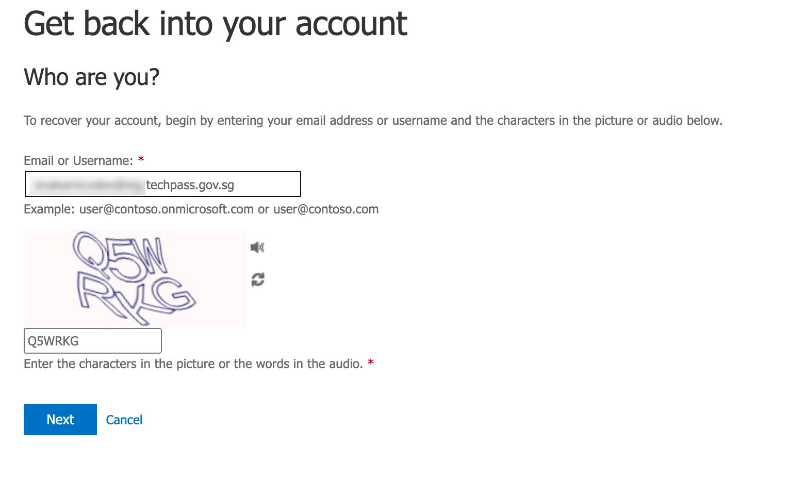

# Reset TechPass password

If you are a vendor and if your TechPass domain is ```techpass.gov.sg```, you may reset your TechPass password according to the [Azure Password Policy](https://learn.microsoft.com/en-us/azure/active-directory/authentication/concept-sspr-policy#administrator-password-policy-differences) or if your TechPass account gets locked.

>**Notes for public officers**
>
>- If you are a public officer, and if your TechPass account gets locked after continuous unsuccessful login attempts, reset the password of your GSIB device by following the WOG password policies. 
>
>- If there are any issues, contact your Agency Facility Management (AFM).

**To reset TechPass password**

1. Go to [reset password](https://passwordreset.microsoftonline.com/) and  enter your TechPass user name.

> **Note**
>- If the email address you specified while requesting for a TechPass account, is a Microsoft account, you can either enter that email address or your TechPass user name.
>- TechPass user name is sent to you in the TechPass onboarding email.

2. Enter the characters in the picture or the words in the audio.

3. Click **Next**.

4. Follow the on-screen instructions to complete the verification steps. 

>**Note**
>- If your email account is a Microsoft account, you would have provided an alternative email while setting up MFA for your TechPass account.
>- You will receive the verification code on this alternative email account and on your mobile number.

4. Enter the new password and confirm the new password.
5. Click **Finish**.

A success message confirms that your password has been reset for this TechPass account.


<!--

>


