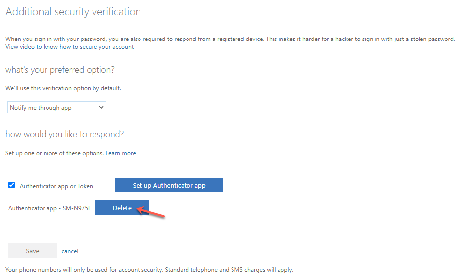
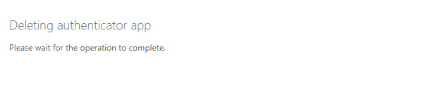
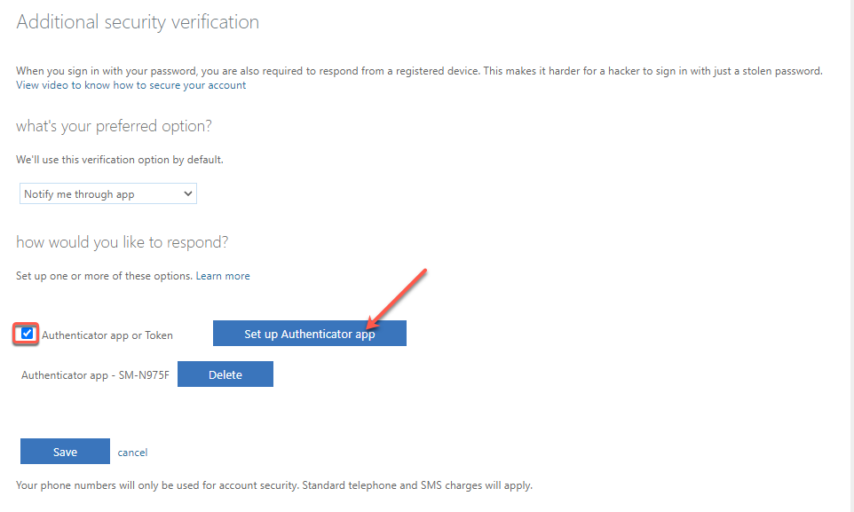
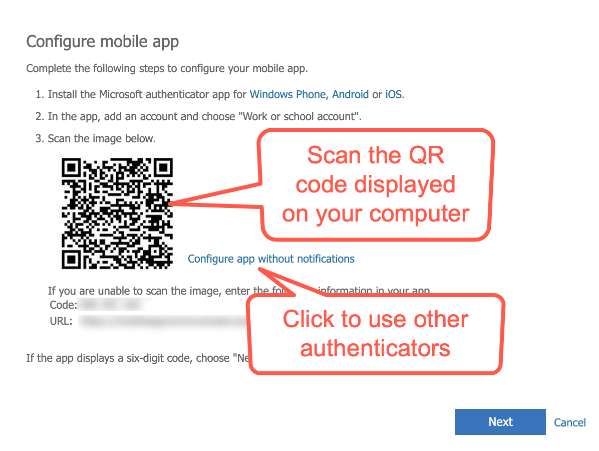
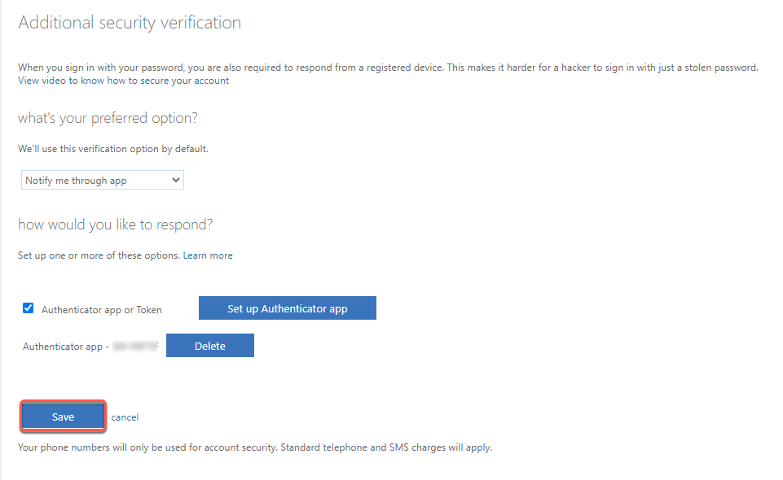
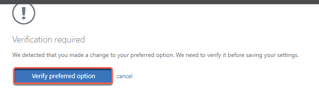

# Reset MFA for WOG account

This article is applicable only for public officers. Public officers might have to reset security verification for their WOG account in the following cases:

- Changed the mobile device that was used for security verification.
  - If you have lost your mobile device, contact your Agency Facility Management(AFM) team to remove the MFA configured for your WOG account before proceeding with the instructions on this page. Also raise a [service request](https://go.gov.sg/techpass-sr) to remove MFA configured for your TechPass account and then [reset your verification for TechPass](reset-techpass-mfa-for-new-device) in the new device.
- Deleted the Authenticator app from their mobile device.
- If public officers are transferred to a different agency, they can sign up for a new TechPass account while the old account to be terminated by their previous agency

  _To reset security verification for WOG account:_

1. On your non-SE GSIB device, go to [Microsoft Additional security verification](https://account.activedirectory.windowsazure.com/proofup.aspx). If prompted, sign in to your WOG account.
<kbd></kbd>
2. Click **Delete** beside the device that you want to remove.
<kbd></kbd>

3. After it is removed, go to your Authenticator app on your mobile device and remove the existing MFA for your WOG account(SG Govt M365).

  ?> This only removes the MFA profile for the WOG account in that device.

4. Select **Authenticator app or Token** and click **Set up Authenticator app**.
<kbd></kbd>

5. Follow the on-screen instructions and scan the QR code displayed on your computer using the new mobile device and click **Next**.
<kbd></kbd>
Now your WOG account gets listed in the **Authenticator** app on your new mobile device. When you click **Next**, your activation status will be confirmed, and a notification will be sent to your new mobile device to verify your authentication process.
6. Approve sign-in on your mobile device and you will be directed back to **Additional security verification** page. The newly added device will be listed on this page.
7. Click **Save**.
<kbd></kbd>
8. If you have changed your preferred option, you will be prompted to verify it. Click **Verify preferred option**.
<kbd></kbd>
9. After you approve the verification sent, you will see a success message. Click **Close**.
<kbd></kbd>
