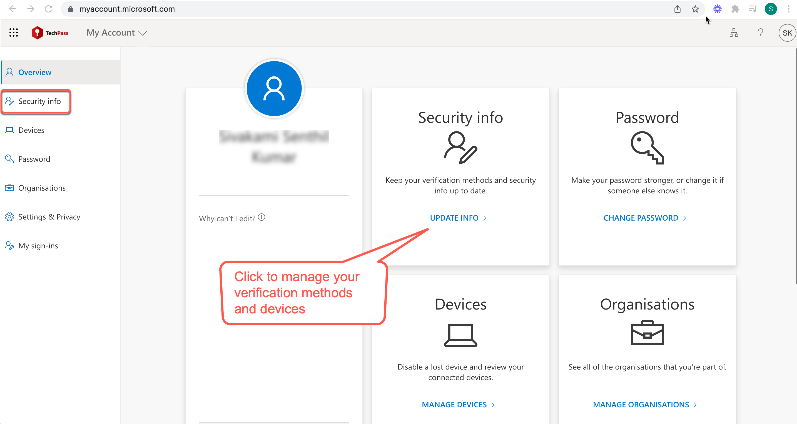
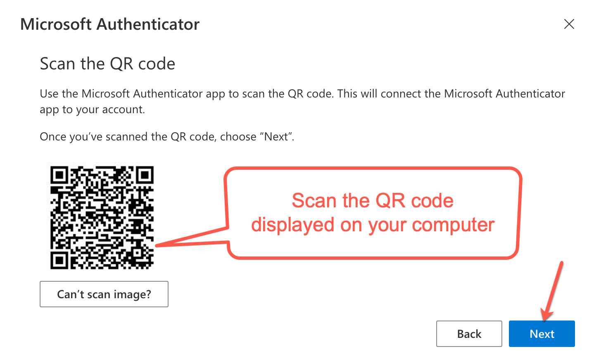

# Reset TechPass MFA

This article guides you how to reset your TechPass MFA.

**Audience**

- Users who have a TechPass account and domain is ```techpass.gov.sg```.

Users whose TechPass domain is not ```techpass.gov.sg``` must [Create service request](https://go.gov.sg/techpass-sr) to **reset TechPass MFA**.


**Preqrequisites** 

If you have changed the mobile phone and want to reset your TechPass MFA on the new mobile phone:

- You must have the old mobile phone.
- You must be able to authenticate your TechPass login using the old mobile phone.

If you have lost your old mobile phone, formatted the old phone(factory reset),or unable to authenticate your log in using the old mobile phone, [Create service request](https://go.gov.sg/techpass-sr) to reset MFA for their TechPass profile.

_To reset MFA for TechPass account:_

1. Go to [My Account](https://account.activedirectory.windowsazure.com/proofup.aspx?proofup=1).

2. If prompted, sign in to your TechPass account and go to **Security info**. Approve the sign-in.

<kbd></kbd>

3.  On the **Security info** page, click **Delete** next to the Authenticator method linked to your mobile device.

<kbd>

4. Click **OK** to confirm the deletion.

5. Open the authenticator app on your mobile phone and delete your TechPass account from the authenticator app.

6. On the **Security info** page, click **+ Add sign-in method**.
7. In **Add a method**, select **Authenticator app** and click **Add**.

<kbd>

7. If needed, download and install Microsoft Authenticator on your [Microsoft phone](https://www.microsoft.com/en-sg/store/apps/windows-phone), [Android](https://play.google.com/store/apps?hl=en&amp;gl=US) or [iOS phone](https://www.apple.com/app-store/) and click **Next**.

  <kbd>

8. Follow the on-screen instructions to add your TechPass account and click **Next**.

  <kbd></kbd>

9. Scan the QR code displayed on your computer using the new mobile device and click **Next**.

  <kbd>

Your TechPass account gets listed in the **Authenticator** app indicating that verification for TechPass is now set on your new mobile phone.

You will receive a notification on your new mobile device to verify your authentication process.

10. Approve sign-in on your new mobile device. You will see a notification approved message.

<kbd>

11. Click **Next**. The new device is listed on the **Security info** page.
