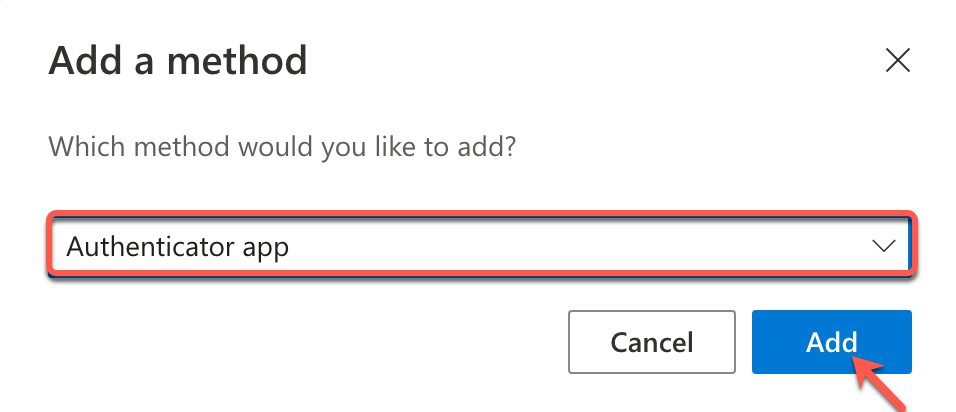
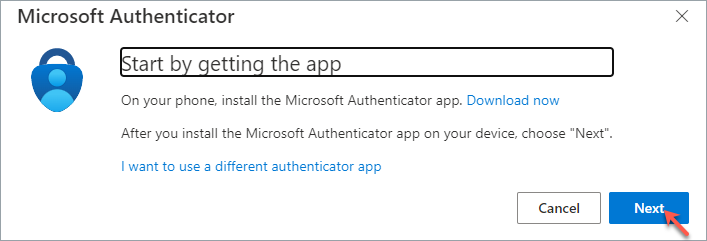
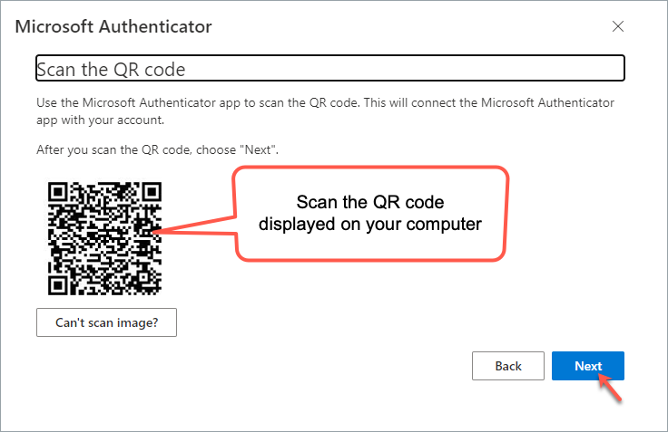

# Reset TechPass Multi-Factor Authentication(MFA)

TechPass users whose Login ID's domain is ```techpass.gov.sg.``` need to reset their TechPass MFA if they have:

- Changed their mobile phone.
- Lost their mobile phone.
- Deleted the Authenticator app from the mobile phone or unable to access the app on your phone.


## Prerequisites

- You must have your previous mobile phone to authenticate your TechPass login.

?> If you have lost or formatted your previous mobile phone or unable to authenticate using it, contact the [TechPass support team](https://go.gov.sg/seed-techpass-support).


### To reset MFA for your TechPass account

1. Go to [My Account](https://account.activedirectory.windowsazure.com/proofup.aspx?proofup=1).
2. On the **Security info** page, click **+ Add sign-in method**.

3. In **Add a method**, select **Authenticator app** and click **Add**.

4. Click **Next**.

5. Follow the on-screen instructions to add your TechPass account and click **Next**.

6. Download and install Microsoft Authenticator on your new [Microsoft phone](https://www.microsoft.com/en-sg/store/apps/windows-phone), [Android](https://play.google.com/store/apps?hl=en&amp;gl=US) or [iOS phone](https://www.apple.com/app-store/).
7. In the app, add an account and choose **Work or school account**.
8. Select **Scan a QR code** on the app.
9. Scan the QR code displayed on your computer using the new mobile phone and click **Next**.


  ?> A notification is sent to your new mobile phone to verify the authentication process. A number is shown on your browser.


10. On the Authenticator app, enter the number shown on your browser.

11. Select **Yes** or **Done** on the app.

You have reset your TechPass MFA using your new mobile phone. 
