# Sign up and onboard to TechPass

This article guides you to sign up for TechPass via TechPass portal and onboard to it. Refer to the flow chart on [Onboard to TechPass](onboard-to-techpass) page to know if you can sign up for TechPass via the TechPass portal.

?> **Note** - If you are a public officer who is using an **SE-GSIB** device, please submit a [service request](https://go.gov.sg/techpass-sr) to create your TechPass account. - Alternatively, users can also get invited to TechPass via [**TechBiz Portal**](https://portal.techbiz.suite.gov.sg). For more information, see [**TechBiz documentation**](https://docs.developer.tech.gov.sg/docs/techbiz-documentation/).

## Audience

Users who need TechPass account and have a non-SE GSIB device and a WOG account. 

<!--
Their organisational email address should be in the format of *\<your_name\>@\<acronym for your agency\>.gov.sg*. For example, *john_doe@tech.gov.sg*.-->

## Prerequisites

You need the following to sign up for TechPass and complete the onboarding:

- Non-SE GSIB device.
- Standard mailbox for your organisational email address. TechPass does not support email accounts which do not have an inbox, such as LiteMail accounts. If you use such an email account, upgrade it to a standard mailbox before signing up.
- Your organisational email address.
- Before you onboard, ensure you have received the TechPass onboarding email and is still valid.

?> TechPass onboarding email is valid for 30 days. If you do not onboard to TechPass within this 30 days, we will terminate your TechPass account, and you need to sign up again.

> **Tip**: Click the triangle to view the instructions to complete each step.

## Step 1. Sign up for TechPass

  
Sign up for TechPass and SEED(optional) via TechPass portal

  1. From your non-SE GSIB device, go to the [TechPass portal](http://portal.techpass.gov.sg) and click **Sign Up**.

  2. Enter your organisational **Email Address**.

  3. Indicate if you want to onboard your Internet Device to SEED and select **I'm not a robot**.

  !> You need SEED provisioning to access SGTS and GCC 2.0 resources via an Internet Device.

  <kbd>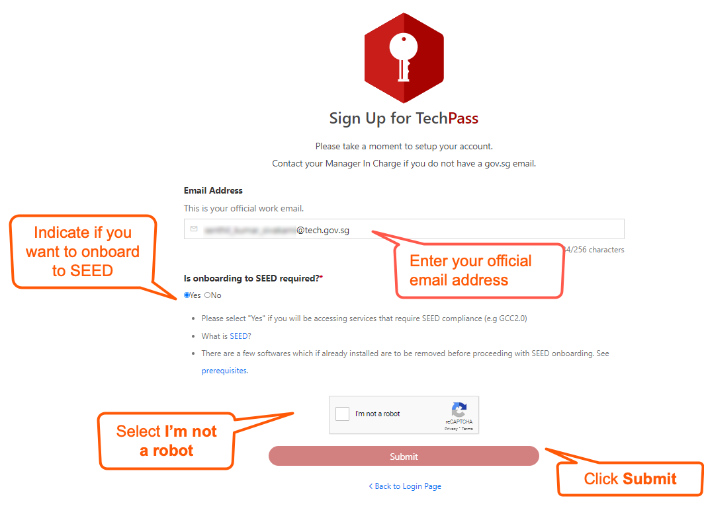</kbd>

  4. Click **Submit** to receive the onboarding invitation email(s).

  > **Additional information**:
  >
  > **If TechPass provisioning
  is approved**:
  >- A TechPass account is provisioned for you and is in pending state.
  >- We'll send the TechPass onboarding email to activate the account.
  
  >
  > **If SEED provisioning is approved**:
  >- We'll send the SEED onboarding email within the next three business days.
  >- This email is valid only for 30 days.
  >- Ensure that you have activated your TechPass account before proceeding to onboard your Internet Device to SEED .
  >- If your SEED onboarding email has expired, you can request again from the TechPass portal. For more information, see [SEED FAQs](https://docs.developer.tech.gov.sg/docs/security-suite-for-engineering-endpoint-devices/faqs/seed-faq-general).

  

## Step 2. Set up security verification for the WOG account

  
Set up security verification for WOG account

<iframe style="position:absolute;top:0;left:0;width:100%;height:100%;" src="https://www.youtube.com/embed/gJ0U0w7C628" title="YouTube video player" frameborder="0" allow="accelerometer; autoplay; clipboard-write; encrypted-media; gyroscope; picture-in-picture; web-share" allowfullscreen="true"></iframe>

  1. From your non-SE GSIB device, go to [Azure Active Directory](https://account.activedirectory.windowsazure.com/proofup.aspx).

  2. If prompted to sign in:
  
      a. Use your organisational email address and GSIB device password.

      b. Click **Next** to provide additional information for your account.

  3. On the **Additional security verification** page, choose **Mobile app** from the dropdown list.
  
  4. Choose your preferred authenticating method, and click **Set up**. 

  <kbd>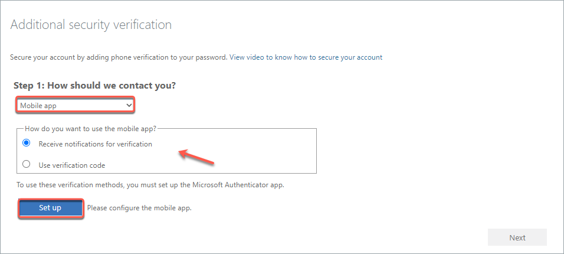</kbd>

  ?> Do not close this page on your computer.

  5. Follow the on-screen instructions on the **Configure mobile app** page.
  <kbd>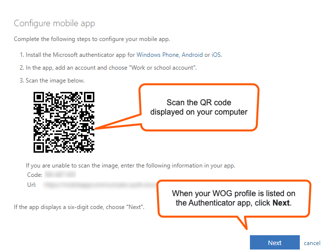</kbd>

  You are now redirected to Step 1 of **Additional security verification**.
  
  6. Confirm your Authenticator app is configured before clicking **Next**.

  <kbd>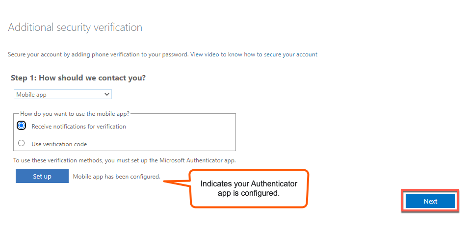</kbd>

  You are now directed to Step 2 of **Additional security verification**. A notification is sent to your Authenticator app.
  
  8. Approve the notification on your Authenticator app to confirm that you are reachable on this mobile phone.

 <kbd></kbd>

 When the notification is successfully approved, you will see the following page on your computer.

 <kbd>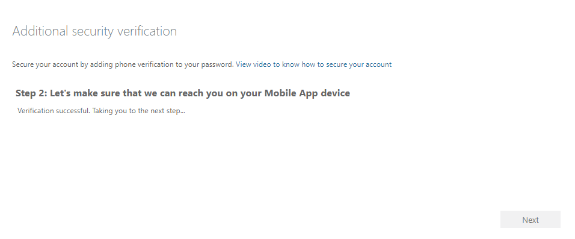</kbd>

 7. Click **Done**.

 <kbd>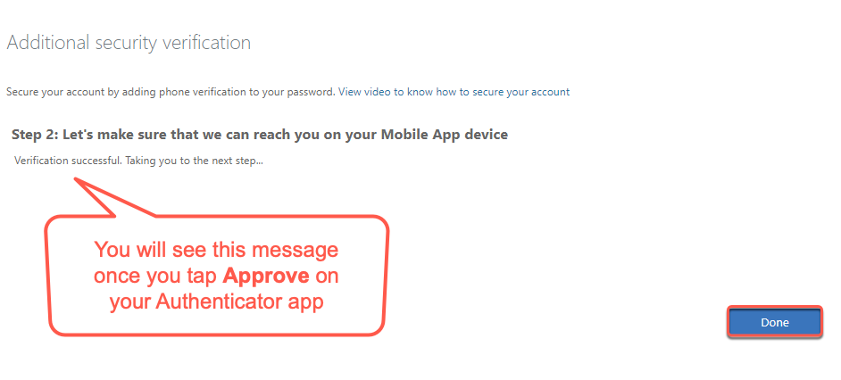</kbd>
  
 8. The **Profile** page is displays your WOG profile under **Organizations**.

 <kbd>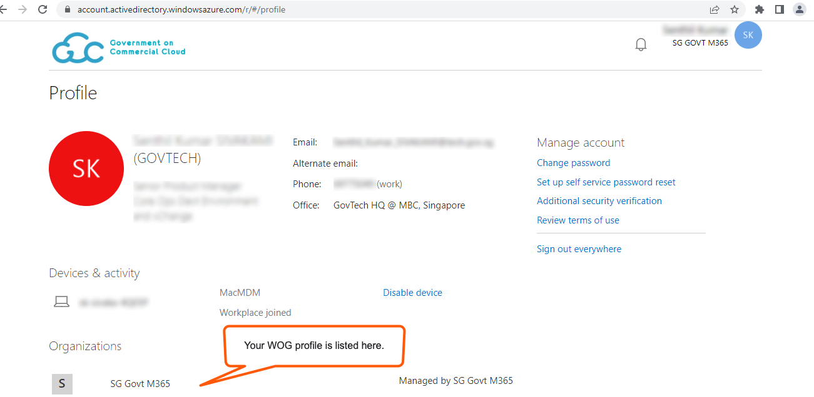</kbd>
  
  

?> Complete steps 3 and 4 within the same session.

## Step 3. Accept invitation

  
Accept TechPass onboarding invitation

<!--

Onboard to TechPass within 30 days of receiving the TechPass invitation email. If you do not onboard within 30 days, we will terminate your TechPass account, and you need to sign up again.
-->

  1. On your GSIB device, open the TechPass onboarding invitation email.

  ?> If you do not see this email in your inbox: - check if it is the same email address you provided while signing up or in your request. - If a spam filter or email rule moved it to other folders, Junk Email, Deleted Items or Archive folder.

  2. Click **Accept invitation**.

  <kbd>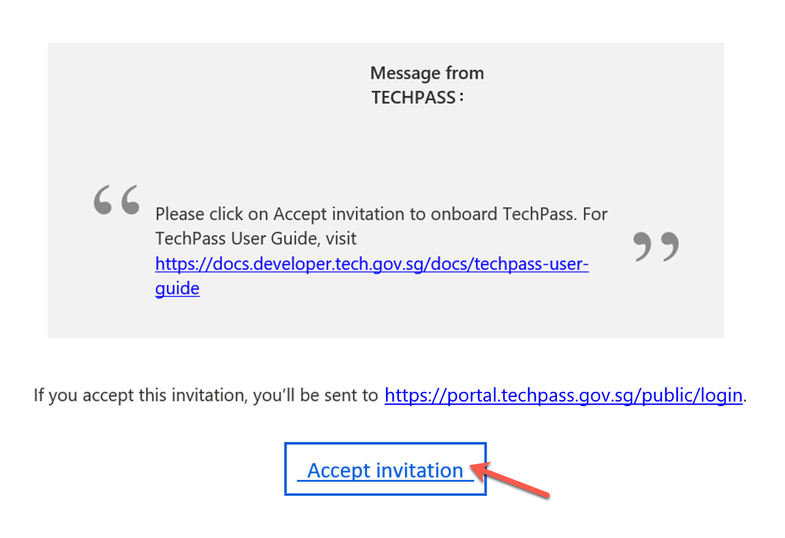</kbd>

  If you are already signed in to your WOG account, you can view the **Review Permissions**.

  ?> If you are not signed in to your WOG account, you will be prompted to sign in to it first before proceeding further. 

  3. In **Review Permissions**, click **Accept**.

  <kbd></kbd>

  ?> If you are not signed in to your WOG account while [accepting the invitation](#step-3-accept-techpass-invitation), you will be prompted to sign in before proceeding further.

  <!-- 4.  Click **Log in with TechPass**.  -->
  4. Ensure the organisational email address you used while signing up or requesting for the TechPass account is displayed as username.
  5. Click **Next** to configure and verify MFA for TechPass account.

  <kbd></kbd>

  

  ## Step 4. Configure and verify MFA for TechPass account

  

  
Configure and verify MFA for TechPass account

  1. Choose one of the following options and click **Next**.

    - If you do not have the Microsoft Authenticator app(recommended) on your mobile phone, download and install it on your [Microsoft phone](https://www.microsoft.com/en-sg/store/apps/windows-phone), [Android](https://play.google.com/store/apps?hl=en&amp;gl=US) or [iOS phone](https://www.apple.com/app-store/) and complete the wizard.
    - To use other authenticators, click **I want to use a different authenticator app**.
    - To use other methods, click **I want to set up a different method**.

    <kbd>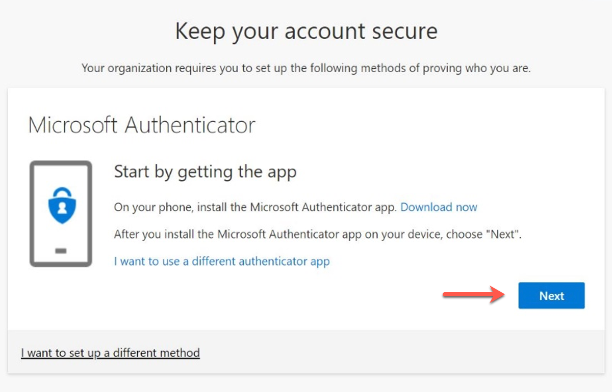</kbd>

  ?> While we recommend Microsoft Authenticator, you can choose any other authenticator app. As we recommend Microsoft Authenticator, this article guides you through setting up multi-factor authentication for your TechPass account using that. For other authenticators, refer to the respective help resources.

  2. On your mobile device, open Microsoft **Authenticator** and select **+ Add account** > **Work or School account**.
  3. Go back to your computer and click **Next**.

  <kbd></kbd>

  4. Scan the QR code on your computer screen and click **Next**. Your TechPass account gets activated and linked to the authenticator app.

  <kbd>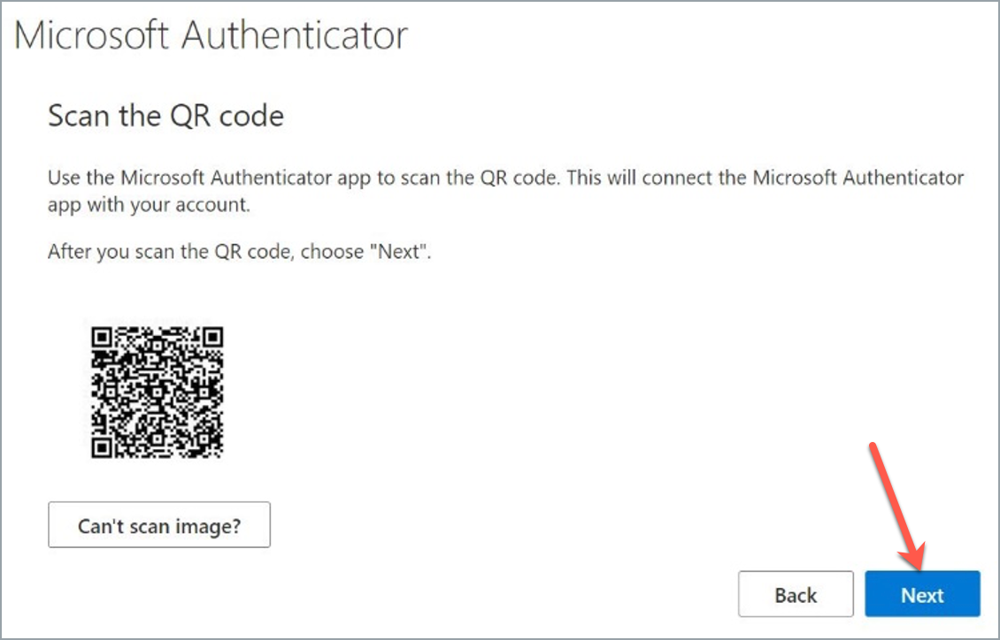</kbd>

  A number is shown on your computer screen.

    <kbd>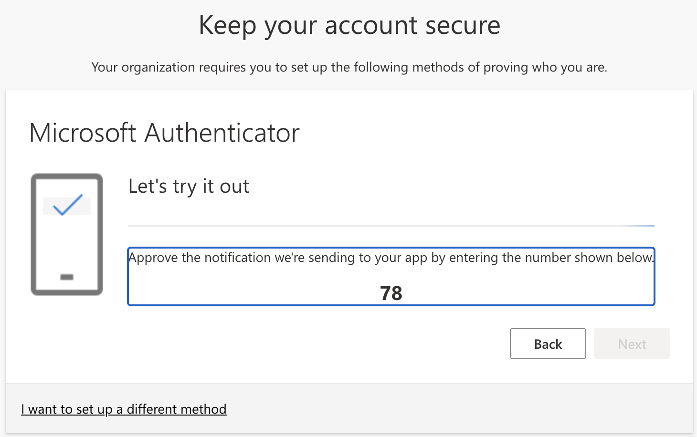</kbd>

  5. On the Authenticator app, enter the number shown, and select **Yes** to authenticate your sign-in.

  6. Click **Next**.

  <kbd>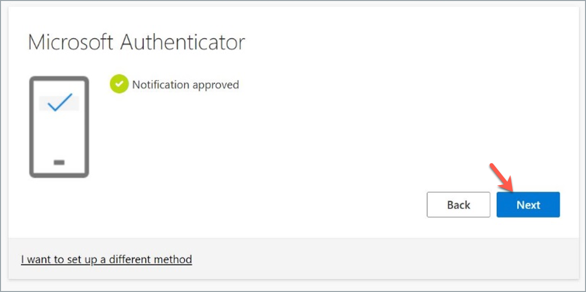</kbd>

  7. When you see the success message, click **Done** to proceed to accept the Terms of Use.

  <kbd>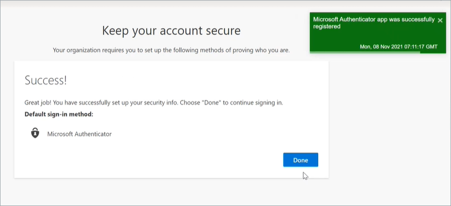</kbd>

  

  ## Step 5. Accept Privacy Policy and Terms of Use

  

  
Read and accept the Terms of Use

    1. Read the **Privacy Policy** and click **Accept**.
    2. Read the **Terms of Use** and click **Accept**.
    3. If SEED has been provisioned to you, read the **MDM AUP Policy** and click **Accept**.

  
  You have now successfully onboarded to your TechPass account. If you need to onboard your Internet Device to SEED, you can proceed now.

?> Refer to the [Prerequisites for onboarding your device to SEED](https://docs.developer.tech.gov.sg/docs/security-suite-for-engineering-endpoint-devices/#/prerequisites-for-onboarding) before you onboard your Internet Device to SEED.

<!--

> **Note**: 
  > You need to set up security verification (multi-factor authentication) for your Whole-of-Government(WOG) account to:
    >- Securely access Singapore Government Technology Stack (SGTS) services and tools from your GMD device.
    >- To view your SG Govt M365 profile on the Microsoft Authenticator app.
12. Click the arrow to view the **TechPass Terms of Use**.
14. Click the arrow to view the **TechPass Privacy Policy**.
16. Click the arrow to view the **TechPass MDM AUP Policy**.
<kbd></kbd>
<kbd></kbd>
 <kbd></kbd>
<kbd></kbd>
  <kbd></kbd>

  <kbd></kbd>

  
- Organisational email address should be in the format of *\<your_name\>@\<acronym for your agency\>.gov.sg*. For example, *john_doe@tech.gov.sg* .

    -->