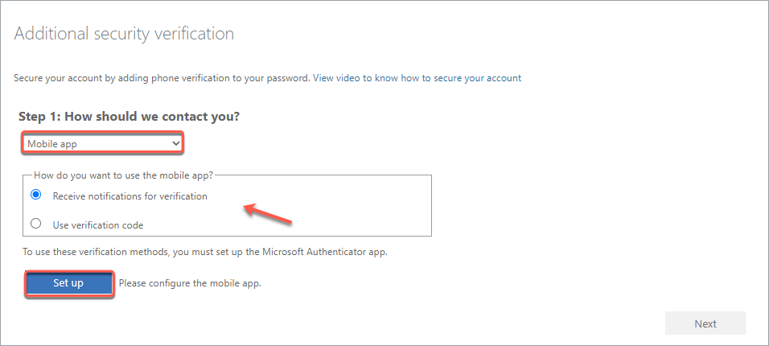
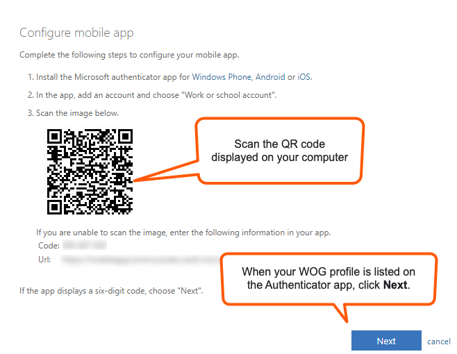
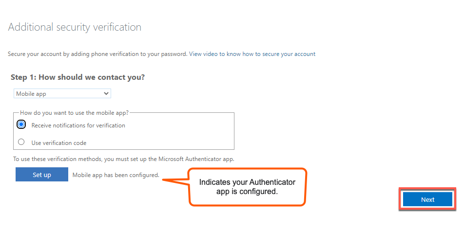
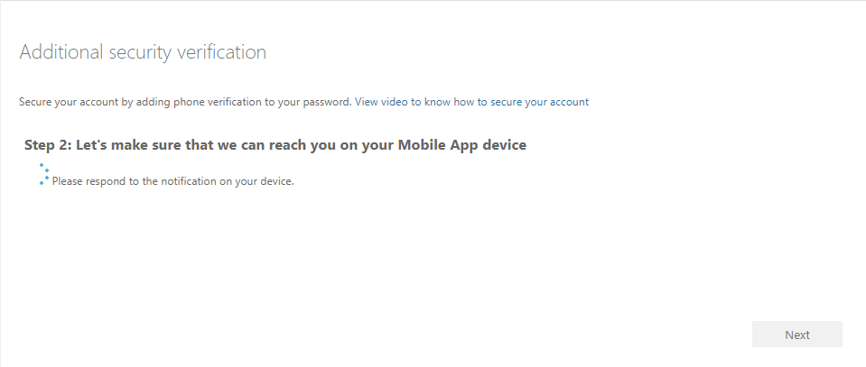
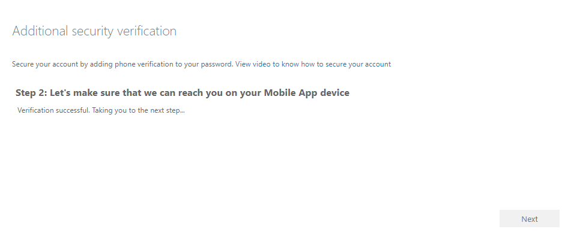
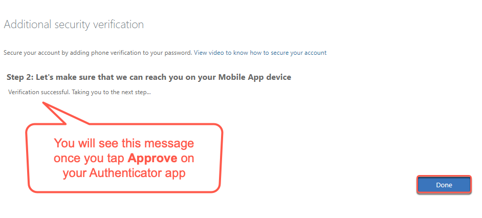
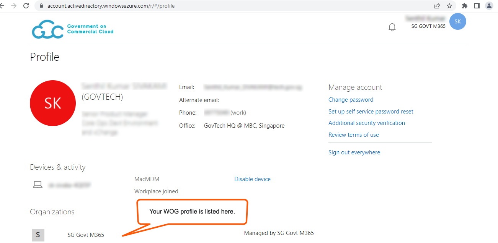

# Step 0: Set up Multi-Factor Authentication for WOG account

<ifigure>
<iframe title="YouTubeVideoPlayer" src="
https://www.youtube.com/embed/P9R5RiMpaVU?showinfo=0" height="315" width="560" frameborder="0" allow="accelerometer; autoplay; encrypted-media; gyroscope; picture-in-picture" allowfullscreen></iframe>
</ifigure>

<ifigure>
<iframe title="YouTubeVideoPlayer" src="
https://youtu.be/gJ0U0w7C628?showinfo=0" height="315" width="560" frameborder="0" allow="accelerometer; autoplay; encrypted-media; gyroscope; picture-in-picture" allowfullscreen></iframe>
</ifigure>

<!--

https://youtu.be/gJ0U0w7C628
https://youtu.be/embed/gJ0U0w7C628?showinfo=0
  > **Note**: 
  > You need to set up security verification (multi-factor authentication) for your Whole-of-Government(WOG) account to:
    >- Securely access Singapore Government Technology Stack (SGTS) services and tools from your GMD device.-->
   

### To set up Multi-Factor Authentication for WOG account

  1. From your non-SE GSIB device, go to the [Azure Active Directory](https://account.activedirectory.windowsazure.com/proofup.aspx).

  2. If prompted, log in using your organisational email address and password.

  3. Click **Next**. You are directed to the **Additional security verification** page to complete the following:

  - Configure mobile app on your mobile phone
  - Ensure you are reacheable via the mobile app on this phone

  4. To configure your mobile app, on the **Additional security verification** page, choose **Mobile app** from the dropdown list.
  
  5. Choose your preferred authenticating method, and click **Set up**. 

  <kbd></kbd>

  6. Follow the on-screen instructions on the **Configure mobile app** page.

    !> Do not close this page on your computer.

  <kbd></kbd>

  When you successfully complete the on-screen instructions, you are redirected to the **Additional security verification** page.
  
  7. Ensure you see the text **Mobile app has been configured** on this page.
  
  8. Click **Next**.

  <kbd></kbd>

  To ensure you are reacheable via your mobile device, a notification is sent to your Authenticator app.
  
  8. Approve the notification on your Authenticator app.

 <kbd></kbd>

 When the notification is successfully approved, you will see the following page on your computer.

 <kbd></kbd>

 9. Click **Done**.

 <kbd></kbd>
  
 10. The **Profile** page now displays your WOG profile under **Organizations**.

  <kbd></kbd>
  
