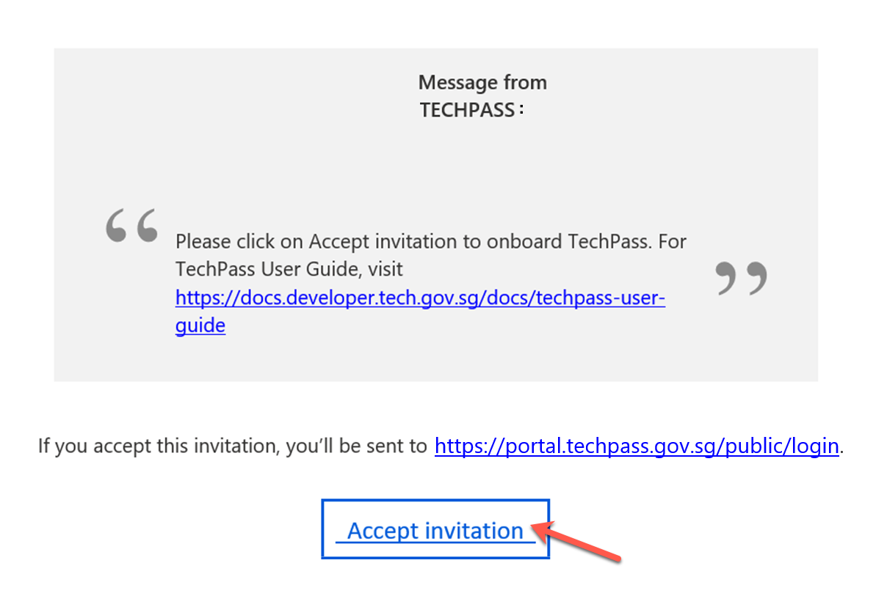

# Step 2: Activate TechPass account

When you sign up or get invited to TechPass, a TechPass account is provisioned to you based on the conditions listed on [TechPass account types](techpass-account-types). We send you an email to activate your TechPass account.

!> **Important notes** - If you do not see this email in your inbox: &nbsp;&nbsp;&nbsp;&nbsp;&nbsp;&nbsp;&nbsp;&nbsp;- Check if it is the same email address you provided while signing-up or when you requested the reporting officer for a TechPass account. &nbsp;&nbsp;&nbsp;&nbsp;&nbsp;&nbsp;&nbsp;&nbsp;- Check if a spam filter or email rule moved it to other folders, Junk Email, Deleted Items or Archive folder. - Activate your TechPass account within 30 days of receiving the TechPass invitation email. -  If you do not onboard within 30 days, we will terminate the provisioned TechPass account.

###  To accept TechPass invitation

  1. On your GSIB device, open the TechPass onboarding invitation email.

  > **Note**:
  >- If you do not see this email in your inbox:
  >
  >
  >- check if it is the same email address you provided during the TechPass self-sign-up or in your request for TechPass to a public officer
  >- If a spam filter or email rule moved it to other folders, Junk Email, Deleted Items or Archive folder.

  2. Click **Accept invitation** and proceed with **Onboarding to TechPass**. If you are already signed in to your WOG account, it will direct you to **Review Permissions**.

  <kbd></kbd>

