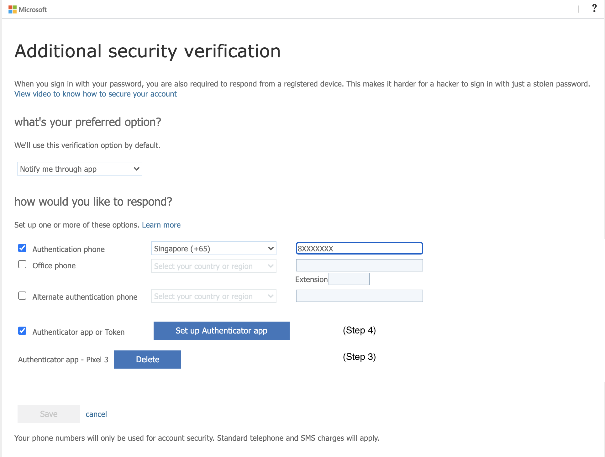

# Support

## Reset password - Vendor
If your account is locked or forget your password, you can follow prompts to unblock yourself and get back to your account. 
Go to https://aka.ms/sspr.

## Reset password - Public Officer
If your account is locked or forget your password, you may attempt accessing https://aka.ms/sspr to reset. Please contact your organisation's AFM tech support if there are problems.

## Reset MFA - new device
If you have a new mobile device, you'll need to set it up to work with multi-factor verification. This is a multi-step solution.

### Step 1
Install the Microsoft Authenticator app on your new mobile device by following the steps in the [Download and install the Microsoft Authenticator app](https://docs.microsoft.com/en-us/azure/active-directory/user-help/user-help-auth-app-download-install) article.

### Step 2
Visit [Microsoft's Additional Security Verification](https://account.activedirectory.windowsazure.com/proofup.aspx?proofup=1) page and sign in.

### Step 3
Delete your current authenticator app

### Step 4
Click **[Set up Authenticator app]** and follow the prompts using the authenticator app you've downloaded on your new mobile device.
You are done if you are a vendor account user.

### Public Officer Only
Step 2 to 4 will help you set up the authenticator app for WOG account. 

Follow these instructions if you got problems with steps 2 to 4.
1. Access [https://myaccount.microsoft.com](https://myaccount.microsoft.com) via your GSIB machine.  
   
2. Access **Security info**, you may be prompted to Approve/enter MFA code for another sign in request  
   
3. You can now add your new phone and delete your old authenticator app  
   

Next, please continue with steps 5 & 6 to set up the authenticator for TechPass Multi Factor Authentication (MFA).

### Step 5
Please send in a service request to revoke your current MFA using this [form](https://go.gov.sg/techpass-sr).

Select **[Request to reset Multi Factor Authentication]** for issue option and fill in the rest of the form. Our support team will send you an email once it's done.

### Step 6
Sign in to TechPass Portal and follow the series of prompt to set up MFA in your authenticator app using your new mobile device

## Reset MFA - lost device

### Public Officer Only
#### Step 1
Please contact your organisation's AFM tech support to help reset your mfa.

#### Step 2
Please send in a service request to revoke your current MFA using this [form](https://go.gov.sg/techpass-sr).

Select **[Request to reset Multi Factor Authentication]** for issue option and fill in the rest of the form. Our support team will send you an email once it's done.

#### Step 3
Sign in to TechPass Portal and follow the series of prompt to set up MFA in your authenticator app using your new mobile device

### Vendor Only
#### Step 1
Please send in a service request to revoke your current MFA using this [form](https://go.gov.sg/techpass-sr).

Select **[Request to reset Multi Factor Authentication]** for issue option and fill in the rest of the form. Our support team will send you an email once it's done.

#### Step 2
Sign in to TechPass Portal and follow the series of prompt to set up MFA in your authenticator app using your new mobile device

## More problems with MFA?
You may visit [Microsoft's Common problems with two-factor verification](https://docs.microsoft.com/en-us/azure/active-directory/user-help/multi-factor-authentication-end-user-troubleshoot) for more information 
or you may send us a service request for your problem using this [form](https://go.gov.sg/techpass-sr).
