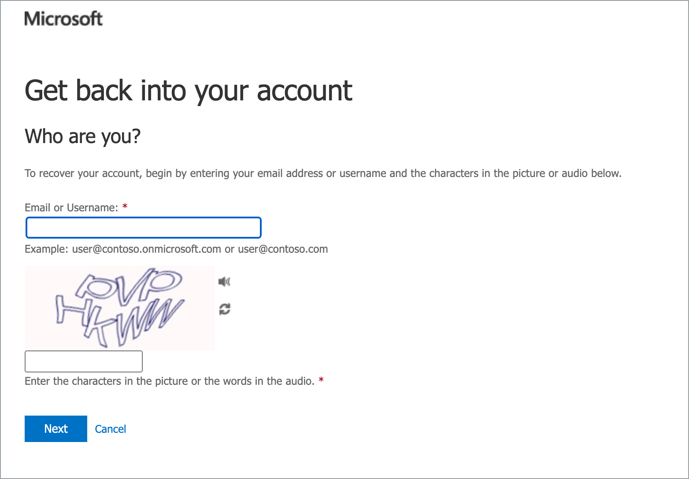

# Account Management FAQs

<details data-is-size="medium">
<summary>Why is my TechPass account locked. How to unlock my TechPass account?</summary>


If your TechPass login ID's domain is ```techpass.gov.sg```, your TechPass account will be locked after continuous unsuccessful login attempts. You need to [Reset TechPass password](reset-password) to unlock your TechPass account.


</details><br>

<details data-is-size="medium">
<summary>What is the password reset policy for TechPass accounts?</summary>

If your TechPass login ID's domain is ```techpass.gov.sg```, we follow the [password policy of Azure Active Directory][password-policy-of-azure-active-directory]. You will receive password expiry notifications accordingly. [Reset your password][reset-password-vendor] by following the on-screen instructions on this page.



</details><br>

<details data-is-size="medium">
<summary>How often should I verify my security info?</summary>

As security information is vital, you need to make sure it is always up-to-date. You will receive a reminder every 180 days to review your security info and update it as needed.

To manage your security info any time, go to <a href="https://myaccount.microsoft.com/" target="_blank">My Account</a>.

</details><br>

<details data-is-size="medium">
<summary>I have lost my mobile device that I used for MFA authentications. What should I do?</summary>

**If your TechPass login ID's domain is ```techpass.gov.sg```**:

a. Create a [service request](https://go.gov.sg/seed-techpass-support) to contact our technical support to remove the MFA configured for your TechPass account.

?> In the service request form, select **Service Request** as **Ticket Type** and select **Request to reset Multi Factor Authentication (MFA)** as **Service Requests**. 

b. [Reset TechPass MFA](https://docs.developer.tech.gov.sg/docs/techpass-user-guide/reset-techpass-mfa-for-new-device).

**If your TechPass ID is same as the organisational email ID**:

a. Contact your Agency Facility Management (AFM) to remove the MFA configured for your WOG account and create a [service request](https://go.gov.sg/seed-techpass-support) to remove the MFA configured for your TechPass account.

?> In the service request form, select **Service Request** as **Ticket Type** and select **Request to reset Multi Factor Authentication (MFA)** as **Service Requests**.

b. [Reset WOG MFA](https://docs.developer.tech.gov.sg/docs/techpass-user-guide/reset-security-verification-for-wog-account).
    
c. [Reset TechPass MFA](https://docs.developer.tech.gov.sg/docs/techpass-user-guide/reset-techpass-mfa-for-new-device).

</details><br>

<details data-is-size="medium">
<summary>I have other problems with MFA?</summary>

Do one of the following:

 - Visit Microsoft's [Common problems with two-factor verification](https://docs.microsoft.com/en-us/troubleshoot/azure/active-directory/troubleshoot-azure-mfa-issue) to see if there is a solution.
 - You can also create a [service request](https://go.gov.sg/seed-techpass-support).

</details><br>

<details data-is-size="medium"><summary>I have not yet onboarded to my TechPass account but I received an email stating that it has been terminated. Why was it terminated?</summary>

When you sign up or get invited to a TechPass account, a TechPass account is created for you and we will send an onboarding invitation email. When you onboard to your account, it gets activated.

This onboarding invitation email is valid only for 30 days and if you have not completed to onboard to TechPass within this time, you will be notified via email on the 25th day and your account will be terminated on the 30th day. When your account is terminated, you will again be notified about the account termination.

?><br>- Terminating account is different from disabling an account.<br>- If your TechPass ID is same as your organisational email ID, [accept the onboarding invitation](https://docs.developer.tech.gov.sg/docs/techpass-user-guide/sign-up-and-onboard-to-techpass?id=step-3-accept-invitation).<br>- If your TechPass login ID's domain is ```techpass.gov.sg```, you will receive an initial password by SMS. You need to [sign in to TechPass using initial password](https://docs.developer.tech.gov.sg/docs/techpass-user-guide/get-invited-and-onboard-to-techpass?id=step-2-sign-in-using-initial-password).

 
</details><br>

<details data-is-size="medium"><summary>My TechPass account is active but my SEED onboarding email invitation has expired. How do I get another SEED onboarding email invitation?</summary>

Your SEED onboarding email invitation is valid only for 30 days. 

- If you can access [TechPass portal](http://portal.techpass.gov.sg), complete the instructions mentioned on [Request for SEED provisioning](https://docs.developer.tech.gov.sg/docs/techpass-user-guide/request-for-seed-provisioning).

- If you can't access [TechPass portal](http://portal.techpass.gov.sg), do one of the following:<br>-&nbsp;&nbsp;&nbsp;&nbsp;&nbsp;&nbsp;&nbsp;&nbsp;&nbsp; If you had earlier requested your reporting officer or project manager to invite you to TechPass and SEED, contact them again to resend the SEED onboarding invitation. <br>-&nbsp;&nbsp;&nbsp;&nbsp;&nbsp;&nbsp;&nbsp;&nbsp;&nbsp;[Create a service request with TechPass](https://go.gov.sg/seed-techpass-support) to receive the SEED onboarding invitation email again.

</details><br>

<details data-is-size="medium"><summary>Why is my TechPass account disabled? How to re-enable it?</summary>

Your TechPass account might be disabled if you have not used it for 90 consecutive days. However, if you have not used it for 60 consecutive days, from day 61 onwards you will receive an email alert about your inactive status with the remediation step. If you still do not use your TechPass account, your account will be disabled on day 90 and you will be notified.

To re-enable or if you think your account was incorrectly disabled, create a [service request](https://go.gov.sg/seed-techpass-support).

</details><br>

<details data-is-size="medium"><summary>I am a WOG user and I am unable to sign in to my WOG account using my GMD(Internet Device onboarded to SEED).</summary>


You might encounter this error if you are trying to sign in to your WOG account without setting up the MFA for WOG to authenticate it. For more information, refer to [Set up security verification for WOG account](https://docs.developer.tech.gov.sg/docs/techpass-user-guide/sign-up-and-onboard-to-techpass?id=step-2-configure-mfa-for-the-wog-account)

</details><br>

[reset-password]: https://passwordreset.microsoftonline.com/
[password-policy-of-azure-active-directory]: https://docs.microsoft.com/en-us/azure/active-directory/authentication/concept-sspr-policy#administrator-password-policy-differences
[reset-password-gsib]: https://itsm.sgnet.gov.sg/sp3
[service-request]: https://go.gov.sg/seed-techpass-support
[reset-password-vendor]: https://passwordreset.microsoftonline.com/
[reset-mfa]: reset-mfa
