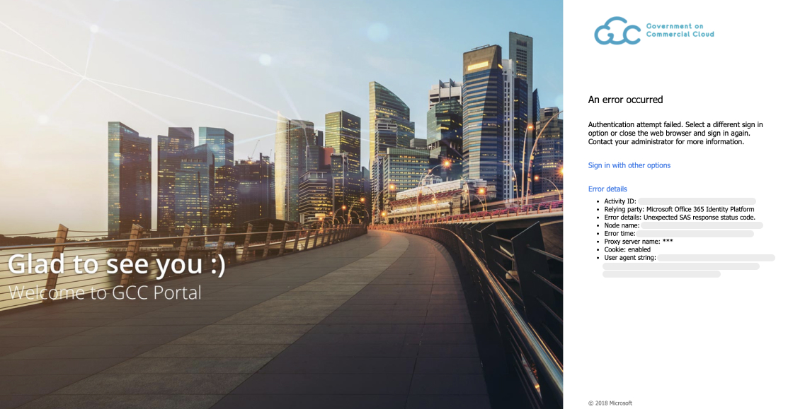

# Account Management FAQ

1. Why is my TechPass account locked. How to unlock my TechPass account?

If you are a vendor, your TechPass account will be locked after five consecutive unsuccessful login attempts. Go to [reset password][reset-password] and follow the on-screen instructions.

If you are a public officer, [reset GSIB password][reset-password-gsib] according to WOG's password policies. If there are any issues, contact your Agency Facility Management (AFM).

2. What is the password reset policy for TechPass accounts?

For vendors, we follow the [password policy of Azure Active Directory][password-policy-of-azure-active-directory] and will receive password expiry notifications accordingly. [Reset your password][reset-password-vendor] by following the on-screen instructions on this page.

Based on WOG's password policies, public officers will be notified to [reset GSIB password][reset-password-gsib]. If there are any issues, contact your Agency Facility Management (AFM).

3. How often should I verify my security info?

As security information is vital, you need to make sure it is always up-to-date. You will receive a reminder every 180 days to review your security info and update it as needed.

To manage your security info any time, go to <a href="https://myaccount.microsoft.com/" target="_blank">My Account</a>.

4. I have lost the mobile device which I used for MFA authentications. What should I do?

**If you are a vendor**:

i. Raise a [service request](https://go.gov.sg/techpass-sr) to contact our technical support to remove the MFA configured for your TechPass account.

ii. Once this is done, you will be notified. Proceed to [Reset TechPass MFA](reset-techpass-mfa-for-new-device) using your new mobile device.

 **If you are a public officer**:

i. Contact your Agency Facility Management (AFM) to  remove the MFA configured for your WOG account and raise a [service request](https://go.gov.sg/techpass-sr) to remove the MFA configured for your TechPass account.

ii. Once these are completed, reset MFA for [WOG account](reset-security-verification-for-wog-account) and [TechPass account](reset-techpass-mfa-for-new-device) using your new mobile device.

?> In the service request form, select **Service Request** and **Request to reset Multi Factor Authentication (MFA)** as **Ticket Type** and **Service Requests**, respectively.

5. I have other problems with MFA?

You may visit Microsoft's [Common problems with two-factor verification](https://docs.microsoft.com/en-us/troubleshoot/azure/active-directory/troubleshoot-azure-mfa-issue) for more information or you may raise us a [service request](https://go.gov.sg/techpass-sr).

6. I am public officer and my TechPass account has been deleted. Why was it deleted and what should I do to get another account?

When public officers sign up for TechPass, a TechPass account is created but will be in pending status until they accept the invitation link. If they do not accept this invitation link within 30 days, this account will be deleted. Note this is different from disabling TechPass account. If you still want a TechPass account, go to [TechPass portal](http://portal.techpass.gov.sg) and sign up again to receive a new invitation link.

7. Why is my TechPass account disabled? How to re-enable it?

Your TechPass account might be disabled if you have not used it for 90 consecutive days. However, if you have not used it for 60 consecutive days, from day 61 onwards you will receive an email alert about your inactive status with the remediation step. If you still do not use your TechPass account, your account will be disabled on day 90 and you will be notified.

To re-enable or if you think your account was incorrectly disabled, raise a [service request](https://go.gov.sg/techpass-sr) with us.

8. I am a public officer and unable to sign in to my WOG account from my GMD.

You may encounter this error if you are trying to sign in to your WOG account without setting up the MFA to authenticate it. For more information, refer to [step 3 in Onboarding public officer](https://docs.developer.tech.gov.sg/docs/techpass-user-guide/#/onboard-public-officers-using-non-se-machines?id=step-3-set-up-security-verification-for-your-wog-account)

[reset-password]: https://passwordreset.microsoftonline.com/
[password-policy-of-azure-active-directory]: https://docs.microsoft.com/en-us/azure/active-directory/authentication/concept-sspr-policy#administrator-password-policy-differences
[reset-password-gsib]: https://itsm.sgnet.gov.sg/sp3
[service-request]: https://go.gov.sg/techpass-sr
[reset-password-vendor]: https://passwordreset.microsoftonline.com/
[reset-mfa]: ../reset-mfa.md
