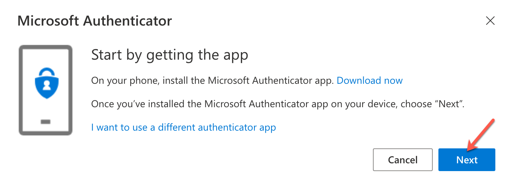
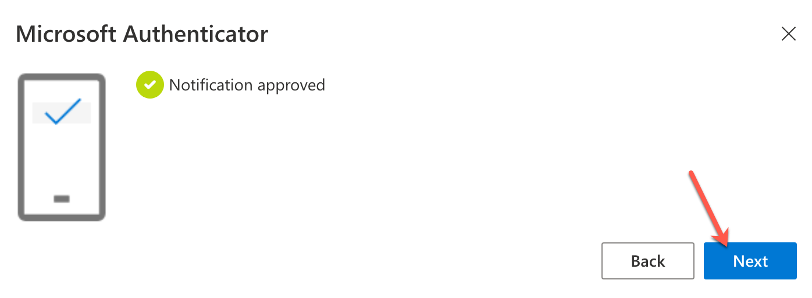

# Account Management FAQs

1. I am a vendor and my TechPass account has got locked. How to unlock my TechPass account?

  Vendor's TechPass account will be locked after five consecutive unsuccessful login attempts. To unlock, go to https://passwordreset.microsoftonline.com/ and follow the on-screen instructions.

2. What is your password reset policy for TechPass accounts?

  For vendors, we follow the [password policy of Azure Active Directory](https://docs.microsoft.com/en-us/azure/active-directory/authentication/concept-sspr-policy#administrator-password-policy-differences).  Hence vendors will receive a password expiry notification accordingly. You can [reset password](https://passwordreset.microsoftonline.com/) by following the on-screen instructions.

  However, if you are a public officer, you will be notified to reset your GSIB password as per the WOG password policies. If there are any issues with this, please contact your organisation's Agency Facility Management (AFM).

3. How often should I verify my security info?

 As security information is vital, you need to make sure it is always up-to-date. You will receive a reminder every 180 days to review your security info and update it as needed. To manage your security info any time, go to https://myaccount.microsoft.com/.

<!--

If you have issues in using TechPass from a GMD, ensure that you have [set up security verification for WOG account](manage-security-verification-for-wog-account)  before contacting the TechPass support team.-->

## Reset TechPass MFA (New mobile device)
If TechPass users have changed, they need to reset their TechPass MFA on the new device.

<!--- new device
If you have a new mobile device, you'll need to set it up to work with multi-factor verification. This is a multi-step solution.-->

1. Go to [My Account](https://account.activedirectory.windowsazure.com/proofup.aspx?proofup=1).

2. If prompted, sign in to your TechPass account and go to **Security info**. When prompted to approve the sign-in, use your old mobile device to approve.

?> If you are a public officer and trying to access your TechPass account from a GMD, you will be prompted to authenticate your SG GovtM365 account before authenticating TechPass sign-in.

<kbd></kbd>

3.  On the **Security info** page, click **Delete** next to the Authenticator method linked to your old mobile device.

<kbd>

4. Click **OK** to confirm the deletion.

5. Open the authenticator app on your old mobile device, delete your TechPass account from the authenticator app.

6. On the **Security info** page, click **+ Add method**, select **Authenticator app** and click **Add**.

<kbd>

7. Download and install Microsoft Authenticator on your [Microsoft phone](https://www.microsoft.com/en-sg/store/apps/windows-phone), [Android](https://play.google.com/store/apps?hl=en&amp;gl=US) or [iOS phone](https://www.apple.com/app-store/) and click **Next**.

  <kbd>

8. Follow the on-screen instructions to add your TechPass account and click **Next**.

  <kbd></kbd>

9. Scan the QR code displayed on your computer using the new mobile device and click **Next**.

  <kbd>

Your TechPass account gets listed in the **Authenticator** app indicating that verification for TechPass is now set on your new mobile device.

You will receive a notification on your new mobile device to verify your authentication process.

10. Approve sign-in on your new mobile device. You will see a notification approved message.
<kbd>

11. Click **Next**. The new device will be listed in the **Security info** page as an authenticating method.

<!--### Public Officer Only
Step 2 to 4 will help you set up the authenticator app for WOG account.

Follow these instructions if you got problems with steps 2 to 4.
1. Access [https://myaccount.microsoft.com](https://myaccount.microsoft.com) via your non-SE GSIB machine.  
   
2. Access **Security info**, you may be prompted to Approve/enter MFA code for another sign in request  
   
3. You can now add your new phone and delete your old authenticator app  
   

Next, please continue with steps 5 & 6 to set up the authenticator for TechPass Multi Factor Authentication (MFA).

### Step 5
Please send in a service request to revoke your current MFA using this [form](https://go.gov.sg/techpass-sr).

Select **[Request to reset Multi Factor Authentication]** for issue option and fill in the rest of the form. Our support team will send you an email once it's done.

### Step 6
Sign in to TechPass Portal and follow the series of prompts to set up MFA in your authenticator app using your new mobile device.-->

## Reset MFA - lost device

### Public Officer Only
#### Step 1
Please contact your organisation's AFM tech support to help reset your mfa.

#### Step 2
Please send in a service request to revoke your current MFA using this [form](https://go.gov.sg/techpass-sr).

Select **[Request to reset Multi Factor Authentication]** for issue option and fill in the rest of the form. Our support team will send you an email once it's done.

#### Step 3
Sign in to TechPass Portal and follow the series of prompts to set up MFA in your authenticator app using your new mobile device.

### Vendor Only
#### Step 1
Please send in a service request to revoke your current MFA using this [form](https://go.gov.sg/techpass-sr).

Select **[Request to reset Multi Factor Authentication]** for issue option and fill in the rest of the form. Our support team will send you an email once it's done.

#### Step 2
Sign in to TechPass Portal and follow the series of prompt to set up MFA in your authenticator app using your new mobile device

## More problems with MFA?
You may visit [Microsoft's Common problems with two-factor verification](https://docs.microsoft.com/en-us/troubleshoot/azure/active-directory/troubleshoot-azure-mfa-issue) for more information or you may raise us a [service request](https://go.gov.sg/techpass-sr).
