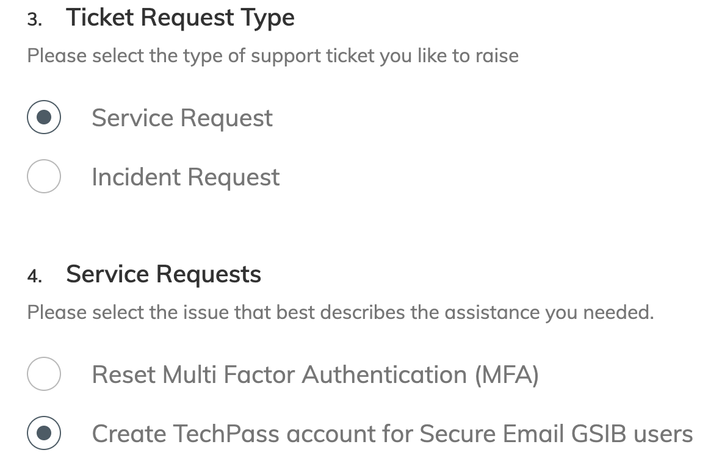
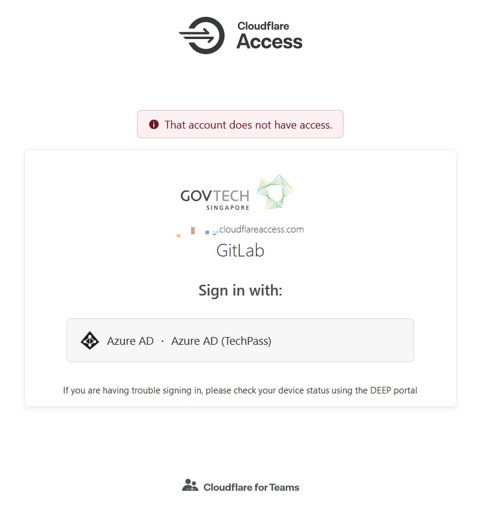
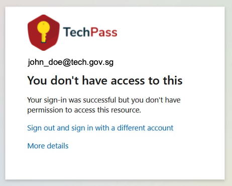

# TechPass onboarding and signing in FAQ

## Can I use my *your_name@litemail.gov.sg* to sign up for a TechPass account?
No. As LiteMail accounts can't receive emails outside your agency, you will not receive emails from TechPass. So upgrade to a standard mailbox before signing up for TechPass. Format of a standard, official email address of a public officer will be *your_name@agency.gov.sg*.

## I am using a SE GSIB device. How do I sign up for a TechPass account?
If you are using a SE GSIB device:

1. Raise a [service request](https://go.gov.sg/techpass-sr) to get your TechPass account.

2. In **Ticket Request Type**, select **Service Request** and choose **Create TechPass account for Secured Email GSIB users**.
3. When prompted to confirm if you are a Secured Email (SE) GSIB user, select **Yes**.

?> It takes 3 business days for us to provision a TechPass account for a SE GSIB user. Refer to [Glossary](../glossary.md) for more information on SE GSIB device.

## How do I confirm if my device is SE GSIB or non-SE GSIB device?

If you are using a SE GSIB device, you will be using your PS-Card to authenticate. If you are using a non-SE GSIB device, every time you log in to your device, you will be prompted to enter your BitLocker PIN.

<!--## TechPass account for SE-GSIB device users
SE-GSIB device users can raise a [service request](https://go.gov.sg/techpass-sr) to get their TechPass account and it takes 3 business days for us to provision the TechPass Account.

Please select **Service Request** for ticket request type and **Create TechPass account for Secure Email GSIB users** when submitting the ticket.

<kbd></kbd>-->

## DEEP (device compliance)
DEEP is a system that helps developers establish a robust security baseline for their devices, while ensuring only compliant devices can access Government engineering resources.

### Protecting developer devices
DEEP applies a security configuration baseline for each developer device based on industry standards such as the CIS benchmark. It also alerts developers on configuration and malware-related issues via the DEEP Dashboard, providing detailed remediation instructions for each issue.

### Protecting Government engineering resources
DEEP makes use of device-specific configuration and malware information to block developers with at-risk devices from accessing Government engineering resources.

### Login Errors
When a user is blocked by DEEP at the Cloudflare level, the user will be presented this error:

When the user has established a connection with Cloudflare and the user's device has been blocked by DEEP, the user will be get this error:

### Resolution

If you've encountered any of the above errors, try to resolve them by going to the DEEP Portal link listed below based on environment. The DEEP Portal will show you all the issues and instructions on how to fix them.

| Environment | Links                     |
| ----------- | ------------------------- |
| PROD        | https://deep.tech.gov.sg/ |
