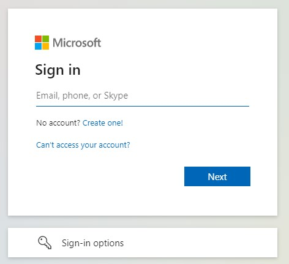
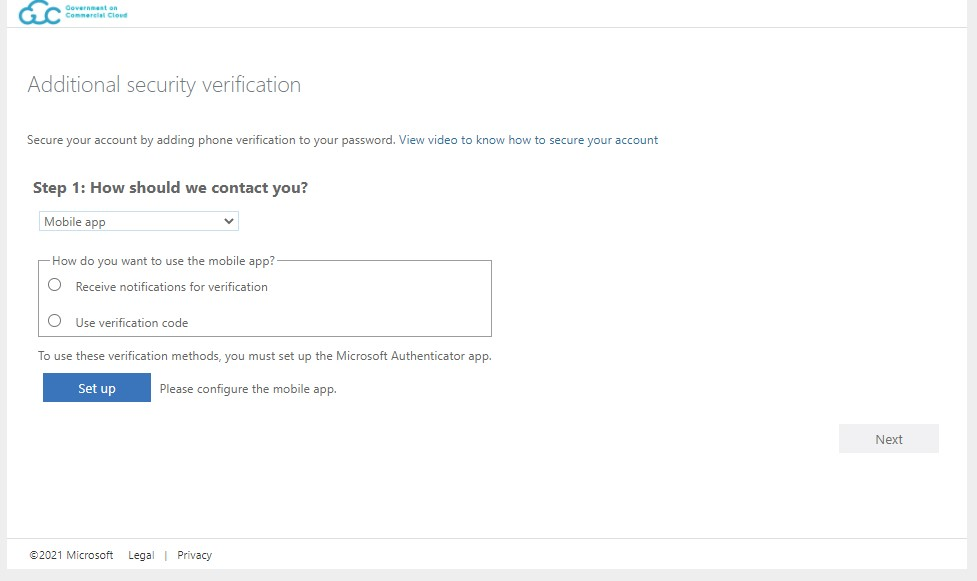
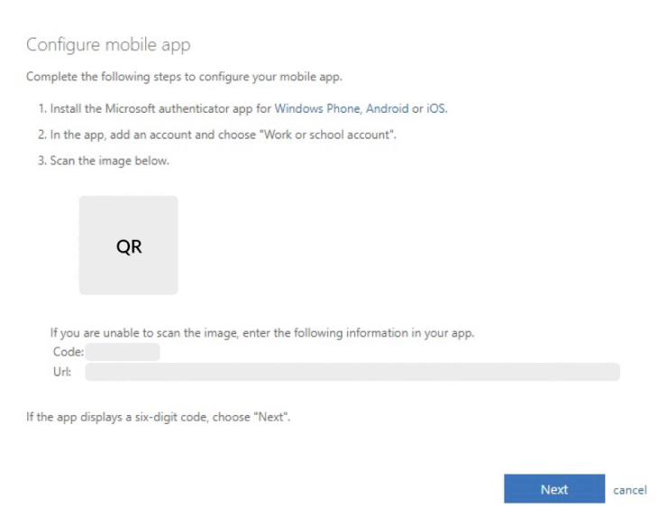
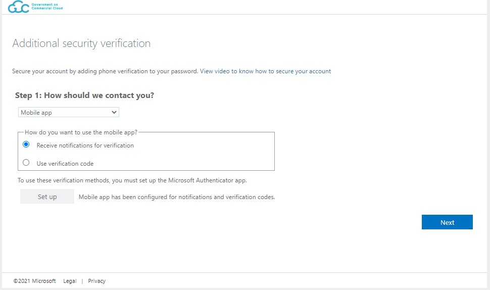
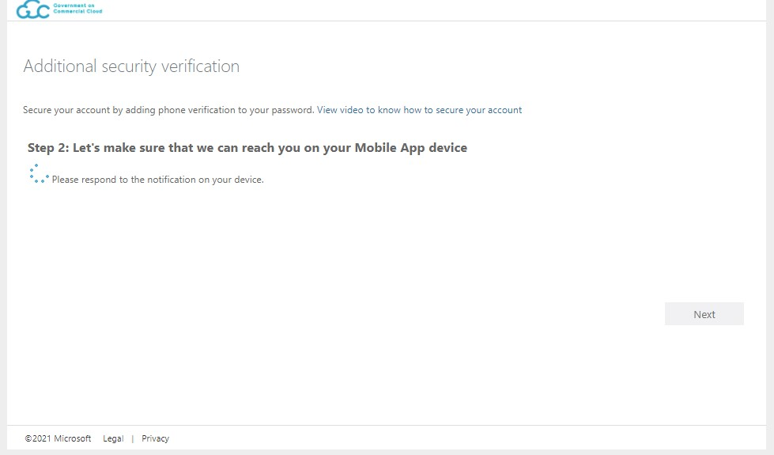
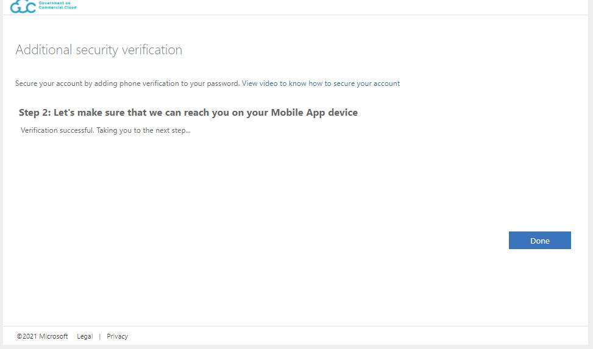

# Problems with Onboarding and Signing In

## I received an email that my TechPass account in pending status has been deleted. What should I do?
When you sign up for TechPass, a TechPass is created for you but will be in pending status until you accept the invitation link we send to you. If you do not accept the invitation link within 30 days, your TechPass account in pending status will be deleted. If you still want to use a TechPass account, sign up again to receive a new invitation link.

## Why is my TechPass account disabled? How to re-enable it?
Your TechPass account might be disabled if you have not used it for 90 consecutive days. However, when you have not used it for 60 consecutive days, on day 61 you will receive an email alert on your inactive status and also state that your account will be disabled after 30 days. You continue to receive this email until you log in or until your account is disabled.

If you continue to be inactive, your TechPass will be disabled on the 90th day and you will be notified about it. To re-enable or if you think your account was incorrectly disabled, raise a [service request](https://go.gov.sg/techpass-sr) with us.

<!--Your account might be disabled if you encounter an issue where you've signed in but the system keeps routing you back to the page.

!> Your account can be disabled due to inactivity of 90 days.  
You should receive email alerts to sign in at least once after 60 days of inactivity.

If you are certain that you still need TechPass to access the SG TechStack integrated services and that you should still have valid access. Please contact the respective SG TechStack Product team or us [here](support/overview?id=need-more-help) for help.-->

## Authentication attempt failed

A possible error faced when signing into a WOG account from an **internet device** can be seen below.

One reason this could happen is because the user have not completed the MFA setup for additional security verification on the WOG account. Signing in from an internet device to your WOG account requires a verification from the authenticator before the sign in will be successful.

Please follow the steps below to complete the MFA setup. Note that the steps are to be performed on the GSIB laptop.

1. On GSIB, navigate to the additional security verification page by accessing this URL: https://account.activedirectory.windowsazure.com/Proofup.aspx

2. On GSIB, enter your WOG Email and click "Next".
   

3. On GSIB, select either "Receive notifications for verification" or "Use verification code". Then click "Set up". <small>*This setting can be changed later on after the setup if you would like to switch to either of the option.*</small> <small>*Choosing "Receive notifications for verification" requires you to use the Microsoft Authenticator app as Microsoft will attempt to send push notifications to your mobile device for you to approve/deny the signin, instead of entering a verification code.*</small>
   

4. On GSIB, the following modal will appear together with a QR code. On your mobile phone, scan the QR code using your authenticator app. The recommended authenticator app is Microsoft Authenticator.   Once you have scanned the QR code, a MFA record named "SG Govt M365" should be added for your WOG account in your Microsoft Authenticator app.
   

5. Once you have clicked "Next" from step 4, the following should appear. The text "Mobile app has been configured for notifications and verification codes." should be displayed, and a record in your Microsoft Authenticator with the name "SG Govt M365" should be present. Click "Next".
   

6. Microsoft will attempt to verify that your MFA device is set up correctly at this step. If you have selected "Receive notifications for verification" from step 3, a push notification will be sent to your Microsoft Authenticator to approve the sign in. If you have selected "Use verification code" instead, please locate the verification code from your authenticator and type in the code.
   

7. If the verification succeeds, the text "Verification successful. Taking you to the next step..." will appear. Click on "Done" and you will be done setting up the MFA for your WOG account.
   

This should resolve the authentication error when signing in from an internet device. Do take note that this is the MFA (SG Govt M365) security verification for **WOG accounts**. There is another layer of security verification for **TechPass accounts** using a different MFA (TECHPASS).

## DEEP (device compliance)
(This is only enabled in the PROD environment and only users participating in the MDM End-to-End testing will encounter this issue.)

DEEP is a system that helps developers establish a robust security baseline for their devices, while ensuring only compliant devices can access Government engineering resources.

### Protecting developer devices
DEEP applies a security configuration baseline for each developer device based on industry standards such as the CIS benchmark. It also alerts developers on configuration and malware-related issues via the DEEP Dashboard, providing detailed remediation instructions for each issue.

### Protecting Government engineering resources
DEEP makes use of device-specific configuration and malware information to block developers with at-risk devices from accessing Government engineering resources.

### Login Errors
When a user is blocked by DEEP at the Cloudflare level, the user will be presented this error:

When the user has established a connection with Cloudflare and the user's device has been blocked by DEEP, the user will be get this error:

### Resolution

If you've encountered any of the above errors, try to resolve them by going to the DEEP Portal link listed below based on environment. The DEEP Portal will show you all the issues and instructions on how to fix them.

| Environment | Links                     |
| ----------- | ------------------------- |
| PROD        | https://deep.tech.gov.sg/ |
