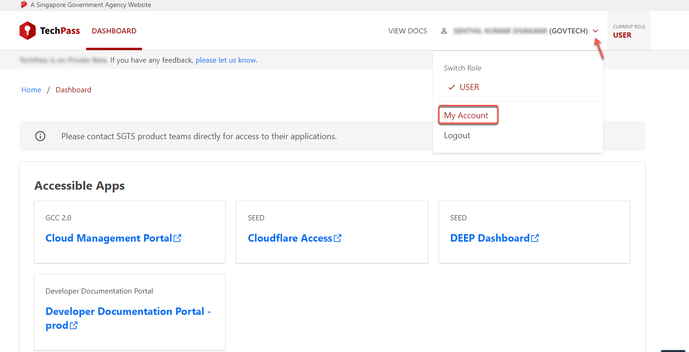

# Setup Passwordless Sign-In

This article guides you how to setup passwordless sign-in if you have existing MFA.

## Benefits of Passwordless Authentication

[Passwordless authentication](https://www.microsoft.com/en-sg/security/business/solutions/passwordless-authentication) offers several advantages over traditional password-based systems:
- Reduced attack surface: Eliminates risks from password theft, reuse, phishing, and brute-force attacks.
- Improved user experience: Users do not need to remember complex passwords or manage frequent resets. Authentication is faster and less error-prone.
- Stronger security posture: Modern passwordless methods use cryptographic keys, biometrics, and device-bound credentials, which are more secure than passwords.
- Simplified access: Users can securely access corporate resources from various devices, supporting organizational security policies.

More information [about passwordless](https://learn.microsoft.com/en-us/entra/identity/authentication/howto-authentication-passwordless-phone).

## Audience

Users who have `@techpass.gov.sg` account and have signed-in and setup MFA before.

If you already have **Microsoft Authenticator app and use app notification with number matching** for your MFA, proceed to [Step 4](#step-4-enable-passwordless-sign-in-in-mobile-app).

If you are using **other software token authenticators** like Authy or Google Authenticator, continue with [Step 1](#step-1-open-my-account-in-techpass-portal) to transition to use Microsoft Authenticator for passwordless sign-in.

?> Azure Passwordless authentication **do not support the use of 3rd-party authenticators** like Authy or Google Authenticator. Hence, the need to transition to Microsoft Authenticator.  Raise a [ticket](https://go.gov.sg/seed-techpass-support) with us if you have legitimate reasons where you cannot use Microsoft Authenticator to secure your identity. Eg. security-related (you cannot bring mobile phone into the work premises)

## Step 1: Open My Account in TechPass Portal

1. Using your non-SE GSIB or GMD device, log in to [TechPass Portal](https://portal.techpass.gov.sg).

2. Hover over your account name and click **My Account**.

## Step 2: Open Manage Sign-In Methods (Microsoft Account Security Info)

1. Hover over the setting icon and click **Manage Sign-In Methods**.

  

2. You may be asked to verify your sign-in. Select the same account that you used in previous step.

3. Microsoft account's Security info will be displayed.

  

## Step 3: Configure Microsoft Authenticator sign-in method

1. Click on **Add sign-in method**.

  

2. Click on **Microsoft Authenticator**.

3. Install Microsoft Authenticator on your mobile phone if you have not done so. Click **Next** on your computer.

  ?> Azure Passwordless authentication **do not support the use of 3rd-party authenticators** like Authy or Google Authenticator

  

4. On your computer, it will prompt you to setup account in your app. Click **Next**.

  

5. On your computer, a QR code will be displayed. 

  

6. On your mobile phone, open Microsoft **Authenticator** and select **+ Add account** > **Work or School account**.

7. **Scan** the QR code on your computer screen. TechPass account is added to your Microsoft Authenticator on your mobile phone.

8. On your computer, click **Next**.

  A number is shown on your browser.
  
  

9. On the Authenticator app, **enter the number** shown, and select **Yes** to verify. 

## Step 4: Enable Passwordless sign-in in mobile app
?> This section guides you to configure Passwordless sign-in using Microsoft Authenticator.

1. On the Microsoft Authenticator app, select the TECHPASS account

2. Select on **Set up Passwordless sign-in requests**.

  

3. Enter TechPass account password when prompted in the Microsoft Authenticator app and tap on **Sign in**.

  

4. MFA will be prompted and your mobile phone will receive a push notification to approve the sign-in.

  

5. **Open** the Authenticator notification and approve the sign-in by selecting **Yes**.

  

6. Proceed with passwordless setup when displayed by selecting on **Continue**.

  

7. The Authenticator app will prompt you for phone passcode or biometric. **Proceed** with the authentication.

8. Account added page will be displayed when the passwordless setup is done. You may select **Done**.

  

## Step 6: Enable Microsoft Authenticator App lock
This step is to ensure that App Lock is enabled in the Microsoft Authenticator.

1. On the Microsoft Authenticator app, access the **Settings**.

   - For Android, open the menu via the three-dot icon and select Settings.
     
     

   - For iOS, open the sidebar and select Settings.
     
     

2. Enable the **App Lock** if not yet enabled.

3. The app will prompt you for phone passcode or biometric. **Proceed** with the authentication.

## Step 7: Set default sign-in method
?> Proceed with this step only if the **Sign-in method when most advisable is unavailable** is not **App based authentication - notification**.

1. Back to the Microsoft Account Security Info on your computer.

2. Click on the **Change** of **Sign-in method when most advisable is unavailable**.

  

3. Select **App based authentication - notification**.

4. Click on **Confirm**.

## Step 8: (Optional) Delete Authenticator app (TOTP) sign-in method
?> Proceed only if you have setup Microsoft Authenticator sign-in method and wish to remove other Authenticator app (TOTP) sign-in method.

1. Back to the Microsoft Account Security Info on your computer.

2. Find the **Authenticator app** **Time-based one-time password (TOTP)**.

3. Click on **Delete**.

4. Click on **Ok** to confirm.

## Next step

- [Verify TechPass login](log-in-with-techpass#log-in-to-a-service-using-your-techpass-account)
