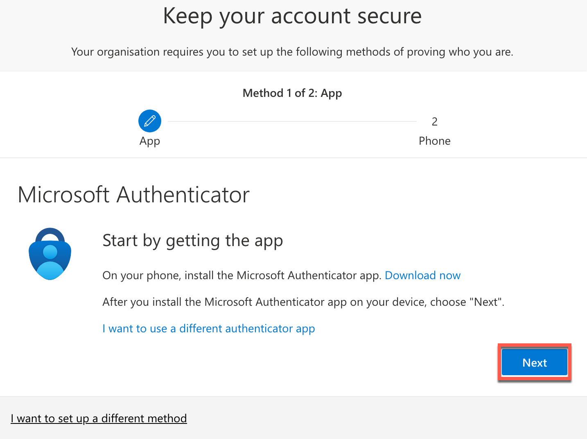
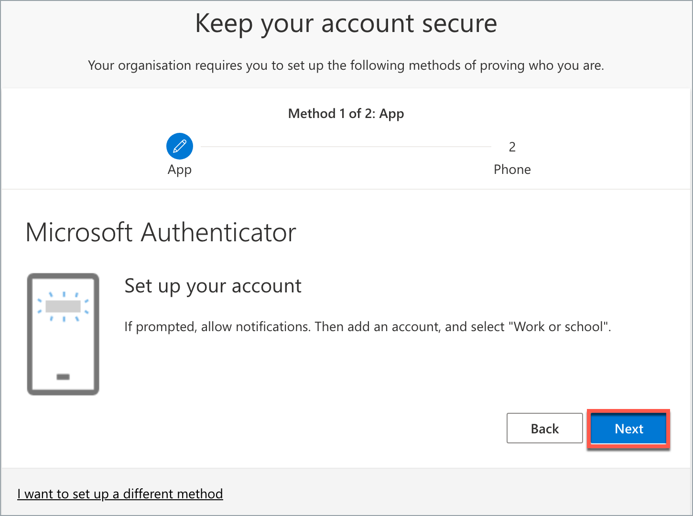
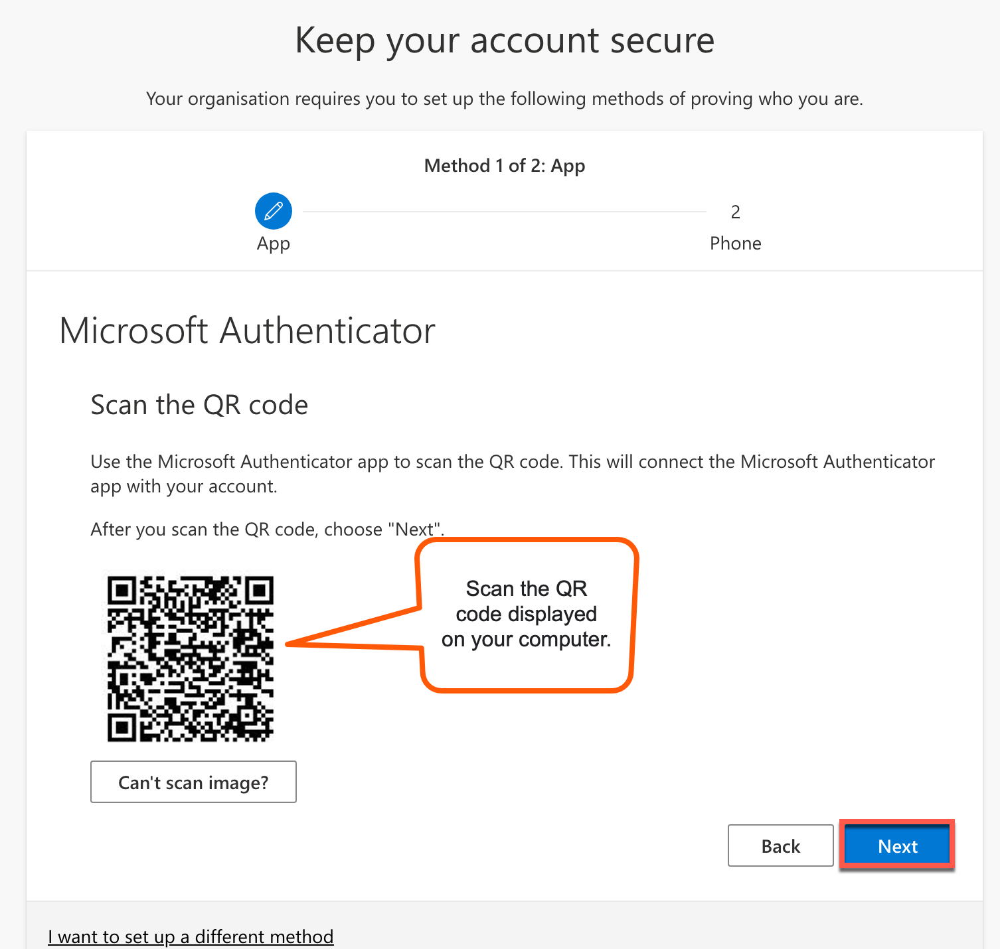
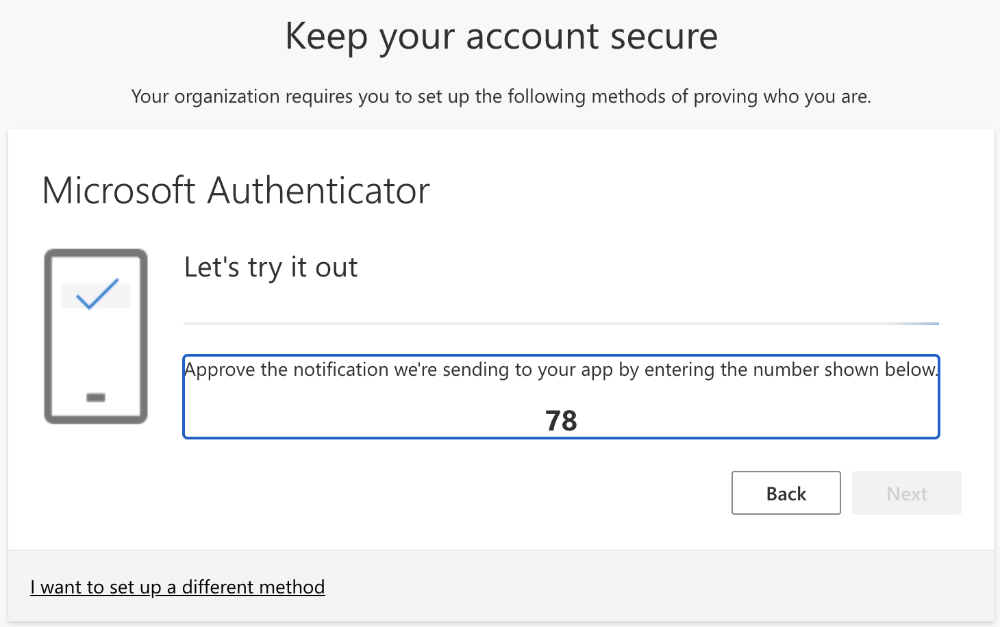
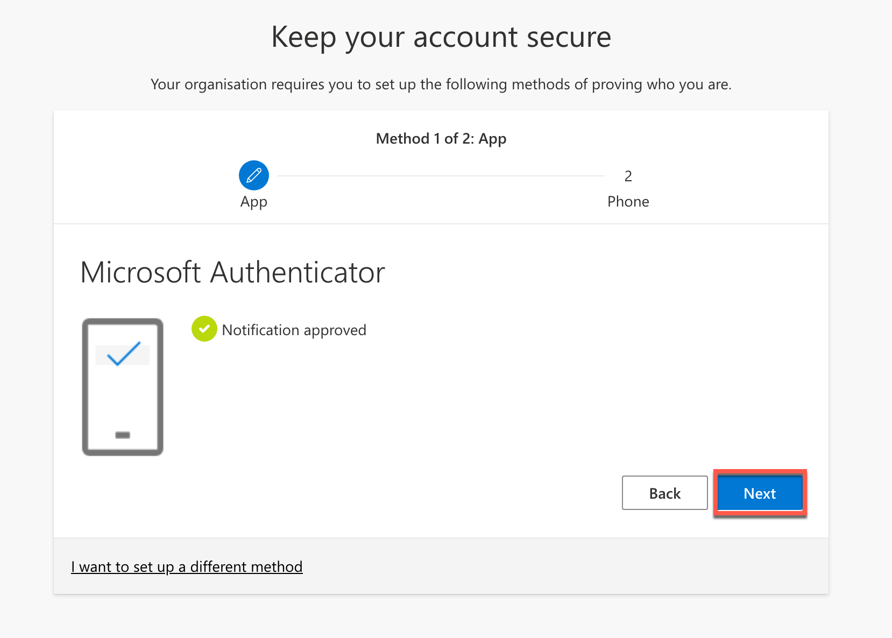

# Setup Passwordless Sign-In

This article guides you how to setup passwordless sign-in if you have existing MFA.

## Audience

Users who have `@techpass.gov.sg` account and have signed-in and setup MFA before.

## Step 1: Open My Account in TechPass Portal
?> If you already have Microsoft Authenticator app and use app notification with number matching for your MFA, proceed to [Step 4](#step-4-enable-passwordless-sign-in-in-mobile-app)

1. Using your non-SE GSIB or GMD device, log in to [TechPass Portal](https://portal.techpass.gov.sg).

2. Hover over your account name and click **My Account**.

## Step 2: Open Manage Sign-In Methods (Microsoft Account Security Info)

1. Hover over the setting icon and click **Manage Sign-In Methods**.

  

2. You may be asked to verify your sign-in. Select the same account that you used in previous step.

3. Microsoft account's Security info will be displayed.

  

## Step 3: Configure Microsoft Authenticator sign-in method

1. Click on **Add sign-in method**.

2. Click on **Microsoft Authenticator**.

3. Install Microsoft Authenticator on your mobile phone.

4. Click **Next** on your computer. 

  

5. On your mobile phone, open Microsoft **Authenticator** and select **+ Add account** > **Work or School account**.
6. Select **Scan a QR code**.
7. Go back to your computer and click **Next**.

  

8. Scan the QR code on your computer screen and click **Next**. Your TechPass account gets activated and linked to the Authenticator app.

    

  A number is shown on your browser.
  
  

9. On the Authenticator app, enter the number shown, and select **Yes** to authenticate your sign-in. 
  
  

## Step 4: Enable Passwordless sign-in in mobile app
?> This section guides you to configure Passwordless sign-in using Microsoft Authenticator.

1. On the Microsoft Authenticator app, select the TECHPASS account

2. Select on **Set up Passwordless sign-in requests**.

  

3. Enter TechPass account password when prompted in the Microsoft Authenticator app and tap on **Sign in**.

  

4. MFA will be prompted and your mobile phone will receive a push notification to approve the sign-in.

  

5. **Open** the Authenticator notification and approve the sign-in by selecting **Yes**.

  

6. Proceed with passwordless setup when displayed by selecting on **Continue**.

  

7. Account added page will be displayed when the passwordless setup is done. You may select **Done**.

  

## Step 5: Set default sign-in method
?> Proceed with this step only if the **Sign-in method when most advisable is unavailable** is not **App based authentication - notification**.

1. Back to the Microsoft Account Security Info on your computer.

2. Click on the **Change** of **Sign-in method when most advisable is unavailable**.

3. Select **App based authentication - notification**.

4. Click on **Confirm**.

## Step 6: (Optional) Delete Authenticator app (TOTP) sign-in method
?> Proceed only if you have setup Microsoft Authenticator sign-in method and wish to remove other Authenticator app (TOTP) sign-in method.

1. Back to the Microsoft Account Security Info on your computer.

2. Find the **Authenticator app** **Time-based one-time password (TOTP)**.

3. Click on **Delete**.

4. Click on **Ok** to confirm.

## Next step

- [Verify TechPass login](log-in-with-techpass#log-in-to-a-service-using-your-techpass-account)
