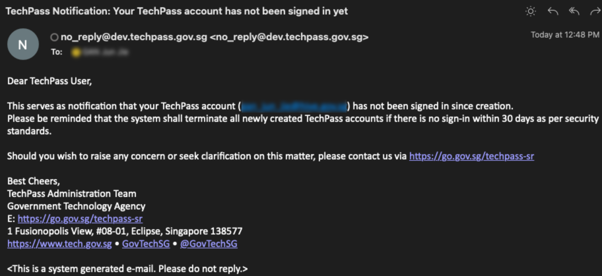
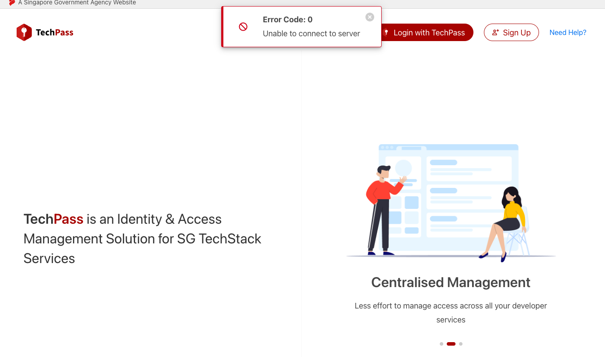

# Production release notes

> **Tip**: Click the triangle to view more details about the change.

## Production release 30 November 2022

Frontend version: 1.0.0-20221117.0948   | Backend version: 1.35.8-221123.0155

**New features**
<details>
<summary style="font-size:20px;font-weight:bold">Automatically retrieve public officer profile details from WOG AAD upon account creation</summary>

Upon account creation, the TechPass portal displays profile details such as first name, last name, organisation, department and mobile number of public officers.

When WOG AAD does not have this information, and if you invite the public officer using automation API, the portal will display profile details provided in the Automation API.

</details>

<details>
<summary style="font-size:20px;font-weight:bold">Display Key ID for client secrets</summary>

Tenant admins can view the Key IDs for their client secrets on the TechPass portal.

</details>

<details>
<summary style="font-size:20px;font-weight:bold">Number matching in multifactor authentication (MFA) notifications</summary>

To enhance secured login, we are enabling the number matching authentication for TechPass users. When TechPass users respond to an MFA push notification using the Authenticator app, they'll be presented with a number. They need to type that number into the app to complete the approval.

For more information, refer to [Azure documentation](https://learn.microsoft.com/en-us/azure/active-directory/authentication/how-to-mfa-number-match).

</details>

**Fixes**
<details>
<summary style="font-size:20px;font-weight:bold">Logs are now displayed for a newly added webhook</summary>

When users added a webhook URL to an active tenant, they could not see the logs related to the webhook. We have fixed this, and you can view the logs.

</details>

<details>
<summary style="font-size:20px;font-weight:bold">The word "terminated" won't be displayed in the mobile number field</summary>

If a vendor's TechPass account was terminated, and when you selected or assigned this user to a role using any downstream services such as TechBiz, you could see the word terminated displayed in the mobile number field. We have fixed this now.

</details>

**Changes**
<details>
<summary style="font-size:20px;font-weight:bold">Disable reset password for test and training accounts</summary>

TechPass admins and the operations team will no longer be able to reset passwords for test and training accounts.

</details>

## Production release 12 November 2022

Frontend version: 1.0.0-20221112.0330  | Backend version: 1.35.1-221112.0342

**New features** - **TechPass Portal**

<details>
<summary style="font-size:20px;font-weight:bold">A new webhook, application-credentials-expiring, is available for subscription</summary>

Tenant admins can subscribe to this webhook to get notifications about their applications' expiring certificates and secrets. </details>

## Production release 07 November 2022

Frontend version: 1.0.0-20221021.0757  | Backend version: 1.34.3-221021.0828

**New features** - **Backend**

<details>
<summary style="font-size:20px;font-weight:bold">Tenant state overrides webhook state </summary>

Tenant state will now override the webhook state. In other words, if the tenant state is disabled, irrespective of the web hook status, webhook event will not be triggered. </details>

**Fixes** - **Frontend**

<details>
<summary style="font-size:20px;font-weight:bold">While signing up for TechPass, appropriate error messages will be displayed in the portal </summary>

Public officers will see relevant error messages if they provide email address with domains that are not in the allowlist.

</details>

**Fixes** - **Backend** and **Automation API**

<details>
<summary style="font-size:20px;font-weight:bold">Error response will be returned for invalid display names provided while creating or updating applications using API</summary>

If the application display name does not conform to our valid display name policy when the tenant admins create or update applications using API, the system will return the appropriate error response.

</details>


**Fixes** - **Frontend**

<details>
<summary style="font-size:20px;font-weight:bold">Fixed incorrect hints displayed while creating application</summary>

On screen hints displayed for Homepage URL and Logout URL on Create Application were not accurate. We have fixed them.

</details>

**Changes** - **Backend** and **Automation API**

<details>
<summary style="font-size:20px;font-weight:bold">Improved user experience while modifying tenant groups or creating applications</summary>

We have improved the performance of the tenant group modification and the application creation processes.

</details>

## Production release 19 October 2022

Frontend version: 1.0.0-20221013.0247 | Backend version: 1.32.4-221013.0845

**New features** - **Backend**

<details>
<summary style="font-size:20px;font-weight:bold">Tenant admins can now create and update applications using APIs.</summary>

Tenant Admins can now create and update applications using APIs. For more information, refer to [TechPass Automation API](https://docs.developer.tech.gov.sg/docs/techpass-automation-api/#tag/Tenant).

This new feature complements the existing functionality to [create and update applications through the TechPass portal](https://docs.developer.tech.gov.sg/docs/techpass-tenant-guide/applications?id=registering-an-app).

</details>

**Fixes** - **Backend**

<details>
<summary style="font-size:20px;font-weight:bold">Terminated admins will not be notified of expiring or expired secrets and certificates.</summary>

Terminated admins will no longer be notified when an application's secret and certificate are nearing expiry or expired.

</details>

**Changes** - **Frontend** and **Backend**

<details>
<summary style="font-size:20px;font-weight:bold">Security enhancements.</summary>

We have made some changes to improve the security of your applications. When you create and update applications, ensure the **Homepage URL** and **Redirect URL** are in ```https://``` format.

If your existing applications' **Homepage URL** and **Redirect URL** do not comply with this, we strongly encourage you to update them.

Refer to [TechPass Tenant Guide](https://docs.developer.tech.gov.sg/docs/techpass-tenant-guide/applications?id=updating-an-app).

</details>

## Production release 06 October 2022

Frontend version: 1.0.0-20220927.1052 | Backend version: 1.31.10-220927.0538

**New features** - **Backend**

<details>
<summary style="font-size:20px;font-weight:bold">We send emails to the requestor and the TechPass account holder when a TechPass account's status changes.</summary>

Won't it be great to know the progress of your request to enable, disable or terminate your or others' TechPass account?

We have introduced a new feature to send an email to the requestor and account holder when a TechPass account is enabled, disabled and terminated. The requestor will be aware of the progress of their request at all stages.

</details>

**Fixes** - **Frontend**

<details>
<summary style="font-size:20px;font-weight:bold">Fixed incorrect validation rules for public officer's email address.</summary>

Were you perplexed when you got an incorrect error "failed to invite user" while inviting public officers? Don't worry, we fixed it now!

The validation rule for a public officer's email address:
- must be in the format *your_name@<acronym for your agency>.gov.sg*.
- must not exceed 113 characters.
- The local part in the email address must not exceed 64 characters \<local part\>@\<domain part\>.

</details>

## Production release 21 September 2022
Frontend version: 1.0.0-20220915.0435 | Backend version: 1.31.7-220914.1416

**Changes** - **Backend**

<details>
<summary style="font-size:20px;font-weight:bold">Automated resend initial password for vendor</summary>

We have automated the process of resending the initial password to vendors. If the vendor creates a service request for a new initial password, the tenant admin or the support team creates a new initial password for the vendor. The system automatically sends it to the registered mobile phone of the vendor.

</details>

**Changes** - **TechPass Portal**

<details>
<summary style="font-size:20px;font-weight:bold">Signing up for TechPass using *_from.XX@XX.gov.sg* is allowed again :grinning:!</summary>

Vendors who have *_from.XX@XX.gov.sg* email address can continue to use it to sign up for a TechPass account from the TechPass portal.

</details>

**Changes** - **Legal**

<details>
<summary style="font-size:20px;font-weight:bold">Updated Terms of Use and Privacy Statement</summary>

We have revised the Terms of Use and Privacy Statement for TechPass. Go to [Terms and policies](terms-and-policies) download the latest version.

</details>

## Production release 07 September 2022
Frontend version: 1.0.0-20220830.0352 | Backend version: 1.29.0-220826.0415

**New features** - **Backend**

<details>
<summary style="font-size:20px;font-weight:bold">Notify users before terminating their account which is inactive for 30 days from creation</summary>

TechPass automatically terminates TechPass accounts that have not been used within 30 days from its creation date. Users will now receive an email notification seven days in advance about this termination.

<kbd></kbd>

**Action required:**

Log in with your TechPass and complete the TechPass onboarding flow.

- If you are a public officer, [accept the invitation and complete the onbaording flow](/onboard-public-officers-using-non-se-machines?id=step-3-accept-invitation).

- If you are a vendor, [sign in to your TechPass account](onboard-vendors-to-techpass?id=step-2-first-time-sign-in-using-initial-password)

</details>

**Fixes** - **TechPass portal**

<details>
<summary style="font-size:20px;font-weight:bold">Warning message for expiring and expired certificates and secrets</summary>

We have fixed a bug and now warning messages will be displayed for both expiring and expired certificates and secrets on the portal. Earlier, it was displayed only for expiring certificates and secrets.

</details>

## Production release 25 August 2022
Frontend version: 1.0.0-20220808.0908 | Backend version: 1.27.8-220817.0220  
**Updates** - **Backend**

<details>
<summary style="font-size:20px;font-weight:bold">Email reminders for expiring/expired secrets and certificates</summary>

A new cron job sends email reminders to all Tenant admins whenever an application's certificate or secret is going to expire or if expired already. This email will prompt tenant admins to upload new certificate or create a new secret for the application.

You will have up to 30 days to upload a new certificate or generate a new secret upon receiving such emails. Do this on time for your published applications; otherwise users of this application will have issues in accessing it.

**Action required**: If you receive email notifications for expired or expiring certificates or secrets, please follow the instructions in the TechPass tenant guide to [upload new certificate](https://docs.developer.tech.gov.sg/docs/techpass-tenant-guide/concepts/clientcred?id=upload-certificate) or [create new secret](https://docs.developer.tech.gov.sg/docs/techpass-tenant-guide/concepts/authcodegrant?id=_2-create-secret).


</details>

**Fixes** - **TechPass Portal**

<details>
<summary style="font-size:20px;font-weight:bold">Implicit grant settings were overwritten when updating other application settings</summary>

A fix has been applied so that if a Tenant Admin enables the ID Token in the **Implicit Grant settings** via Azure Portal and proceeds to change any application settings in the TechPass portal, the changes in the Azure Portal will be discarded.

</details>

**Fixes** - **Backend**

<details>

<summary style="font-size:20px;font-weight:bold">Email notification sent to deleted account indicate five days of no sign-in but it should be 30 days</summary>

A fix has been applied to the email template to indicate 30 days instead of 5 days of no sign-in. It was only a typo, the logic for the deletion is triggered after 30 days, as intended.

</details>

**Fixes** - **Automation API**

<details>
<summary style="font-size:20px;font-weight:bold">Invite and Get user APIs does not return any value for UserPrincipalName</summary>

On rare occasions, Azure may take up more time than expected to generate a user resource when invite user API is triggered. On such occasions, Invite and Get user APIs may return no value for **UserPrincipalName** .

A fix has been applied to manage the delay from Azure and to return a valid error message when UserPrincipalName is empty for the following APIs.  

**Invite user API**
[Invite Public Officer](https://docs.developer.tech.gov.sg/docs/techpass-automation-api/#tag/IAM/paths/~1iam~1namespace~1{namespace}~1users~1publicofficer/post)

[Invite Vendor](https://docs.developer.tech.gov.sg/docs/techpass-automation-api/#tag/IAM/paths/~1iam~1namespace~1{namespace}~1users~1vendor/post)

**Retrieve user info API**  
[List Users](https://docs.developer.tech.gov.sg/docs/techpass-automation-api/#tag/IAM/paths/~1iam~1users/get)  
[Get User Info](https://docs.developer.tech.gov.sg/docs/techpass-automation-api/#tag/IAM/paths/~1iam~1users~1{identifier}/get)

</details>

## Production release 03 August 2022
Frontend version: 1.0.0-20220802.1153 | Backend version: 1.27.1-220801.1032  
**Updates** - **TechPass Portal**

<details>
<summary style="font-size:20px;font-weight:bold">Self sign up using *_from@*.gov.sg are no longer permitted</summary>

Vendors are given *_from@*.gov.sg emails for their work via GSIB. However, TechPass accounts for vendors must be sponsored by their respective agencies via the downstream SGTS services in use and vendors will need to provide their vendor company emails for account creation.

So emails with *_from@*.gov.sg format are now forbidded to self sign up via TechPass portal.

**Action required:**  
For existing TechPass users with *_from@*.gov.sg - Please wait for news on account migration. There's no change for now. You may continue to use *_from@*.gov.sg as your TechPass account.

For new GCC Common Services vendor users with *_from@*.gov.sg - Please raise a [service request](https://go.gov.sg/techpass-sr) to provision your accounts. You will need to provide a valid vendor company email address, mobile number, first name, last name, company and department.

</details>

**Fixes** - **Portal**

<details>
<summary style="font-size:20px;font-weight:bold">Fixed failed to get user's status when accessing application edit page</summary>

A fix has been applied to properly detect users with multiple roles assigned to the application; so that this list of users can be properly displayed in the application edit page.

</details>

## Production release 27 July 2022
Frontend version: 1.0.0-20220719.0855 | Backend version: 1.24.10-220715.1024  
**Improvements** - **Automation API**

<details>
<summary style="font-size:20px;font-weight:bold">Parameter changed in the request for access token</summary>

There is a change to the `scope` parameter in the request for access token via client credentials grant.

**Action required**: Change the `scope` parameter value from `https://graph.microsoft.com/.default` to `https://api.techpass.gov.sg/.default`.

For more information, refer to the following:
- [Transition guide](https://docs.developer.tech.gov.sg/docs/techpass-tenant-guide/#/concepts/transition-guide)
- [Change in Automation API Access Token Scope](https://docs.developer.tech.gov.sg/docs/techpass-tenant-guide/#/apis/integration?id=change-in-access-token-scope).

</details>

**Fixes** - **Backend**

<details>
<summary style="font-size:20px;font-weight:bold">Fixed the issue that triggered incorrect emails from TechBiz</summary>

A fix has been applied to the email templates to correct the invitation emails triggered from TechBiz.

</details>

## Production release 13 July 2022
Frontend version: 1.0.0-20220705.0420 | Backend version: 1.24.6-220701.0601

**New features** - **TechPass portal**

<details>
<summary style="font-size:20px;font-weight:bold">Developer Portal Widget is available on the TechPass portal</summary>

A new widget from the Developer Portal has been integrated into the TechPass portal. Using this, you can now access and learn more about the various GovTech featured products.

<kbd></kbd>

</details>

<details>
  <summary style="font-size:20px;font-weight:bold">New webhook in TechPass portal</summary>

Tenants can configure a new event webhook, `application-deleted` to get notifications when an application gets deleted from their system.

For more information, refer to [Configuring Webhooks](https://docs.developer.tech.gov.sg/docs/techpass-tenant-guide/#/webhooks?id=configuring-your-webhooks).

</details>

<details>
  <summary style="font-size:20px;font-weight:bold">New configuration flag for Applications</summary>

  A new configuration flag `published` has been added to Applications. When the application is indicated as `published`, it will be visible on the TechPass portal.

 >**Note**:
 >- All existing applications are marked as **published**.
 >- To unpublish an application, clear the **Mark As Published** option.

  </details>

**Improvements** - **TechPass portal**

  <details>
  <summary style="font-size:20px;font-weight:bold">Metrics are available only for published applications on TechPass portal</summary>

  **Earlier**:
  - Metrics of all the applications were displayed on the TechPass portal login page.

  **Now**:
  - Metrics will be available only for the published applications on the TechPass portal login page.

  </details>
  <details>
  <summary style="font-size:20px;font-weight:bold">Search user by mobile number</summary>

  The search user feature now allows tenant to search for users by their mobile number.

  

  </details>

**Improvements** - **TechPass portal and Automation API**

  <details>
  <summary style="font-size:20px;font-weight:bold">Access token and ID token durations shortened</summary>

  Access and ID token durations are shortened for better security posture.

  **Earlier**:
  - Access token was valid for 20 minutes
  - ID token was valid for 60 minutes

  **Now**:
  - Access token is valid for 10 minutes
  - ID token is valid for 10 minutes.

 >**Note**:
 >- You'll be able to request for a new access token, ID token and refresh token if OAuth2.1 refresh_token grant flow is applied.
 >- Refresh token expiration remains the same. The default is 90 days and is a sliding window (extended by issuing a refresh_token grant).

  </details>

  <details>
  <summary style="font-size:20px;font-weight:bold">Verify user availability on TechPass before sending TechPass invitation email</summary>

  **Earlier**:

  Tenants were unable to find users by mobile number.They were not able to determine if the same user has attempted to request for a new account or if it was a suspicious attempt.

  **Now**:
  Tenants can search for users using their mobile number. This feature comes in handy for tenants to identify if a user already has an account in the TechPass system and if yes, invitation will not be sent to that user.

  For more information, refer to the following documentation:
  - [List Users By Namespace](https://docs.developer.tech.gov.sg/docs/techpass-automation-api/#tag/IAM/paths/~1iam~1namespace~1{namespace}~1users/get)
  - [List Users](https://docs.developer.tech.gov.sg/docs/techpass-automation-api/#tag/IAM/paths/~1iam~1users/get).
  </summary>
  </details>

<details>
<summary style="font-size:20px;font-weight:bold">Three different login timestamps available</summary>

[Get User Info API](https://docs.developer.tech.gov.sg/docs/techpass-automation-api/#tag/IAM/paths/~1iam~1users~1{identifier}/get) now lists the following three different last login date and time:

  - **lastInteractiveSignInAt**: Displays the timestamp of a user who logs in with the login credentials and MFA.
  - **lastNonInteractiveSignInAt**: Displays the timestamp of a user who logs in without the authenticating factor as the session is still valid.
  - **lastSignInAt**: Composite of the above two, whichever is later.


  For more information, refer to Microsoft's article on [Non-interactive logins](https://techcommunity.microsoft.com/t5/microsoft-sentinel-blog/non-interactive-logins-minimizing-the-blind-spot/ba-p/2287932).


  </details>

  <details>
  <summary style="font-size:20px;font-weight:bold">Redirect user to TechPass portal login page</summary>

  **Earlier**:
  When user clicks the BACK button on their browser while logging out from the TechPass portal, an error is displayed as the session is no longer valid.

  **Now**:
   When user clicks the BACK button on their browser while logging out from the TechPass portal, user will be redirected to the TechPass portal login page.

  </details>


## Production Release 17 June 2022
Frontend version: 1.0.0-20220531.0334 | Backend version: 1.23.5-220601.0954

**Improvements** - **Automation API**
<details>
<summary style="font-size:20px;font-weight:bold">Whitelist value will be the Whitelist ID</summary>

**Earlier**:

To update or delete a whitelist, you need the whitelist ID (UUID) and to get this ID, you need to invoke the
[Get OTP Whitelist API](https://docs.developer.tech.gov.sg/docs/techpass-automation-api/#tag/OTP/paths/~1otp~1namespace~1{namespace}~1apps~1{appid}~1whitelists/get) repeatedly until the ID is found. This process was tedious and slow.

**Now**:

Whitelist value will be the Whitelist ID and when you create a new whitelist, there is no need to know the whitelist ID if you already know the whitelist value. The OTP Update/Delete Whitelist APIs will accept email domains and email addresses.  

For more information, refer to the following:
- [Update OTP Whitelist API](https://docs.developer.tech.gov.sg/docs/techpass-automation-api/#tag/OTP/paths/~1otp~1namespace~1{namespace}~1apps~1{appid}~1whitelists~1{whitelistid}/put) documentation.
- [Delete OTP Whitelist API](https://docs.developer.tech.gov.sg/docs/techpass-automation-api/#tag/OTP/paths/~1otp~1namespace~1{namespace}~1apps~1{appid}~1whitelists~1{whitelistid}/delete)

>**Note**:
>- There will not be any change to your existing whitelist entries.
>- If the same whitelist ID/value is desired, please recreate the existing entries.

</details>

**Improvements** - **Webhook**

<details>
<summary style="font-size:20px;font-weight:bold">Updated Webhook retry logic</summary>

Failed webhook events are now retried for 14 days with the time interval of five minutes.

</details>

**Fixes** - **TechPass portal**

<details>
<summary style="font-size:20px;font-weight:bold"> Configuration fix </summary>

The HTTP `X-XSS-Protection` response header has been deprecated by modern browsers as it can introduce additional security issues on the client side.

In the HTTP Response Header, the XSS protection response header has been disabled by a `0` value as shown below:

 `X-XSS-Protection: 0`


</details>

<details>
<summary style="font-size:20px;font-weight:bold">Fixed Error Code:0</summary>

  TechPass portal displayed an error banner if the metrics about **TechPass Users** and **Applications Integrated with TechPass** could not be displayed. This has been fixed in this release.

  <kbd></kbd>

  </details>
